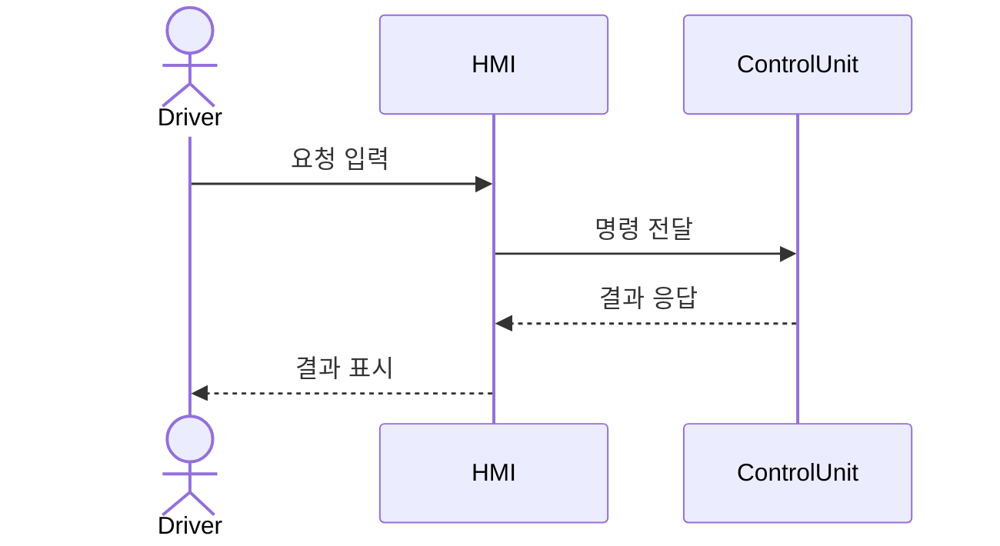
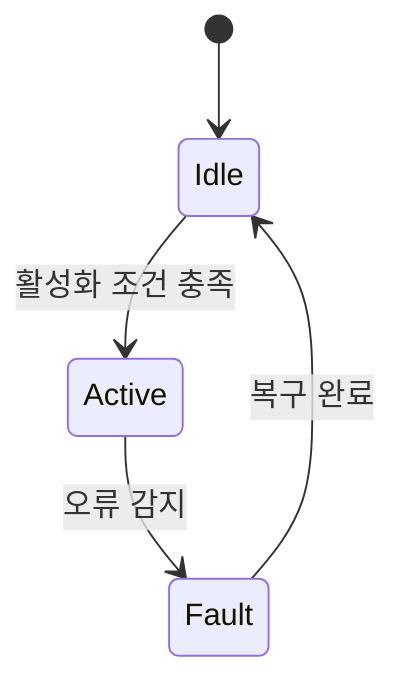
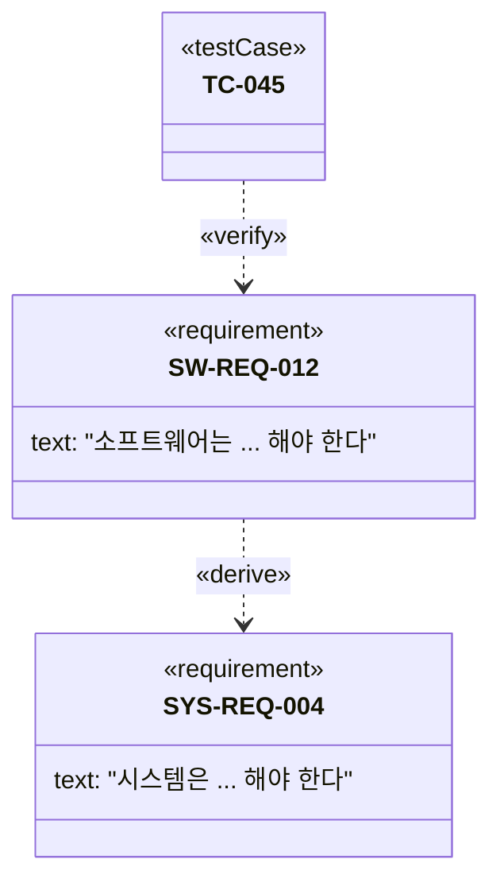

# 기능 요구사항의 UML/SysML 다이어그램 표현 가이드

산출물은 텍스트 기반이므로 Mermaid 코드 블록으로 다이어그램을 표현한다 (렌더링 가능한 형식 유지). SysML 전용 표기(«requirement», «satisfy» 등)는 Mermaid `classDiagram`의 스테레오타입 표기로 근사한다.

## 요구사항 성격별 다이어그램 선택 기준

| 요구사항 성격 | 권장 다이어그램 | 이유 |
|---|---|---|
| 사용자/외부 시스템과의 상호작용 범위 정의 | Use Case Diagram | 액터-시스템 경계와 기능 목록을 한눈에 표현 |
| 메시지/호출 순서가 중요한 동작 | Sequence Diagram | 시간 순서에 따른 컴포넌트 간 상호작용 표현 |
| 상태/모드에 따라 동작이 달라지는 요구사항 | State Machine Diagram | 상태 전이 조건과 결과를 명확히 표현 |
| 처리 절차/분기/병렬 흐름이 있는 요구사항 | Activity Diagram | 제어 흐름과 조건 분기 표현 |
| 상위-하위 요구사항 간 파생/만족/검증 관계 | SysML Requirement Diagram (근사) | «derive», «satisfy», «verify», «trace», «refine» 관계로 추적성을 시각화 |
| 컴포넌트 구조/인터페이스 할당 | SysML Block Definition/Internal Block Diagram (근사) | 요구사항이 어느 구성요소에 할당되는지 표현 |

## Mermaid 예시

### Sequence Diagram

### State Machine Diagram

### SysML Requirement Diagram 근사 (classDiagram + 스테레오타입)

## 규칙

- 다이어그램은 요구사항 문장을 대체하지 않는다 — 반드시 텍스트 요구사항 + 다이어그램을 함께 제공한다.
- 다이어그램 내 요소 이름(요구사항 ID 등)은 실제 문서의 ID와 정확히 일치시켜 추적성이 깨지지 않게 한다.
- 다이어그램이 없어도 되는 단순 비기능 요구사항에는 억지로 다이어그램을 붙이지 않는다.
