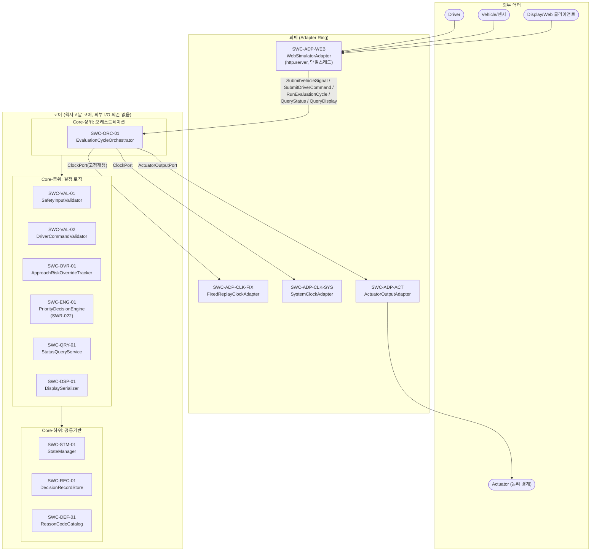
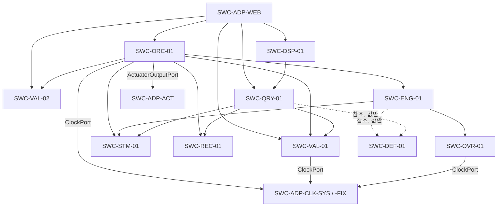
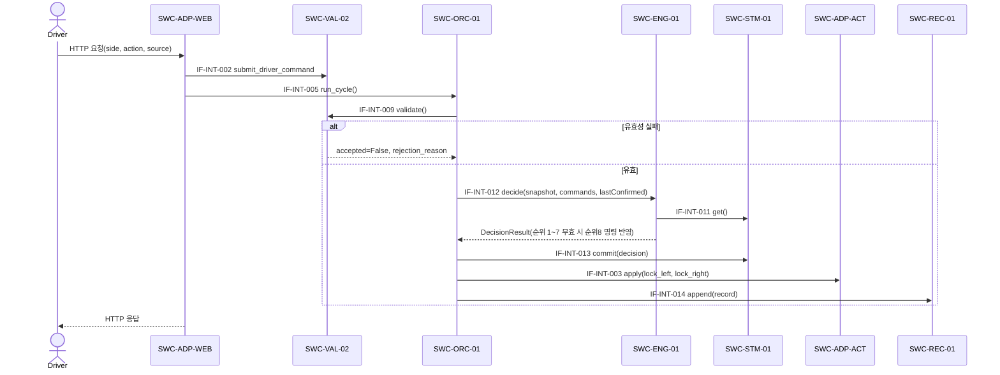
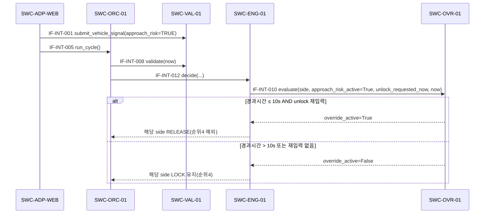
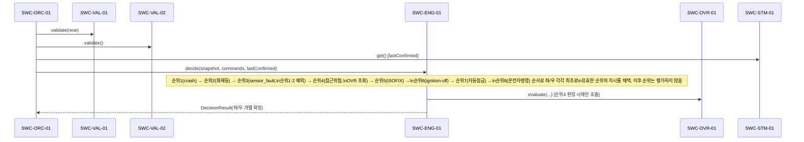
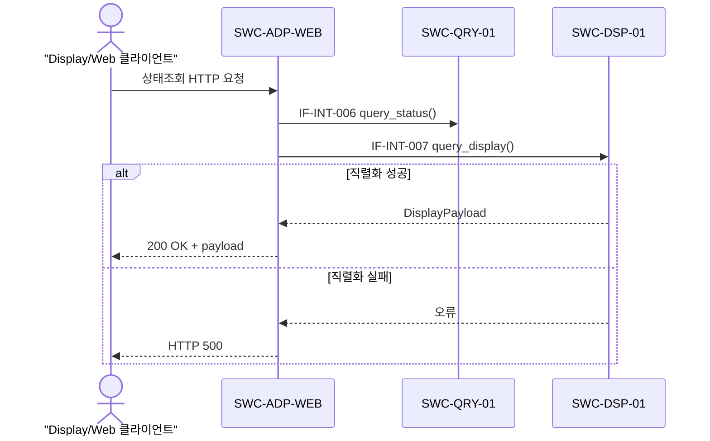
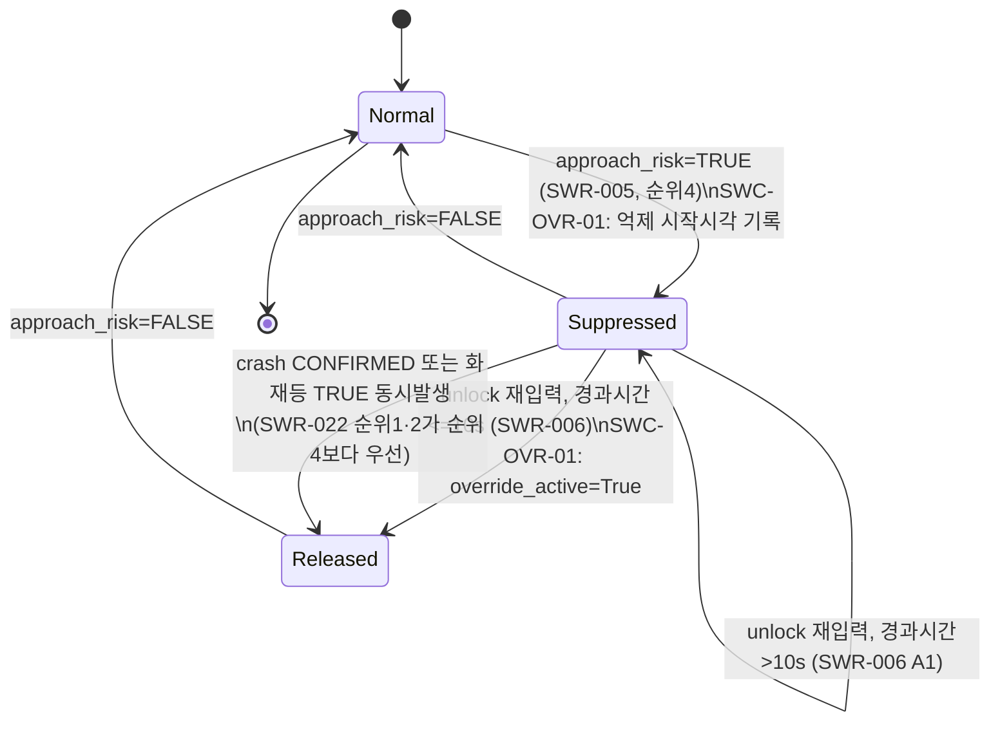
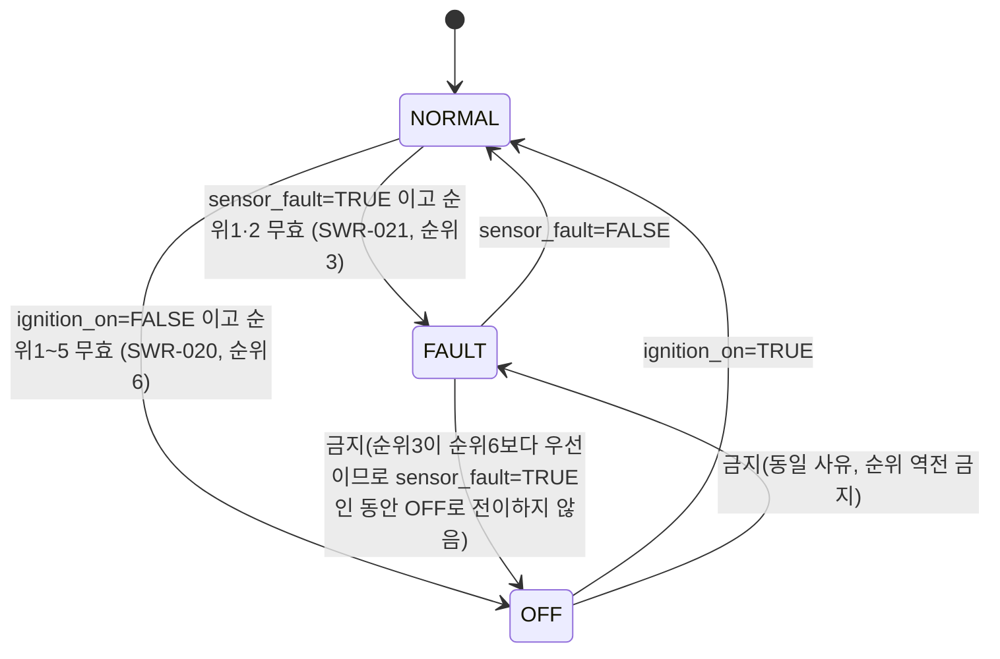
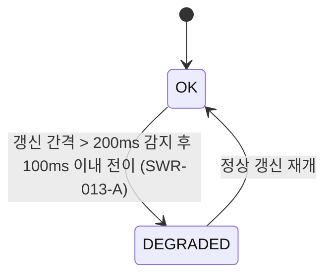

# SWA-001 SW 아키텍처 설계서 — 전자식 차일드락 제어 SW

## 문서 통제

| 항목 | 내용 |
|---|---|
| 문서 ID / 명칭 | SWA-001 / SW 아키텍처 설계서 — 전자식 차일드락 제어 SW |
| 적용 템플릿 | TPL-SWE2-001_SW 아키텍처 설계서 템플릿.docx (섹션 1~15 구조를 그대로 따름), 다이어그램 표기는 TPL-SWE2-002(drawio) 규칙을 Mermaid로 표현 |
| 적용 프로세스 | A-SPICE 4.1 SWE.2 |
| 버전 / 베이스라인 | Rev 0.1 / BL-OEM-1.0 (OEM 입력 베이스라인 불변) |
| 작성자 | 아키텍처설계 에이전트 |
| 검토 요청 대상 | jay.kim3063@gmail.com |
| 승인자 | 대기 — 가상 OEM-A 역할을 겸임하는 사용자(jay.kim3063@gmail.com) |
| 작성 상태 | 4~16절(TPL-SWE2-001 전체 목차) 최초 작성 완료(Draft), 검토 대기 |

**교육용 시나리오 고지**: 본 문서는 SW 품질교육을 위한 가상 OEM-A 입력(`OEM_Sample/OEM-SWR-001_OEM SW 요구사항 사양서.docx`, Rev 1.0, BL-OEM-1.0) 기반 교육용 산출물이며, 실제 제작사의 사양을 나타내지 않는다. 본 문서와 이를 생성한 방법론(`architecture-design` 스킬)은 실무 보조 도구이며 Automotive SPICE(A-SPICE) PAM 및 ISO 26262 Part 6 원문 표준을 대체하지 않는다. ASIL B 등급은 OEM 입력을 그대로 승계했으며 HARA/ASIL 도출 타당성은 본 문서 범위 밖이다(ISO 26262 Part 3 제외).

## 개정 이력

| Rev | 일자 | 작성자 | 변경 내용 |
|---|---|---|---|
| 0.1 | 2026-09-18 | 아키텍처설계 에이전트 | 최초 작성. 아키텍처 후보 A(계층형)/B(헥사고날)/C(하이브리드) 제시 후 사용자 결정으로 **후보 C(계층형 외피 + 헥사고날 코어) 확정**(§15.1 ADR). 이에 따라 4~16절 전체 상세 설계 작성. 사용자 결정 반영 사항: (1) 동시성 모델 단일 스레드 순차 처리 확정, (2) `gear`={P,N,D,R}, `vehicle_speed_kph`=0.0~300.0 데이터 계약 확정, (3) DEGRADED 표시우선순위는 Phase 4 확장 지점으로 명시적 이월. |

---

## 1. 목적 및 적용범위

### 1.1 목적

본 문서는 `SWE1-001_SW 요구사항 명세서.md`(SWR-001~022, 특히 SWR-022 트리거 우선순위 정책)와 `SWE1-002_Use Case 명세서.md`(UC-001~005)를 입력으로, A-SPICE SWE.2 절차에 따라 후석 좌/우 전자식 차일드락 제어 SW의 소프트웨어 아키텍처를 설계한다. 본 아키텍처는 이후 SWE.3(상세설계), SWE.4/5/6(단위/통합/시스템 시험)의 기준선이 된다.

### 1.2 적용범위

대상 SW는 SWR-001~022(SWR-013은 013-A/013-B) 전량을 실현하는 PC/SIL 및 Web 시뮬레이터 소프트웨어이다. 개발 언어는 Python 3.12, 표준 라이브러리(`http.server` 등)만 사용하며 외부 웹 프레임워크는 금지된다. 대상 조직/생명주기 단계는 SWE.2(아키텍처 설계)이다.

### 1.3 적용 경계

- HIL, 실차, 타깃 ECU, 시스템/HW 개발, ISO 26262 Part 3(HARA/ASIL 도출), 공식 심사·인증은 범위 밖이다(`SWE1-001` §1.3과 동일 경계).
- 도어 래치 HW 구동, 통신 매체(CAN/이더넷 등)의 신뢰성 자체는 다루지 않는다. `ActuatorOutputAdapter`는 논리적 출력 적용 경계까지만 다룬다.
- 영상·음성 원본과 개인식별정보는 입력·저장하지 않는다(SWR-010/012).
- 본 문서는 SWR-022의 8단계 우선순위(§4.2.5)를 재해석하지 않고 그대로 구현 가능한 컴포넌트 구조로 옮긴다.

---

## 2. 아키텍처 설계 원칙

### 2.1 분해 원칙 — 계층형 외피 + 헥사고날 코어 (후보 C, §15.1 ADR로 확정)

- **외피(Adapter Ring)**: 외부 액터(Driver, Vehicle/센서, Display/Web 클라이언트, Actuator)와의 경계는 전부 어댑터가 담당하며, 어댑터는 코어가 정의한 포트(인터페이스)만 통해 코어와 통신한다.
- **코어(Core, 순수 로직)**: 외부 I/O·프로토콜(HTTP 등)에 대한 의존이 전혀 없는 순수 Python 로직으로 구성되며, 코어 내부는 다시 아래와 같이 계층화되어 ISO 26262-6의 "계층 구조(hierarchical structure)" 원칙을 명시적으로 만족한다.
  - Core-상위(오케스트레이션 계층): `EvaluationCycleOrchestrator` — 평가주기 실행 순서를 결정론적으로 보증.
  - Core-중위(결정 로직 계층): `SafetyInputValidator`, `DriverCommandValidator`, `ApproachRiskOverrideTracker`, `PriorityDecisionEngine`, `StatusQueryService`, `DisplaySerializer`.
  - Core-하위(공통기반 계층): `StateManager`, `DecisionRecordStore`, `ReasonCodeCatalog`(공용 불변 정의).
  - 의존 방향은 상위→중위→하위 단방향이며, 코어는 외부(어댑터) 구현에 의존하지 않는다(포트 인터페이스에만 의존, DIP).

### 2.2 결합도 원칙 — 데이터 결합 목표

모든 컴포넌트 간 상호작용은 6장에 정의된 인터페이스(포트)를 통해서만 이루어지며, 필요한 값만 담은 값 객체(DTO: `ValidatedVehicleSnapshot`, `ValidatedDriverCommand`, `DecisionResult`, `LastConfirmedOutput` 등)를 매개변수로 전달한다. 전역 변수·공유 가변 상태·다른 컴포넌트 내부 필드 직접 접근은 금지한다. 판정 근거는 §4/§5에 컴포넌트·관계별로 기록한다.

### 2.3 응집도 원칙 — 기능적 응집 목표

모든 코어 컴포넌트는 "단 하나의 검증 가능한 기능"을 책임으로 갖도록 분해했다(§4 참조). 예: `PriorityDecisionEngine`은 오직 "SWR-022 8단계 우선순위에 따른 좌·우 도어 출력 결정"만 수행하며, 기록·조회·직렬화·시간관리는 별도 컴포넌트로 분리했다.

### 2.4 인터페이스 원칙

코어는 자신이 필요로 하는 외부 능력(Driven Port: `ActuatorOutputPort`, `ClockPort`)과 자신이 외부에 제공하는 능력(Driving Port: `SubmitVehicleSignal`, `SubmitDriverCommand`, `RunEvaluationCycle`, `QueryStatus`, `QueryDisplay`)을 인터페이스로 명시적으로 선언한다(6장). 어댑터는 이 인터페이스를 구현하거나 호출하는 방식으로만 코어와 연결된다.

### 2.5 오류 격리 원칙

입력 유효성/freshness 오류는 `SafetyInputValidator`/`DriverCommandValidator` 경계에서 흡수되며, `PriorityDecisionEngine`은 항상 이미 검증된 DTO만 수신한다(원시 오류가 판정 로직까지 전파되지 않음). QM 등급 컴포넌트(`StatusQueryService`, `DisplaySerializer`, `DecisionRecordStore`)는 ASIL B 판정 경로(`PriorityDecisionEngine`→`StateManager`→`ActuatorOutputPort`)에 대해 읽기 전용(query)으로만 접근하며 판정에 영향을 주는 쓰기 경로를 갖지 않는다(간섭으로부터의 자유, freedom from interference의 취지를 소프트웨어 구조 수준에서 반영. 단, 이는 HW/메모리 파티셔닝을 의미하지 않으며 본 프로젝트는 SW-only PC/SIL이므로 이 원칙의 엄격한 ISO 26262 준수 여부는 본 문서가 주장하지 않는다).

### 2.6 변경 용이성 원칙 (OCP)

SWR-022의 8단계 정책은 Phase1(순위8)→Phase2(순위1,3,4)→Phase3(순위2,5,6,7)→Phase4(표시/비기능) 순서로 증분 구현될 예정이다(§14.2). `PriorityDecisionEngine`은 이 증분을 "기존 순위 판정 로직 수정 없이 신규 순위 판정 스텝 추가"로 흡수하도록 설계 원칙을 둔다(구체적 모듈/함수 분해는 SWE.3 상세설계에서 정의하며, 본 문서는 이 확장이 컴포넌트 경계 변경 없이 가능해야 한다는 아키텍처 제약만 규정한다).

### 2.7 Python 3.12 / 표준 라이브러리 제약

- 실행/구현 언어: Python 3.12. 테스트: `unittest`.
- 외부 웹 프레임워크 금지 — Web 시뮬레이터는 `http.server.HTTPServer`(표준 라이브러리)만 사용한다.
- ASIL B 컴포넌트(`SafetyInputValidator`, `ApproachRiskOverrideTracker`, `PriorityDecisionEngine`, `StateManager`)는 다음 설계 기법 제약을 따른다(ISO 26262-6 ASIL 등급별 설계기법 취지를 Python 환경에 맞게 해석 — 원문 표 대체 아님, §11.4 재확인 필요 참고):
  - **재귀 미사용**: `PriorityDecisionEngine`의 8단계 판정은 반복(순차 루프)으로만 구현하고 재귀 호출을 사용하지 않는다.
  - **동적 메모리의 무제한 증가 금지**: `DecisionRecordStore`는 `collections.deque(maxlen=100)` 등 상한이 고정된 자료구조만 사용한다(SWR-011). ASIL B 컴포넌트 내부에서 크기가 입력에 비례해 무한히 증가하는 자료구조를 사용하지 않는다.
  - **포인터 등가 개념(가변 참조 공유) 제한**: Python은 포인터를 노출하지 않지만, 가변 객체(list/dict)를 컴포넌트 간에 참조로 공유하면 내용 결합과 동일한 위험이 있다. 컴포넌트 간 전달 DTO는 불변(가능하면 `dataclass(frozen=True)` 또는 방어적 복사)으로 취급한다.

### 2.8 동시성 모델 (사용자 확정)

**단일 스레드 순차 처리**로 확정한다. Web 시뮬레이터는 `http.server.HTTPServer`(스레딩 미사용, `ThreadingHTTPServer` 사용 금지)로 구동하며, HTTP 요청 처리와 `EvaluationCycleOrchestrator`의 평가주기 실행이 동일 스레드에서 순차적으로 일어난다. 이 결정은 SWR-016(결정론, 고정시계 1,000회 재생 시 해시 100% 동일)을 최우선으로 보장하기 위한 것이며, 응답 지연 증가는 본 PC/SIL 교육 시나리오에서 허용 가능한 트레이드오프로 간주한다(정량적 근거는 §10.1 품질속성 분석 참조). 이 결정에 따라 컴포넌트 간 락(lock)·세마포어 등 동시성 제어 메커니즘은 아키텍처상 불필요하며, 코어의 모든 컴포넌트는 스레드 안전성을 별도로 설계하지 않는다(§6 인터페이스 명세의 "재진입성" 칸에 반영).

### 2.9 ISO 26262-6 설계 원칙 정합성 요약

| ISO 26262-6 원칙 | 본 문서 반영 위치 | 요약 |
|---|---|---|
| 계층 구조(Hierarchical structure) | §2.1, §3, §5 | Core-상위/중위/하위 3단 계층 + 어댑터 외피, 정적 의존성 DAG(순환 없음, §5) |
| 컴포넌트/인터페이스 크기·복잡도 제한 | §4 | 컴포넌트당 단일 책임 문장, 인터페이스당 단일 연산군(§6) |
| 높은 응집도 | §2.3, §4 | 전 컴포넌트 기능적 응집 판정(§4 표) |
| 낮은 결합도 | §2.2, §5 | 전 관계 데이터 결합 판정(§5 표) |
| 명확히 정의된 인터페이스 | §2.4, §6 | 전 상호작용에 대한 Provided/Required 포트 명세 |
| 오류 검출/처리 | §2.5, §9 | 검증 컴포넌트의 오류 흡수, ASIL B/QM 접근 방향 제한 |
| ASIL 등급별 설계 기법 | §2.7 | 재귀 미사용, 상한 고정 자료구조, 불변 DTO |

---

## 3. 논리 아키텍처

### 3.1 아키텍처 요소

| 요소 ID | 명칭 | 계층/구분 | ASIL | 목적/제공 기능 |
|---|---|---|---|---|
| SWC-ORC-01 | EvaluationCycleOrchestrator | Core-상위 | B(안전경로 호출자) | 매 평가주기마다 입력수집→검증→판정→상태갱신→출력적용→기록의 순서를 결정론적으로 고정 실행 |
| SWC-VAL-01 | SafetyInputValidator | Core-중위 | B | Vehicle측 안전관련 입력(OEM-IF-001/002/003/007/008/009)의 freshness(SWR-013-A)·형식/범위(SWR-013-B) 검증·정규화 |
| SWC-VAL-02 | DriverCommandValidator | Core-중위 | QM | 운전자 명령(OEM-IF-004) 필드 유효성 검증·거절(SWR-019, SWR-013-B의 IF-004 부분 포함) |
| SWC-OVR-01 | ApproachRiskOverrideTracker | Core-중위 | B | 접근위험 억제 시작시각 기록 및 10초 이내 재입력 override 판정(SWR-006), 좌/우 독립(SWR-009) |
| SWC-ENG-01 | PriorityDecisionEngine | Core-중위 | B | SWR-022 8단계 우선순위에 따라 좌·우 도어 출력·제어상태·reason_code를 결정(무상태 순수 판정) |
| SWC-QRY-01 | StatusQueryService | Core-중위 | QM | 상태조회 응답 구성(SWR-014) |
| SWC-DSP-01 | DisplaySerializer | Core-중위 | QM | 표시 인터페이스(OEM-IF-006) 직렬화, priority_reason=reason_code 매핑, 직렬화 오류계약(SWR-015) |
| SWC-STM-01 | StateManager | Core-하위 | B | 직전 확정 lock_left/lock_right 및 제어상태(control_state) 보관·제공(SWR-021의 "직전 확정 출력" 근거) |
| SWC-REC-01 | DecisionRecordStore | Core-하위 | QM | 결정 레코드 FIFO 100건 메모리 보관(SWR-010/011/012) |
| SWC-DEF-01 | ReasonCodeCatalog | Core-하위(공용 정의) | — | reason_code/경고코드 불변 상수 정의(런타임 상태 없음, 값으로 참조되는 정적 데이터) |
| SWC-ADP-VEH | VehicleSignalAdapter | 외피(어댑터) | — | Vehicle측 신호원(OEM-IF-001/002/003/007/008/009)을 `SubmitVehicleSignal` 포트로 변환 |
| SWC-ADP-CMD | DriverCommandAdapter | 외피(어댑터) | — | 운전자 명령(OEM-IF-004)을 `SubmitDriverCommand` 포트로 변환 |
| SWC-ADP-ACT | ActuatorOutputAdapter | 외피(어댑터) | — | 코어의 `ActuatorOutputPort` 요구를 실제(또는 PC/SIL 가상) 액추에이터 경계(OEM-IF-005)로 적용 |
| SWC-ADP-WEB | WebSimulatorAdapter | 외피(어댑터) | — | `http.server.HTTPServer`(단일 스레드) 기반 Web 시뮬레이터. `SWC-ADP-VEH`/`SWC-ADP-CMD`의 Phase 1 구체 구현체 겸 Display 클라이언트 서빙 |
| SWC-ADP-CLK-SYS | SystemClockAdapter | 외피(어댑터) | — | `ClockPort`의 실시간 구현(대화형 Web 시뮬레이터용) |
| SWC-ADP-CLK-FIX | FixedReplayClockAdapter | 외피(어댑터) | — | `ClockPort`의 고정시계 재생 구현(SWR-016 결정론 자동시험용) |

### 3.2 관계와 제약

- **허용된 의존 방향**: 외피(어댑터) → 코어(포트 호출), 코어 내부는 상위→중위→하위 단방향(§2.1). 코어는 어댑터 구현 클래스를 import/참조하지 않는다(포트 인터페이스만 안다).
- **호출 관계**: 6장 인터페이스 명세 표의 제공자/사용자 칸이 유일한 호출 관계 목록이다. 표에 없는 호출은 금지된다.
- **공유 자원**: 프로세스 메모리 내 `StateManager`(마지막 확정 출력), `DecisionRecordStore`(FIFO 100건)가 유일한 상태 저장 지점이며, 각각 소유 컴포넌트를 통해서만 접근 가능하다. 전역 변수·모듈 수준 가변 싱글턴 공유는 금지한다.
- **금지된 결합**: 공통 결합(전역 변수 공유), 내용 결합(다른 컴포넌트의 내부 필드/자료구조 직접 접근) 전면 금지(§5 결합도 판정표에서 위반 없음을 확인).

---

## 4. 컴포넌트 책임

| 요소 ID | 책임(단일 문장) | 입력 | 출력 | 상태 | 오류 처리 | 할당 요구사항 | 응집도 판정 |
|---|---|---|---|---|---|---|---|
| SWC-ORC-01 | 매 평가주기의 실행 순서(검증→판정→커밋→출력→기록)를 결정론적으로 고정한다. | tick 신호(RunEvaluationCycle 호출) | 완료된 1회 평가주기(부수효과: StateManager 커밋, ActuatorOutputPort 적용, DecisionRecordStore 기록) | 무상태(호출 간 자체 데이터 보관 없음) | 하위 컴포넌트 예외를 포착해 해당 주기를 "미확정"으로 남기지 않고 안전 상태(§9) 경로로 위임 | SWR-004, SWR-016, SWR-022(호출 순서) | 기능적(단일 책임: 순서 보증) |
| SWC-VAL-01 | Vehicle측 안전입력의 freshness와 형식/범위를 검증해 정규화된 DTO를 만든다. | 최근 Submit된 raw Vehicle 신호(그룹별 source_timestamp_s 포함) | `ValidatedVehicleSnapshot`(필드별 validity, freshness_status) | 각 신호 그룹의 마지막 수신값·타임스탬프 보관 | 형식/범위 위반 필드는 INVALID로 표시(판정에서 배제), freshness 위반은 DEGRADED 플래그 | SWR-013-A, SWR-013-B(IF-004 제외) | 기능적 |
| SWC-VAL-02 | 운전자 명령 필드(side/action/source)의 완전성·enum 유효성을 검증해 거절/수락을 결정한다. | raw 운전자 명령 | `ValidatedDriverCommand`(accepted, rejection_reason) | 무상태 | 누락/형식/미등록 enum 시 거절 + 오류기록 | SWR-019, SWR-013-B(IF-004 부분) | 기능적 |
| SWC-OVR-01 | 접근위험 억제 시작시각을 추적하고 10초 이내 동일 도어 재입력 시 override 성립을 판정한다. | side, approach_risk_active, unlock_requested_now, now | OverrideDecision{override_active, since, reason_code} | side별 억제 시작 타임스탬프(최대 2개, 상한 고정) | 없음(입력은 이미 검증된 값만 수신) | SWR-006, SWR-009 | 기능적 |
| SWC-ENG-01 | SWR-022 8단계 우선순위에 따라 좌·우 도어의 출력·제어상태·reason_code를 결정한다(무상태 순수 함수). | ValidatedVehicleSnapshot, ValidatedDriverCommand 목록, LastConfirmedOutput, OverrideDecision(좌/우) | DecisionResult{lock_left, lock_right, control_state, reason_code, override_left/right} | 무상태(순수 계산) | 입력 DTO 자체는 이미 검증되었으므로 이 컴포넌트는 추가 오류 처리를 하지 않음(설계상 오류 없음 보장은 상위 검증 컴포넌트의 책임) | SWR-001,002,003,004,005,006,007,008,009,017,018,020,021,022 | 기능적 |
| SWC-STM-01 | 마지막으로 확정된 lock_left/lock_right와 제어상태(control_state)를 보관하고 조회를 제공한다. | Commit(DecisionResult) / Get() | LastConfirmedOutput | lock_left, lock_right, control_state (초기값: RELEASE/RELEASE/NORMAL — 시스템 기동 시 안전한 기본값. 초기값의 안전성 재확인은 §11.4 참조) | 없음(단순 저장) | SWR-021(직전 확정 출력 유지의 근거 데이터) | 기능적 |
| SWC-REC-01 | 결정 레코드를 최근 100건까지 FIFO로 메모리에 보관한다. | Append(DecisionRecord) | GetRecent(n) | `deque(maxlen=100)`(상한 고정) | 없음(허용 필드 외 데이터는 스키마 자체에서 배제) | SWR-010, SWR-011, SWR-012 | 기능적 |
| SWC-QRY-01 | 현재 lock_left/lock_right, state, input_validity, 최근 reason_code로 상태조회 응답을 구성한다. | StateManager.Get(), DecisionRecordStore.GetRecent(1), SafetyInputValidator의 freshness_status | StatusSnapshot | 무상태 | 없음(하위 컴포넌트 값을 그대로 조합) | SWR-014 | 기능적 |
| SWC-DSP-01 | StatusSnapshot을 OEM-IF-006 형식(state, priority_reason, reason_code, input_validity)으로 직렬화한다. | StatusSnapshot | 직렬화된 표시 페이로드 또는 오류 | 무상태 | 직렬화 실패 시 오류 계약(HTTP 500, §6.2 IF-EXT-006) | SWR-015 | 기능적 |
| SWC-DEF-01 | reason_code/경고코드의 불변 목록을 정의한다. | — | 상수 참조값 | 없음(불변) | 없음 | SWR-014, SWR-015, SWR-017, SWR-021 등 reason_code 참조 전반 | 기능적(단, "정의 카탈로그"로서 응집도 판정은 자료 성격상 참고용) |
| SWC-ADP-VEH/CMD/ACT/WEB/CLK-* | (각 어댑터) 정확히 하나의 외부 경계를 코어 포트로 번역한다. | 외부 프로토콜별 원시 데이터 | 코어 포트 호출 또는 외부 응답 | 어댑터별 최소 상태(예: HTTP 소켓) | 프로토콜 수준 오류(잘못된 HTTP 요청 등)를 코어에 전파하지 않고 자체 오류 응답 | §6.2 외부 인터페이스 전체 | 기능적(어댑터당 단일 경계) |

### 4.1 SOLID 자체 점검표

| 요소 ID | SRP | OCP | LSP | ISP | DIP |
|---|---|---|---|---|---|
| SWC-ORC-01 | Pass — 책임은 "실행순서 보증" 하나뿐 | Pass — 신규 단계 추가 시 순서표 확장, 기존 단계 로직 불변 | Pass — 대체 구현 없음(해당 없음으로 처리) | Pass — Adapter에는 RunEvaluationCycle 하나만 노출 | Pass — StateManager/Engine/RecordStore 등을 구체클래스가 아닌 자신이 선언한 필요 인터페이스로만 참조(구성 시점 주입) |
| SWC-VAL-01 | Pass — "Vehicle 안전입력 검증"만 | Pass — 신규 안전입력 필드 추가 시 검증 규칙 추가로 확장 가능 | Pass | Pass — Orchestrator/Engine이 필요한 조회만 노출(원시 데이터 미노출) | Pass — ClockPort 인터페이스에만 의존 |
| SWC-VAL-02 | Pass — "운전자 명령 검증"만 | Pass — 신규 명령 필드/enum 추가 시 규칙 확장 | Pass | Pass | Pass — 외부 의존 없음(순수 검증) |
| SWC-OVR-01 | Pass — "override 판정"만 | Pass — 판정 조건(예: 시간 임계값) 변경이 이 컴포넌트 내부로 국한 | Pass | Pass — Engine에는 Evaluate() 하나만 노출 | Pass — ClockPort에만 의존 |
| SWC-ENG-01 | Pass — "8단계 판정"만(레코드/조회/직렬화는 분리됨) | Pass(조건부) — 신규 순위 판정 스텝은 추가로 확장 가능하나, 8단계 정책 자체의 순서 변경은 SWR-022 재해석에 해당하므로 아키텍처가 임의로 허용하지 않음(의도된 제한) | Pass — 단일 구현체, 계약은 §6 인터페이스 명세로 고정 | Pass — Orchestrator에는 Decide() 하나만 노출, StatusQueryService는 Engine을 직접 호출하지 않음(StateManager를 통해서만 결과 조회) | Pass — StateManager/OverrideTracker를 자신이 정의한 Required Port 인터페이스로 참조 |
| SWC-STM-01 | Pass — "마지막 확정 출력 보관"만 | Pass — 필드 추가 시 Commit/Get 계약 확장으로 흡수 | Pass | Pass — Commit(쓰기)/Get(읽기) 최소 연산만 노출, StatusQueryService는 Get만 사용 | Pass — 외부 의존 없음 |
| SWC-REC-01 | Pass — "FIFO 100건 보관"만 | Pass — 스키마 필드 추가는 DecisionRecord DTO 확장으로 흡수 | Pass | Pass — Append/GetRecent만 노출 | Pass — 외부 의존 없음 |
| SWC-QRY-01 | Pass — "상태조회 응답 조합"만(직렬화는 DisplaySerializer로 분리) | Pass | Pass | Pass | Pass — StateManager/RecordStore/SafetyInputValidator를 인터페이스로만 참조 |
| SWC-DSP-01 | Pass — "직렬화 및 오류계약"만 | Pass — 신규 표시 필드 추가는 직렬화 매핑 확장으로 흡수. `display_priority`(§6.1 IF-INT-007 비고, §9.4) 확장 지점을 통해 Phase 4 확장을 사전에 수용 | Pass | Pass | Pass — StatusQueryService 인터페이스에만 의존 |
| 어댑터 그룹(SWC-ADP-*) | Pass — 어댑터당 정확히 하나의 외부 경계 | Pass — 신규 채널(예: 실제 CAN 어댑터) 추가 시 동일 포트를 구현하는 신규 어댑터로 확장, 코어 무변경 | Pass — 동일 포트 계약을 지키는 한 어댑터 교체 가능(Web↔실HW) | Pass — 각 어댑터는 자신이 실제로 쓰는 포트만 구현 | Pass — 코어가 정의한 포트 인터페이스를 구현(어댑터→코어 방향 의존, 역방향 없음) |

Fail 판정 항목 없음. 전 컴포넌트 SRP/OCP/LSP/ISP/DIP Pass.

### 4.2 응집도/결합도 총괄

- 응집도: 전 컴포넌트 기능적(Functional) 응집으로 판정(위 §4 표 "응집도 판정" 칸). 논리적/우연적 응집으로 판정된 컴포넌트 없음.
- 결합도: §5(정적 의존성)와 §6(인터페이스 명세)의 모든 관계가 데이터 결합(Data Coupling)으로 판정됨(§5.2 표). 공통/내용 결합 없음.

---

## 5. 정적 의존성

### 5.1 의존 그래프

### 5.2 결합도 판정표(대표 관계)

| 관계(From → To) | 결합도 유형 | 판정 근거 |
|---|---|---|
| SWC-ORC-01 → SWC-VAL-01/02 | 데이터 | `Validate(now)` 호출, 반환값은 필요한 필드만 담은 DTO |
| SWC-ORC-01 → SWC-ENG-01 | 데이터 | `Decide(snapshot, commands, lastConfirmed)` — Engine이 실제로 사용하는 필드만 전달 |
| SWC-ORC-01 → SWC-STM-01 | 데이터 | `Commit(decisionResult)` / `Get()` — 값 객체만 이동 |
| SWC-ORC-01 → SWC-REC-01 | 데이터 | `Append(record)` — DecisionRecord DTO(SWR-010 허용 필드만) |
| SWC-ORC-01 → SWC-ADP-ACT(ActuatorOutputPort) | 데이터 | `Apply(lock_left, lock_right)` — 2개 열거값만 전달 |
| SWC-ENG-01 → SWC-OVR-01 | 데이터 | `Evaluate(side, approach_risk_active, unlock_requested_now, now)` |
| SWC-ENG-01 → SWC-STM-01 | 데이터 | `Get()`(읽기 전용) |
| SWC-QRY-01 → SWC-STM-01/REC-01/VAL-01 | 데이터 | 각각 필요한 조회 연산만 호출(§6.1) |
| SWC-DSP-01 → SWC-QRY-01 | 데이터 | `StatusSnapshot` 하나만 전달받아 직렬화 |
| 전 어댑터 → 코어 포트 | 데이터 | 포트가 선언한 시그니처의 값만 전달(§6) |

공통 결합·내용 결합으로 판정된 관계 없음. `SWC-DEF-01`(ReasonCodeCatalog)은 불변 상수 참조이므로 공유 가변 상태가 아니며 공통 결합에 해당하지 않는다(값으로 복사/참조되는 불변 데이터).

### 5.3 순환 의존 검증

위 그래프를 위상정렬한 결과 **순환 의존이 발견되지 않았다**(DAG). 코어는 어댑터 구현 클래스에 의존하지 않고 자신이 정의한 포트 인터페이스에만 의존하므로, 어댑터→코어 방향의 단방향성이 구조적으로 보장된다(§2.1, §2.4). Core-상위(SWC-ORC-01) → Core-중위(SWC-VAL-01/02, SWC-ENG-01, SWC-QRY-01, SWC-DSP-01) → Core-하위(SWC-STM-01, SWC-REC-01, SWC-DEF-01) 순서로 계층을 거스르는 역방향 호출이 없음을 확인했다.

---

## 6. 인터페이스 명세

### 6.1 내부 인터페이스

| ID | 제공자 | 사용자 | 연산/시그니처 | 데이터 계약 | 사전/사후조건 | 시간 제약 | 오류 계약 | 재진입성 | 버전 | 할당 요구사항 |
|---|---|---|---|---|---|---|---|---|---|---|
| IF-INT-001 | SWC-VAL-01 (Driving Port `SubmitVehicleSignal`) | SWC-ADP-VEH, SWC-ADP-WEB | `submit_vehicle_signal(group_id, fields: dict, source_timestamp_s: float) -> None` | group_id ∈ {IF-001,002,003,007,008,009}; fields는 그룹별 정의된 필드만; source_timestamp_s는 초 단위 실수 | 사전: 그룹 식별자가 유효해야 함. 사후: 최신값으로 내부 버퍼 갱신 | 호출 즉시 반영(동기), 평가주기 시작 전 최신값 사용 | 미등록 group_id는 예외 없이 무시 + 오류기록 | 재진입 불가 필요 없음(단일 스레드, §2.8) | v1.0 | SWR-013-A, SWR-013-B |
| IF-INT-002 | SWC-VAL-02 (Driving Port `SubmitDriverCommand`) | SWC-ADP-CMD, SWC-ADP-WEB | `submit_driver_command(side, action, source) -> None` | side/action/source는 OEM-IF-004 원시값(검증 전) | 사전: 없음(원시값 그대로 수신). 사후: 명령 큐에 적재 | 동기, 평가주기 시작 전까지 큐 적재 | 필드 자체가 없어도 예외 없이 수신 후 §6.1 IF-INT-009에서 거절 판정 | 단일 스레드 | v1.0 | SWR-019 |
| IF-INT-003 | SWC-ADP-ACT (Driven Port `ActuatorOutputPort`) | SWC-ORC-01 | `apply(lock_left: {LOCK,RELEASE}, lock_right: {LOCK,RELEASE}) -> None` | 열거값 2개만 | 사전: Engine 판정 완료. 사후: 어댑터가 즉시 적용 확인 | 평가주기당 1회, 지연 없이 동기 반영 | 어댑터 적용 실패 시 예외를 Orchestrator로 전파(→ §9 안전상태 경로) | 단일 스레드 | v1.0 | 전 출력결정 SWR 공통 |
| IF-INT-004 | SWC-ADP-CLK-SYS / SWC-ADP-CLK-FIX (Driven Port `ClockPort`) | SWC-ORC-01, SWC-VAL-01, SWC-OVR-01 | `now() -> float`(초 단위) | 단조 증가 실수 | 사전 없음. 사후: 호출 시점 시각 반환 | 호출당 O(1) | 없음(항상 값 반환) | 재진입 가능(순수 조회) | v1.0 | SWR-016 |
| IF-INT-005 | SWC-ORC-01 (Driving Port `RunEvaluationCycle`) | SWC-ADP-WEB, PC/SIL 테스트 하니스(§13 비고) | `run_cycle() -> CycleResult` | 반환값 없음 또는 요약 결과(성공/실패) | 사전: 코어 구성 완료. 사후: §4 SWC-ORC-01 흐름 전부 완료 | 1회 호출=1 평가주기, 300ms 이내 완료(SWR-007 근거) | 하위 예외 발생 시 §9 안전상태로 귀결, 예외를 호출자에 재전파하지 않음(호출자는 "완료"만 확인) | 단일 스레드(동시 호출 없음, §2.8) | v1.0 | SWR-004, SWR-016, SWR-022 |
| IF-INT-006 | SWC-QRY-01 (Driving Port `QueryStatus`) | SWC-ADP-WEB | `query_status() -> StatusSnapshot{lock_left, lock_right, state, input_validity, reason_code}` | §4 SWC-QRY-01 참조 | 사전: 최소 1회 평가주기 완료. 사후: 순수 조회, 부수효과 없음 | O(1), 동기 | 없음(항상 최신 스냅샷 반환) | 재진입 가능 | v1.0 | SWR-014 |
| IF-INT-007 | SWC-DSP-01 (Driving Port `QueryDisplay`) | SWC-ADP-WEB | `query_display() -> DisplayPayload{state, priority_reason, reason_code, input_validity}` 또는 직렬화 오류 | priority_reason == reason_code(SWR-015). **비고**: `display_priority`(DEGRADED와 FAULT/OFF 동시발생 시 표시 우선순위) 필드는 **TBD — Phase 4에서 확정**(SWE1-001 §8.3 잔존-3과 동일 사안, §9.4 참조). 현재 구현은 잠정 규칙(FAULT/OFF가 DEGRADED보다 우선 표시)을 placeholder로 사용하며 확정 아님 | 사전: QueryStatus 성공. 사후: 직렬화 성공 시 페이로드, 실패 시 오류 | O(1), 동기 | 직렬화 실패 시 오류 계약(§6.2 IF-EXT-006과 연계, HTTP 500) | 재진입 가능 | v1.0(display_priority는 v-TBD) | SWR-015 |
| IF-INT-008 | SWC-VAL-01 (내부 연산 `validate(now)`) | SWC-ORC-01 | `validate(now: float) -> ValidatedVehicleSnapshot` | §4 SWC-VAL-01 DTO | 사전: 없음. 사후: 필드별 validity/freshness_status 확정 | 100ms 이내(SWR-013-A) | 필드별 INVALID/STALE 마킹, 예외 없음 | 재진입 가능(무상태) | v1.0 | SWR-013-A, SWR-013-B |
| IF-INT-009 | SWC-VAL-02 (내부 연산 `validate()`) | SWC-ORC-01 | `validate() -> list[ValidatedDriverCommand]` | §4 SWC-VAL-02 DTO | 사전 없음. 사후: 큐의 각 명령에 accepted/rejection_reason 부여 | 동기 | 거절된 명령은 accepted=False + rejection_reason 기록(예외 없음) | 재진입 가능 | v1.0 | SWR-019 |
| IF-INT-010 | SWC-OVR-01 (내부 연산 `evaluate`) | SWC-ENG-01 | `evaluate(side, approach_risk_active: bool, unlock_requested_now: bool, now: float) -> OverrideDecision` | side ∈ {left,right} | 사전: approach_risk_active 값이 이미 검증됨. 사후: 10초 경계 판정(SWR-006) | 경계값 199/200/201ms 급의 정밀도까지는 불필요하나 10.0s 경계는 정확히 판정 | 없음 | 재진입 가능(무상태 계산, 내부 타임스탬프는 side별 독립 저장) | v1.0 | SWR-006, SWR-009 |
| IF-INT-011 | SWC-STM-01 (내부 연산 `get`) | SWC-ENG-01, SWC-QRY-01 | `get() -> LastConfirmedOutput{lock_left, lock_right, control_state}` | 열거값 3개 | 사전 없음. 사후: 순수 조회 | O(1) | 없음 | 재진입 가능 | v1.0 | SWR-021 |
| IF-INT-012 | SWC-ENG-01 (내부 연산 `decide`) | SWC-ORC-01 | `decide(snapshot, commands, lastConfirmed) -> DecisionResult` | §4 SWC-ENG-01 DTO | 사전: snapshot/commands가 이미 검증됨. 사후: SWR-022 8단계 전부 평가 완료 | 300ms 예산 내(SWR-007) | 없음(입력이 이미 유효함이 보장됨) | 재진입 가능(무상태 순수함수) | v1.0 | SWR-001~009,017,018,020,021,022 |
| IF-INT-013 | SWC-STM-01 (내부 연산 `commit`) | SWC-ORC-01 | `commit(decision: DecisionResult) -> None` | DecisionResult 전체 | 사전: decide() 완료. 사후: 내부 상태 갱신 | O(1) | 없음 | 단일 스레드 | v1.0 | SWR-021 |
| IF-INT-014 | SWC-REC-01 (내부 연산 `append`) | SWC-ORC-01 | `append(record: DecisionRecord) -> None` | sequence_id, timestamp, lock_left, lock_right, state, reason_code(SWR-010 허용 필드만) | 사전 없음. 사후: 100건 초과 시 최고령 1건 제거(SWR-011) | O(1) | 없음(스키마 자체가 허용 외 필드를 배제) | 단일 스레드 | v1.0 | SWR-010, SWR-011, SWR-012 |
| IF-INT-015 | SWC-REC-01 (내부 연산 `get_recent`) | SWC-QRY-01 | `get_recent(n: int) -> list[DecisionRecord]` | n ≤ 100 | 사전 없음. 사후: 순수 조회 | O(n) | 없음 | 재진입 가능 | v1.0 | SWR-014 |
| IF-INT-016 | SWC-VAL-01 (내부 연산 `freshness_status`) | SWC-QRY-01 | `freshness_status() -> {OK, DEGRADED}` (필드별 상세는 input_validity로 별도 노출) | 열거값 | 사전 없음 | O(1) | 없음 | 재진입 가능 | v1.0 | SWR-013-A, SWR-014 |

### 6.2 외부 인터페이스

| ID | 방향 | 대응 OEM-IF | 실현 어댑터 | 주요 필드/데이터 계약 | 오류 계약 | 할당 요구사항 |
|---|---|---|---|---|---|---|
| IF-EXT-001 | Vehicle → SW | OEM-IF-001 | SWC-ADP-VEH/WEB | vehicle_speed_kph(실수, **0.0~300.0 km/h**, 사용자 확정), gear(**열거형 {P,N,D,R}**, 사용자 확정), source_timestamp_s(초) | 범위 밖/미등록 값은 SWC-VAL-01이 IF-INT-008에서 INVALID 처리 | SWR-003, SWR-013-A, SWR-013-B |
| IF-EXT-002 | Vehicle → SW | OEM-IF-002 | SWC-ADP-VEH/WEB | crash_status ∈ {NONE, PENDING, CONFIRMED} | 미등록 값 INVALID(SWR-013-B) | SWR-007, SWR-008, SWR-022 |
| IF-EXT-003 | Vehicle → SW | OEM-IF-003 | SWC-ADP-VEH/WEB | rear_left/right_approach_risk ∈ {TRUE, FALSE} | 형식오류 INVALID | SWR-005, SWR-006, SWR-009, SWR-022 |
| IF-EXT-004 | Driver/HMI → SW | OEM-IF-004 | SWC-ADP-CMD/WEB | side∈{left,right,all}, action∈{lock,unlock}, source∈{physical_button,avn,voice,mobile_app} | 누락/형식/미등록 enum → SWC-VAL-02가 거절(SWR-019) | SWR-001,002,004,019,022 |
| IF-EXT-005 | SW → Actuator | OEM-IF-005 | SWC-ADP-ACT | lock_left, lock_right ∈ {LOCK, RELEASE} | 어댑터 적용 실패 → §9 안전상태 | 전 출력결정 SWR 공통 |
| IF-EXT-006 | SW → Display | OEM-IF-006 | SWC-ADP-WEB(HTTP 응답) | state, priority_reason, reason_code, input_validity | 직렬화 실패 시 **HTTP 500**(SWR-015) | SWR-014, SWR-015 |
| IF-EXT-007 | Vehicle → SW | OEM-IF-007 | SWC-ADP-VEH/WEB | fire_detected, overtemperature_detected, adult_present ∈ {TRUE, FALSE} | 형식오류 INVALID | SWR-017, SWR-022 |
| IF-EXT-008 | Vehicle → SW | OEM-IF-008 | SWC-ADP-VEH/WEB | isofix_left, isofix_right ∈ {TRUE, FALSE} | 형식오류 INVALID | SWR-018, SWR-022 |
| IF-EXT-009 | Vehicle → SW | OEM-IF-009 | SWC-ADP-VEH/WEB | ignition_on, sensor_fault ∈ {TRUE, FALSE} | 형식오류 INVALID | SWR-020, SWR-021, SWR-022 |

**변환/프로토콜 책임**: 모든 IF-EXT-*의 HTTP 표현(Web 시뮬레이터 경로) 변환 책임은 `SWC-ADP-WEB`에 있다. `SWC-ADP-WEB`은 `http.server.HTTPServer`만 사용하며(외부 프레임워크 금지), JSON 파싱/직렬화는 표준 라이브러리 `json` 모듈을 사용한다(§2.7).

---

## 7. 동적 동작

### 7.1 UC-001 대응 — 운전자 명령 처리 (컴포넌트 관점)

### 7.2 UC-002 대응 — 접근위험 억제/override

### 7.3 UC-005 대응 — 다중 트리거 동시발생(SWR-022 8단계)

### 7.4 UC-003 대응 — 상태조회/표시

---

## 8. 상태 전이

### 8.1 도어별 제어 출력 — 접근위험 억제/override (SWC-OVR-01 + SWC-ENG-01 관점)

### 8.2 제어상태(control_state) — SWC-STM-01이 보관하는 값

**비고**: 위 `control_state`는 SWR-022의 LOCK/RELEASE 판정과 결합된 값이며, `state` 표시 필드에 그대로 노출되는 것은 아니다. `freshness_status`(DEGRADED, §8.3)와의 결합 규칙은 §9.4/§6.1 IF-INT-007 비고에 따라 **Phase 4 확장 지점**으로 남긴다.

### 8.3 입력 freshness 상태 — SWC-VAL-01이 보관하는 값

금지 전이: `control_state`(§8.2)와 `freshness_status`(§8.3)는 서로 다른 컴포넌트(SWC-STM-01/SWC-ENG-01 vs SWC-VAL-01)가 독립적으로 관리하며, 한쪽이 다른 쪽 상태를 직접 강제 전이시키지 않는다(내용 결합 금지, §5.2). 둘을 조합해 단일 `state` 표시값을 만드는 규칙은 §9.4에서 다룬다.

---

## 9. 오류 격리와 안전 동작

### 9.1 오류 감지 위치

| 오류 유형 | 감지 위치 | 관련 SWR |
|---|---|---|
| Vehicle 안전입력 freshness 위반(200ms 초과) | SWC-VAL-01 | SWR-013-A |
| Vehicle 안전입력 형식/범위 오류 | SWC-VAL-01 | SWR-013-B |
| 운전자 명령 필드 누락/형식/미등록 enum | SWC-VAL-02 | SWR-019 |
| Actuator 적용 실패 | SWC-ADP-ACT → SWC-ORC-01에 예외 전파 | (아키텍처 수준 안전조치, 근거 SWR 없음 — §11.4) |
| 표시 직렬화 실패 | SWC-DSP-01 | SWR-015 |

### 9.2 전파 차단 경계(오류 격리)

- **1차 경계**: SWC-VAL-01/SWC-VAL-02는 원시 입력의 모든 오류를 흡수해 `PriorityDecisionEngine`에는 항상 이미 검증된 DTO만 전달한다. Engine 내부에는 "형식 오류/미등록 값"이라는 개념 자체가 존재하지 않는다(오류가 판정 로직으로 전파되지 않음).
- **2차 경계**: `PriorityDecisionEngine`(ASIL B)과 `StatusQueryService`/`DisplaySerializer`/`DecisionRecordStore`(QM) 사이는 읽기 전용 조회만 허용되며, QM 컴포넌트의 오류(예: 직렬화 실패)가 ASIL B 판정 경로로 역전파되지 않는다(§2.5).
- **3차 경계**: `ActuatorOutputAdapter` 적용 실패는 예외로 `SWC-ORC-01`에 전파되며, Orchestrator는 이를 삼켜서 "성공한 것처럼" 다음 주기로 넘어가지 않는다(§9.3 안전 상태로 연계, §11.4 재확인 필요 — 구체적 안전상태 정의는 SWE1-001에 명시 근거 없음).

### 9.3 안전 상태 및 복구

- SWR-022의 순위 1(crash CONFIRMED)·순위 2(화재/과열/성인탑승)는 요구사항 자체가 "좌·우 강제 RELEASE"를 안전 상태로 정의한다 — 아키텍처가 별도로 정의하지 않고 그대로 채택.
- 순위 3(sensor_fault)의 안전 상태는 "직전 확정 출력 유지"이며, `SWC-STM-01`이 그 근거 데이터를 제공한다. 복구는 sensor_fault=FALSE 확인 시 즉시 정상 평가로 복귀(추가 지연 없음, SWE1-001에 별도 디바운스 요구 없음).
- freshness DEGRADED(SWR-013-A)의 복구는 갱신 재개 즉시 이루어진다(§8.3).
- **진단 정보 책임**: `SWC-VAL-01`이 input_validity(필드별), `SWC-STM-01`/`SWC-ENG-01`이 reason_code/경고코드(§SWC-DEF-01 참조)를 각각 책임진다.

### 9.4 DEGRADED 표시 우선순위 — Phase 4 확장 지점 (사용자 결정)

`SWE1-001` §8.3 잔존-3에서 이미 식별된 대로, `state` 표시 필드(NORMAL/DEGRADED/FAULT/OFF) 중 DEGRADED(freshness 위반)와 나머지 트리거 기반 상태(FAULT/OFF, SWR-022 순위3/6에서 파생)가 동시에 성립할 때의 표시 우선순위는 SWR-022의 8단계 표에 포함되어 있지 않다. 이는 사용자 결정에 따라 **아키텍처 수준에서 강제로 해소하지 않고 Phase 4 확장 지점으로 명시적으로 남긴다**:

- `SWC-DSP-01`(DisplaySerializer)의 인터페이스 계약(§6.1 IF-INT-007)에 `display_priority` 필드를 "TBD — Phase 4에서 확정"으로 명시했다.
- 현재 구현은 임시 placeholder 규칙(FAULT/OFF가 DEGRADED보다 표시 우선)을 사용하되, 이는 **확정된 요구사항이 아니라 시스템이 항상 어떤 값이든 반환해야 하므로 둔 임시값**임을 코드/문서에 명시해야 한다(SWE.3 상세설계 지침으로 전달).
- **중요**: 이 미확정 사항은 `state` 표시 필드에만 영향을 주며, `lock_left`/`lock_right`(도어 LOCK/RELEASE 실제 출력) 판정 로직(SWR-022 8단계, `SWC-ENG-01`)에는 어떤 영향도 주지 않는다. `PriorityDecisionEngine`은 `control_state`(NORMAL/FAULT/OFF)만 산출하며 DEGRADED 오버레이는 `SWC-VAL-01`이 독립적으로 산출하는 별개의 신호이다(§8.2, §8.3).

---

## 10. 품질속성 분석

### 10.1 성능 (실시간성) — 단일 스레드 순차 처리 트레이드오프

| 시나리오 | 정량적 기준 | 아키텍처 대응 |
|---|---|---|
| 충돌 CONFIRMED 강제 RELEASE | 입력 확인 후 300ms 이내 출력 반영(SWR-007) | `RunEvaluationCycle` 1회 호출이 300ms 예산 내 완료(§6.1 IF-INT-005). 단일 스레드이므로 동시 진행 중인 다른 요청이 없다면 지연 요인이 없음 |
| freshness 위반 감지 | 200ms 초과 감지 후 100ms 이내 DEGRADED 전환(SWR-013-A) | `SWC-VAL-01`이 매 평가주기 진입 시 즉시 판정(비동기 대기 없음) |
| **단일 스레드 vs 응답 지연(사용자 결정 근거)** | Web 요청 처리와 평가주기가 같은 스레드에서 순차 실행되므로, 동시에 여러 HTTP 요청이 몰릴 경우 뒤의 요청은 앞 요청(및 그 평가주기)이 끝날 때까지 대기한다. 본 PC/SIL 교육 시뮬레이터는 단일 사용자·저빈도 상호작용을 전제하므로 이 대기 지연(통상 수 ms~수십 ms 수준의 순수 연산 시간)은 **SWR-016 결정론 100% 보장**이라는 상위 목표에 비해 허용 가능한 트레이드오프로 간주한다. `ThreadingHTTPServer` 등 동시성을 허용할 경우 평가주기 실행 순서가 요청 도착 순서/스케줄러 타이밍에 의존하게 되어 고정 입력벡터 재생 시 해시 불일치 위험이 생기므로, 결정론이 응답 지연보다 우선한다(사용자 결정, §2.8) | 락 기반 동시성 제어를 도입하지 않음(불필요) |
| override 판정 경계 | 10.0s 경계값 정확 판정(SWR-006) | `ClockPort`가 초 단위 실수를 반환, `SWC-OVR-01`이 부동소수점 비교로 판정(경계값 처리 세부는 SWE.3에서 정의) |

### 10.2 신뢰성

- `SWC-REC-01`은 프로세스 메모리 내 FIFO만 사용(SWR-012), 재기동 시 소실이 요구사항 그대로 준수됨.
- `SWC-ENG-01`이 무상태 순수 함수로 설계되어, 동일 입력(검증된 DTO)에 대해 항상 동일 출력을 산출한다(SWR-016 결정론의 핵심 근거).

### 10.3 유지보수성/변경용이성

- 헥사고날 코어 덕분에 `SWC-ADP-WEB`을 실제 HW 어댑터로 교체해도 코어(특히 `SWC-ENG-01`) 무변경(§2.1, §2.6).
- Phase1→4 증분(§14.2)이 컴포넌트 경계 변경 없이 `SWC-ENG-01` 내부 판정 스텝 추가로 흡수 가능하도록 설계.

### 10.4 이식성

- Python 3.12 표준 라이브러리만 사용하므로 PC/SIL 환경과 Web 시뮬레이터 환경 간 이식이 용이하다(§2.7).

### 10.5 시험용이성(Testability)

- `SWC-ENG-01`이 무상태·순수 함수이고 `http.server`에 의존하지 않으므로, `unittest`로 HTTP 계층 없이 직접 호출해 단위/PC-SIL 시험이 가능하다(SWE.3/SWE.4/5의 기준선).

---

## 11. 통합 전략

### 11.1 전략 선택

**위험 기반(Risk-based) + 상향식(Bottom-up) 혼합 전략**을 채택한다. 근거: (1) `ClockPort`, `SafetyInputValidator`, `StateManager` 등 최하위 공통 기반은 다른 모든 컴포넌트가 의존하므로 상향식으로 먼저 통합해야 리스크가 낮다. (2) `PriorityDecisionEngine`의 8단계 순위 중 ASIL B 등급(순위 1/3/4)을 QM 등급(순위 2/5/6/7)보다 먼저 통합해 안전 관련 결함을 조기에 노출시키는 것이 위험 기반 원칙에 부합한다. (3) 이 순서는 요구사항 문서가 이미 정의한 Phase1→2→3→4 증분 계획과 정합적이다(§14.2). 빅뱅 통합은 사용하지 않는다(근거: 컴포넌트 수·상호작용 복잡도가 낮지 않아 빅뱅의 전제조건인 "소규모/저위험"에 해당하지 않음).

### 11.2 통합 순서 테이블

| 순서 | 통합 대상 | 선행조건 | 필요 스텁/드라이버 | 검증 목적 | 순서 근거 | Phase |
|---|---|---|---|---|---|---|
| INT-01 | SWC-ADP-CLK-SYS, SWC-ADP-CLK-FIX (ClockPort) | 없음(최하위) | 없음(직접 호출 시험) | 시간추상화 기본 동작 | 거의 모든 상위 컴포넌트가 ClockPort에 의존(§5.1) — 최우선 통합 | 1 |
| INT-02 | SWC-VAL-01 (SafetyInputValidator, freshness+형식/범위) | INT-01 | 더미 Vehicle 신호 주입 드라이버 | SWR-013-A/B 부분 검증 | 최하위 의존성, ASIL B, 다른 모든 트리거 판정의 전제조건 | 1(골격)/2(전 범위) |
| INT-03 | SWC-VAL-02 (DriverCommandValidator) | 없음 | 더미 명령 주입 드라이버 | SWR-019 검증 | Engine 순위8 통합의 전제조건 | 1 |
| INT-04 | SWC-STM-01 (StateManager, 초기값) | 없음 | 없음 | 기본 저장/조회 동작 | Engine·QueryService 공통 전제조건 | 1 |
| INT-05 | SWC-ENG-01(순위8만: 운전자 명령) + INT-02/03/04 | INT-02, INT-03, INT-04 | SWC-OVR-01 스텁(항상 override 없음 반환) | SWR-001/002/004 검증(상위 트리거 없는 기본 경로) | Phase 1 범위는 순위8뿐이므로 다른 순위 미구현 상태에서 먼저 통합 가능 | 1 |
| INT-06 | SWC-ORC-01 + SWC-ADP-ACT(더미) | INT-05 | 더미 액추에이터(기록만) | 1회 평가주기 end-to-end 골격 검증 | 오케스트레이션 골격은 이후 모든 Phase가 재사용 | 1 |
| INT-07 | SWC-ADP-WEB(http.server 단일스레드 골격) | INT-06 | 없음 | Phase 1 Web 시뮬레이터 기본 틀(운전자 명령 경로) 검증 | Phase 1 완료 기준(요구사항 문서 Phase1 정의와 정합) | 1 |
| INT-08 | SWC-ENG-01 순위1(SWR-007/008, crash) 추가 | INT-05 | 없음(실제 SWC-VAL-01 사용) | 최우선 트리거 및 PENDING 비강제 검증 | ASIL B, SWR-022 최우선 순위 — 위험기반 최우선 통합 | 2 |
| INT-09 | SWC-OVR-01 실장 + SWC-ENG-01 순위4(SWR-005/006/009) | INT-08 | 없음 | 접근위험 LOCK/억제/override 검증, 순위1과의 상호작용(A3) 검증 | ASIL B, 순위1 다음으로 안전영향이 큰 순위 | 2 |
| INT-10 | SWC-ENG-01 순위3(SWR-021, sensor_fault) + SWC-STM-01 연계 강화 | INT-08, INT-09 | 없음 | 출력유지 및 순위1 예외 검증(순위2 예외는 Phase3에서 완성, 비고 참조) | ASIL B, 직전 확정 출력 의존성 때문에 StateManager 연계 이후 통합 | 2 |
| INT-11 | SWC-VAL-01 전 범위 강화(gear P/N/D/R, speed 0.0~300.0 등 전 안전입력) | INT-02 | 없음 | SWR-013-A/B 전 범위 검증 | Phase 2 완료 기준 | 2 |
| INT-12 | SWC-ENG-01 순위2(SWR-017, 화재등) | INT-08 | 없음 | 순위1·2 상호작용, 순위2가 순위3 예외를 완성시킴(INT-10 비고 해소) | QM이지만 순위1 다음으로 강제 RELEASE를 유발 — 순위3 완전성 확보를 위해 조기 통합 | 3 |
| INT-13 | SWC-ENG-01 순위5(SWR-018, ISOFIX) | INT-09, INT-12 | 없음 | 순위4/5 상호작용(순위4 우선) 검증 | 요구사항 Phase3 정의 순서 | 3 |
| INT-14 | SWC-ENG-01 순위6(SWR-020, ignition-off) | INT-13 | 없음 | 순위5/6 상호작용(순위5 우선), 좌우 상이 결정(A2) 검증 | 요구사항 Phase3 정의 순서 | 3 |
| INT-15 | SWC-ENG-01 순위7(SWR-003, 자동잠금) | INT-14 | 없음 | 8단계 전체 완성, SWR-022 전 조합(인접쌍7+비인접 대표쌍) 검증 가능 | 8단계 중 마지막 순위, 전체 정책 완결 지점 | 3 |
| INT-16 | SWC-REC-01(FIFO 100, SWR-010/011/012) | INT-06 | 없음 | 결정 레코드 스키마·순환보존·휘발성 검증 | 표시/조회(Phase4)의 전제조건 | 4 |
| INT-17 | SWC-QRY-01(SWR-014) + SWC-ADP-WEB 확장 | INT-11, INT-16 | 없음 | 상태조회 응답 필드 완전성 검증 | Phase4 정의 순서 | 4 |
| INT-18 | SWC-DSP-01(SWR-015, display_priority TBD 확장점 포함) | INT-17 | 없음 | OEM-IF-006 직렬화, priority_reason=reason_code, HTTP 500 오류계약 검증 | Phase4 정의 순서 | 4 |
| INT-19 | SWC-ADP-CLK-FIX 기반 SWR-016 결정론 회귀(1,000회 재생) 전체 시스템 | INT-15, INT-18 | 고정 입력벡터 세트 | 결정론 100%(해시 동일) 검증 | 전 컴포넌트가 통합된 이후에만 전체 시스템 결정론을 의미있게 검증 가능 — 최종 순서 | 4 |

**비고(INT-10)**: `SWR-021`의 예외 조건은 순위1(crash)과 순위2(화재등) 둘 다를 포함하므로, Phase2 시점(INT-10)에는 순위1 예외만 완전하고 순위2 예외는 Phase3(INT-12) 완료 후에야 SWR-021 전체 요구사항이 충족된다. 이는 요구사항 문서의 Phase 구분 자체가 SWR-021을 Phase2로, SWR-017을 Phase3로 배정한 데서 오는 의도된 단계적 제약이며, 아키텍처가 임의로 만든 결함이 아니다.

---

## 12. 요구사항 할당

| SWR | 아키텍처 요소 | 인터페이스 | 비고 |
|---|---|---|---|
| SWR-001 | SWC-ENG-01(순위8) | IF-EXT-004, IF-INT-002, IF-INT-012 | |
| SWR-002 | SWC-ENG-01(순위8) | IF-EXT-004, IF-INT-002, IF-INT-012 | |
| SWR-003 | SWC-ENG-01(순위7) | IF-EXT-001, IF-INT-012 | |
| SWR-004 | SWC-ENG-01(8단계 게이팅 전체), SWC-ORC-01(호출순서) | IF-INT-005, IF-INT-012 | |
| SWR-005 | SWC-ENG-01(순위4), SWC-OVR-01 | IF-EXT-003, IF-INT-010 | |
| SWR-006 | SWC-OVR-01, SWC-ENG-01(순위4 예외) | IF-INT-010 | |
| SWR-007 | SWC-ENG-01(순위1) | IF-EXT-002, IF-INT-012 | |
| SWR-008 | SWC-ENG-01(순위1, PENDING 처리) | IF-EXT-002 | |
| SWR-009 | SWC-ENG-01(순위4, 좌우독립), SWC-OVR-01(side별 독립 상태) | IF-EXT-003, IF-INT-010 | |
| SWR-010 | SWC-REC-01 | IF-INT-014 | 스키마(sequence_id/timestamp/lock_left/lock_right/state/reason_code) |
| SWR-011 | SWC-REC-01 | IF-INT-014 | FIFO 100, `deque(maxlen=100)` |
| SWR-012 | SWC-REC-01 | — | 프로세스 메모리 한정(§13) |
| SWR-013-A | SWC-VAL-01 | IF-EXT-001/002/003/007/008/009, IF-INT-008 | |
| SWR-013-B | SWC-VAL-01(Vehicle측), SWC-VAL-02(IF-004측) | IF-INT-008, IF-INT-009 | IF-004에 대해 SWR-013-B와 SWR-019가 중복 규정 — 아키텍처는 SWC-VAL-02로 단일화(비고 참조) |
| SWR-014 | SWC-QRY-01 | IF-INT-006 | |
| SWR-015 | SWC-DSP-01 | IF-EXT-006, IF-INT-007 | display_priority TBD(§9.4) |
| SWR-016 | SWC-ADP-CLK-FIX, SWC-ORC-01(결정론적 순서), SWC-ENG-01(무상태 순수함수) | IF-INT-004, IF-INT-005 | 아키텍처 전반 원칙(§2.8, §10.1) |
| SWR-017 | SWC-ENG-01(순위2) | IF-EXT-007, IF-INT-012 | |
| SWR-018 | SWC-ENG-01(순위5) | IF-EXT-008, IF-INT-012 | |
| SWR-019 | SWC-VAL-02 | IF-EXT-004, IF-INT-009 | |
| SWR-020 | SWC-ENG-01(순위6) | IF-EXT-009, IF-INT-012 | |
| SWR-021 | SWC-ENG-01(순위3), SWC-STM-01 | IF-EXT-009, IF-INT-011, IF-INT-012 | |
| SWR-022 | SWC-ENG-01(8단계 전체), SWC-ORC-01(호출순서 보증) | IF-INT-005, IF-INT-012 | |

**완전성 확인**: 23개 SW Req(SWR-013-A/B, SWR-022 포함) 전량 아키텍처 요소에 할당됨. 할당되지 않은 SWR 없음. 요구사항과 연결되지 않는 "근거 없는 컴포넌트" 없음(전 컴포넌트가 위 표 또는 §4에서 최소 1개 SWR과 연결됨). 어댑터(SWC-ADP-*)는 §6.2 외부 인터페이스 표를 통해 간접적으로 대응 SWR에 연결됨.

**비고(SWR-013-B/SWR-019 중복)**: `SWE1-001`의 SWR-013-B 본문은 OEM-IF-001~009 전체(즉 IF-004 포함)의 형식/범위 오류 거절을 규정하는 반면, SWR-019는 IF-004에 대해 동일한 취지를 별도로 규정한다. 아키텍처는 이 중복을 재해석하지 않되, 구현 중복을 피하기 위해 IF-004 검증 책임을 `SWC-VAL-02` 하나로 통합했다(SWR-013-B의 IF-004 부분은 SWC-VAL-02가 흡수). 이 배정 자체는 SWE1-001의 요구사항 문구를 변경하지 않는 구현상의 컴포넌트 배치 결정이다.

---

## 13. 자원 및 배포 경계

- **실행 노드**: 단일 PC/SIL 프로세스(로컬 실행) — HW/ECU 배포 없음(§1.3).
- **프로세스/스레드**: 단일 프로세스, 단일 스레드(§2.8). `http.server.HTTPServer.serve_forever()`가 요청을 순차 처리하며, 각 요청 처리 중 필요 시 `SWC-ORC-01.run_cycle()`을 동일 스레드에서 동기 호출한다.
- **메모리**: `SWC-REC-01`은 최대 100개 `DecisionRecord`(고정 상한, §2.7). `SWC-STM-01`/`SWC-OVR-01`은 상수 크기 상태(좌/우 각 1개 값). 전체 메모리 사용량은 입력 이력 길이와 무관하게 상한이 고정된다.
- **CPU/시간 예산**: 1회 평가주기(`RunEvaluationCycle`) 300ms 예산 내 완료(SWR-007 근거), freshness 판정 100ms 이내(SWR-013-A).
- **저장소**: 영속 저장소 없음(SWR-012, 재기동 시 전량 소실). 디스크 I/O 없음.
- **배포 제약**: Python 3.12 인터프리터 + 표준 라이브러리만 필요. 외부 패키지 설치 불필요(외부 웹 프레임워크 금지, §2.7).
- **PC/SIL 자동시험과의 관계(비고)**: `unittest` 기반 자동시험(SWE.4/5/6)은 `SWC-ADP-WEB`(HTTP)을 거치지 않고 코어의 Driving Port(IF-INT-001/002/005/006/007 등)를 직접 호출할 수 있다. 이는 아키텍처의 독립된 실행 노드가 아니라 코어 포트를 재사용하는 시험 방식이며, 별도 컴포넌트로 정의하지 않는다(시험 케이스 자체는 SWE.4/5/6 스킬의 범위).

---

## 14. 추적성

### 14.1 요구사항 ↔ 아키텍처 요소 ↔ 인터페이스

§12(요구사항 할당) 표가 SWR ↔ 아키텍처 요소 ↔ 인터페이스의 1차 매핑이다. `TRC-001_양방향 요구사항 추적 매트릭스.md`의 `Architecture` 열은 본 문서의 요소 ID(SWC-*)로, 향후 `Detailed Design`/`Code`/`SWE.4`/`SWE.5`/`SWE.6` 열은 후속 스킬(`detailed-design`, `tdd`, `integration-testing`, `sw-system-test`)이 채운다(현재 TBD 유지가 정상 — 아키텍처 단계 완료 시점의 정상 상태).

### 14.2 Phase 1~4 매핑표 (증분 구현 범위 기준)

| Phase | 포함 SWR | 관련 아키텍처 요소(신규/확장) | 관련 인터페이스(신규/확장) | 통합 순서(§11.2) |
|---|---|---|---|---|
| **Phase 1** | SWR-001, 002, 004, 019 (+ 013-A/B 골격) | SWC-ADP-CLK-SYS/FIX, SWC-VAL-01(골격), SWC-VAL-02, SWC-STM-01(초기값), SWC-ENG-01(순위8만), SWC-ORC-01, SWC-ADP-ACT, SWC-ADP-WEB(골격) | IF-INT-001,002,003,004,005,008,009,011,012,013 / IF-EXT-004,005 | INT-01~INT-07 |
| **Phase 2 (ASIL B)** | SWR-005, 006, 007, 008, 009, 013-A, 013-B, 021 | SWC-VAL-01(전 범위 강화), SWC-OVR-01(신규), SWC-ENG-01(순위1,3,4 추가), SWC-STM-01(연계 강화) | IF-EXT-001,002,003,007,008,009 / IF-INT-008,010,011 | INT-08~INT-11 |
| **Phase 3 (QM 보조 자동화)** | SWR-003, 017, 018, 020 | SWC-ENG-01(순위2,5,6,7 추가 — 8단계 전체 완성) | IF-EXT-001,007,008,009 / IF-INT-012 | INT-12~INT-15 |
| **Phase 4 (표시/비기능)** | SWR-010, 011, 012, 014, 015, 016 (+ SWR-013-A/021의 DEGRADED 상호작용 확장점) | SWC-REC-01, SWC-QRY-01, SWC-DSP-01(display_priority 확장점), SWC-ADP-CLK-FIX(결정론 회귀) | IF-INT-006,007,014,015,016 / IF-EXT-006 | INT-16~INT-19 |

이 표는 각 Phase의 상세설계(SWE.3) 범위를 정하는 기준으로 사용될 수 있다(요청사항).

---

## 15. 참고자료

### 15.1 아키텍처 후보 제안/선정 ADR

**결정 배경**: SWR-022의 8단계 우선순위 정책이 Phase1→4로 순차 증분되는 요구사항 구조(§14.2) 위에서, ASIL B 판정 로직(`PriorityDecisionEngine`)의 결합도를 최소화하고 Web/PC-SIL 실행환경 차이를 흡수할 아키텍처 구조가 필요했다.

**검토한 대안**:

| 후보 | 구조 개요 | 응집도/결합도 | 변경 유연성 | SOLID | ISO 26262-6 | 리스크 |
|---|---|---|---|---|---|---|
| A. 계층형 | L1(외부 인터페이스)→L2(애플리케이션 서비스)→L3(공통기반) 단방향 | 계층 내 기능적 응집, 계층 간 데이터 결합 지향 가능 | 계층이 굵어지면 경직 | L2가 출력 시 L1에 의존하게 되는 구조적 DIP 위반 위험 | 계층 구조 원칙에 가장 직접 부합 | 계층 우회 호출, L2→L1 역방향 의존 위험 |
| B. 헥사고날 | 순수 코어 + 포트/어댑터 | 코어 기능적 응집, 어댑터로 결합 최소화 | 최고 수준(HW/프로토콜 교체 무관) | DIP 구조적 강제 | 낮은결합/명확한인터페이스에 강점, "계층 구조" 표현 약함 | 코어 내부 계층성 문서화 부족 시 ISO 26262-6 점검 근거 부족 |
| **C. 하이브리드(계층형 외피+헥사고날 코어)** | 코어를 상위/중위/하위로 계층화 + 포트/어댑터 외피 | B와 동일한 결합도 최소화 + 계층으로 SRP 경계 명확 | B와 동일(최고 수준) + Phase 매핑이 계층 위치로 명확 | B와 동일 + SRP 경계 강화 | 계층 구조+낮은결합+명확한인터페이스 모두 명시적 충족 | 문서화 노력 다소 증가(경미) |

**선택 이유**: Phase1~4가 `PriorityDecisionEngine` 내부에 순위를 순차 추가하는 구조(OCP 핵심 요구)이며, ISO 26262-6의 계층 구조 원칙을 A만큼 명시적으로 충족하면서도 A의 구조적 DIP 위반 위험을 피할 수 있는 C를 선택했다.

**트레이드오프**: B 대비 문서화 부담이 다소 증가하나, 컴포넌트 수·인터페이스 수는 B와 동일하므로 과설계는 아니다.

**결정자/일자**: jay.kim3063@gmail.com(가상 OEM-A 역할 겸임) / 2026-09-18. (아키텍처설계 에이전트가 A/B/C 후보와 권고안(C)을 제시했고, 사용자가 이를 그대로 확정함.)

### 15.2 동시성 모델 결정 기록

**결정**: 단일 스레드 순차 처리(`HTTPServer`, `ThreadingHTTPServer` 미사용). **근거**: SWR-016 결정론 100% 보장 최우선, 응답 지연은 PC/SIL 교육 시나리오에서 허용 가능한 트레이드오프. **결정자/일자**: jay.kim3063@gmail.com / 2026-09-18. (상세는 §2.8, §10.1)

### 15.3 입력 데이터 계약 확정 기록

**결정**: `gear` ∈ {P, N, D, R}, `vehicle_speed_kph` ∈ [0.0, 300.0] km/h — OEM 원문에 이미 존재하던 값으로 사용자가 확인·제공(임의 추정 아님). §6.2 IF-EXT-001에 반영 완료. **결정자/일자**: jay.kim3063@gmail.com / 2026-09-18.

### 15.4 입력 문서 및 적용 표준

- `WorkProducts/Engineering/SoftwareRequirementsAnalysis/SWE1-001_SW 요구사항 명세서.md` (SWR-001~022, §4.2.5 SWR-022, §8.2/§8.3)
- `WorkProducts/Engineering/SoftwareRequirementsAnalysis/SWE1-002_Use Case 명세서.md` (UC-001~005)
- `WorkProducts/Engineering/Traceability/TRC-001_양방향 요구사항 추적 매트릭스.md`
- `WorkProducts/Engineering/SoftwareRequirementsAnalysis/glossary.md`
- 적용 템플릿: `WP_Templates/Engineering/SoftwareArchitecturalDesign/TPL-SWE2-001_SW 아키텍처 설계서 템플릿.docx`, `TPL-SWE2-002_SW 아키텍처 UML 템플릿.drawio` (스킬 동기화본 `.claude/skills/architecture-design/references/template.md` 경유 확인)
- 적용 표준(실무 보조 참고, 원문 대체 아님): ISO 26262(도로차량 기능안전) Part 6, Automotive SPICE(A-SPICE) 4.1 PAM SWE.2
- 고객 입력 식별정보: `OEM_Sample/OEM-SWR-001_OEM SW 요구사항 사양서.docx`, Rev 1.0, BL-OEM-1.0(가상 OEM-A, 교육용)

---

## 16. A-SPICE SWE.2 / ISO 26262-6 자체 점검 결과

### 16.1 A-SPICE 4.1 SWE.2 Base Practice 자체 점검

| BP | 점검 항목 | 결과 | 근거(문서 섹션) |
|---|---|---|---|
| BP1 | 소프트웨어 아키텍처 개발(요소, 계층, 관계 식별) | 충족 | §3(논리 아키텍처), §4(컴포넌트 책임) |
| BP2 | 아키텍처 요소 간 외부/내부 인터페이스 식별 | 충족 | §6(인터페이스 명세, 내부 17건 + 외부 9건) |
| BP3 | 동적 동작(자원 사용, 시간 동작 포함) 기술 | 충족 | §7(동적 동작), §8(상태 전이), §13(자원 및 배포 경계) |
| BP4 | 아키텍처의 자원 사용 요구사항 일치 평가 | 충족 | §10.1(성능), §13(메모리/CPU 예산) |
| BP5 | 대안 아키텍처 평가 및 선택 기준 정의 | 충족 | §15.1 ADR(A/B/C 비교, 선택 이유) |
| BP6 | 소프트웨어 요소 통합 순서 정의 | 충족 | §11(통합 전략, INT-01~INT-19) |
| BP7 | 아키텍처와 SW 요구사항의 일관성 평가 | 충족 | §12(요구사항 할당, 23개 SWR 전량 할당 확인) |
| BP8 | 양방향 추적성(요구사항 ↔ 아키텍처 요소) 확립 | 부분 충족 | §14(추적성) — Upstream(SWR↔SWC) 확립 완료. Downstream(상세설계/코드/SWE.4~6)은 아직 산출물이 없어 TBD(설계 착수 단계의 정상 상태, `TRC-001`과 동일 기준) |
| BP9 | 이해관계자와 아키텍처 합의(리뷰/승인) | 미충족(진행 전) | 문서 통제(작성 상태: Draft, 검토 대기). 아키텍처 후보 선정(§15.1)과 세부 결정(§2.8/§9.4/§15.2/§15.3)은 사용자 승인을 받았으나, 문서 전체의 정식 Review/Approve는 아직 이루어지지 않음 |

### 16.2 ISO 26262-6 아키텍처 설계 관련 자체 점검

| 항목 | 결과 | 근거 |
|---|---|---|
| 설계 원칙 반영(계층구조/크기제한/응집도/결합도) | 충족 | §2(아키텍처 설계 원칙), §2.9(원칙별 반영 위치 요약표) |
| 인터페이스 정의(모든 상호작용이 명확한 인터페이스로만) | 충족 | §6, §3.2("표에 없는 호출은 금지") |
| 오류 검출/처리(오류 격리, ASIL 연계) | 충족 | §9(오류 격리와 안전 동작), ASIL B/QM 접근 방향 제한(§2.5) |
| ASIL별 설계 기법(포인터/재귀/동적메모리 제한) | 충족(Python 환경 해석 기준, 원문 표 대체 아님) | §2.7 |
| 아키텍처 검증(일관성/완전성/정확성) | 부분 충족 | 완전성: §12에서 23개 SWR 전량 할당 확인(충족). 일관성: §5.3 순환 없음 확인(충족). 정확성: 이해관계자 정식 리뷰 미실시로 "부분 충족"(§16.1 BP9와 동일 사유) |
| 요구사항 추적(안전요구 포함 전량 아키텍처 요소 할당) | 충족 | §12(SWR-005/006/007/008/009/013-A/013-B/021/022 등 ASIL B 요구 전량 SWC-ENG-01 등에 할당 확인) |

**중요 고지**: 본 자체 점검은 실무 보조 목적이며, Automotive SPICE PAM 및 ISO 26262 Part 6 원문의 심사·평가를 대체하지 않는다. ASIL B 등급은 OEM 입력으로 그대로 승계했으며 HARA/ASIL 결정의 타당성 자체는 본 문서 범위 밖이다(ISO 26262 Part 3 제외, `SWE1-001` §10과 동일 경계).

---

## 부록 A. 사용자 확인 필요 항목 (임의 결정하지 않고 남긴 사항)

| 번호 | 항목 | 상태 | 비고 |
|---|---|---|---|
| 1 | 동시성 모델(단일 스레드 vs 스레딩) | **해결됨** | 사용자 결정(§2.8, §15.2) — 단일 스레드 확정 |
| 2 | `gear`/`vehicle_speed_kph` 데이터 계약 | **해결됨** | 사용자 확정 제공(§6.2, §15.3) |
| 3 | DEGRADED와 SWR-022(FAULT/OFF) 동시발생 시 `state` 표시 우선순위 | **의도적으로 미해결 — Phase 4로 이월** | 사용자 결정에 따라 강제 해소하지 않음. `display_priority` 확장 지점으로 §6.1 IF-INT-007, §9.4에 명시. `lock_left`/`lock_right` 판정에는 영향 없음 |
| 4 | (신규 식별) 결정 레코드의 단일 `reason_code` 필드와 좌/우 도어가 서로 다른 순위의 사유로 결정되는 경우(예: SWR-020 대안흐름 A2 — 좌측 ISOFIX/우측 ignition-off)의 표기 규칙 | **미해결 — 재확인 권장** | `SWE1-001`의 SWR-010/014/015 스키마가 좌우 공통의 단일 reason_code 필드만 정의하고 있어(§4 SWC-REC-01), 아키텍처는 잠정적으로 "그 평가주기에 적용된 가장 높은 순위(가장 작은 번호)의 사유"를 기록하는 것으로 설계했다(§4 컴포넌트 책임, `DecisionResult`). 이는 SWE1-001 원문에 명시된 근거가 아니라 아키텍처 단계에서 새로 식별한 해석이므로, SWE.3 상세설계 착수 전 사용자 재확인을 권장한다 |
| 5 | (신규 식별) `WebSimulatorAdapter`가 평가주기를 트리거하는 방식(HTTP 요청마다 1회 vs 별도 `/api/tick` 명시적 호출) | **미해결 — SWE.3에서 확정 예정** | SWE1-001/SWE1-002 어디에도 Web 시뮬레이터의 "평가주기 발생 시점"이 정의되어 있지 않다(요구사항은 추상적 "평가주기"만 규정). 본 문서는 두 방식 모두를 §6.1 IF-INT-005(`RunEvaluationCycle`)로 수용 가능하도록 설계했으나 최종 선택은 SWE.3 상세설계 또는 별도 사용자 확인으로 남긴다 |

이 부록은 §9.4와 함께, "사용자 확인 없이 근거 없는 아키텍처 결정을 확정하지 않는다"는 원칙(작업 지침)의 이행 증거로 유지한다.
