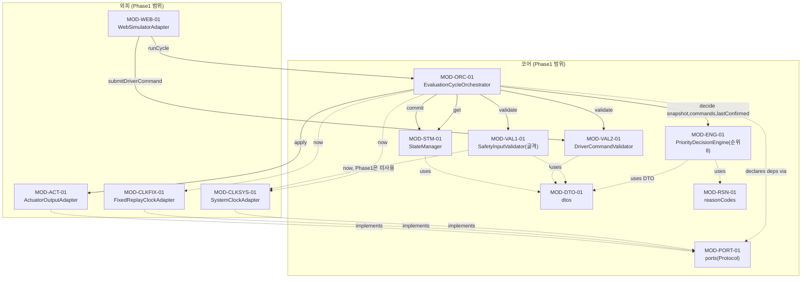

# SWD-001 SW 상세설계서 (Phase 1: 기반 구조 + 수동 명령 처리) — 전자식 차일드락 제어 SW

## 문서 통제

| 항목 | 내용 |
|---|---|
| 문서 ID / 명칭 | SWD-001 / SW 상세설계서(Phase 1) — 전자식 차일드락 제어 SW |
| 적용 템플릿 | `WP_Templates/Engineering/SoftwareDetailedDesignAndUnitConstruction/TPL-SWE3-001_SW 상세설계서 템플릿.docx`(섹션 1~15 구조를 그대로 따름), 다이어그램 표기는 `TPL-SWE3-002`(drawio) 규칙을 Mermaid로 표현 |
| 적용 프로세스 | A-SPICE 4.1 SWE.3 |
| 상위 산출물(재정의하지 않고 세분화만 함) | `SWA-001_SW 아키텍처 설계서.md`(§3~§14, 특히 §14.2 Phase1~4 매핑표, §11.2 INT-01~19) |
| 버전 / 베이스라인 | Rev 0.2 / BL-OEM-1.0 |
| 작성자 | 상세설계 에이전트(detailed-designer) |
| 검토 요청 대상 | jay.kim3063@gmail.com |
| 승인자 | 대기 — 가상 OEM-A 역할을 겸임하는 사용자(jay.kim3063@gmail.com) |
| 작성 상태 | Phase 1 범위 1~18절 최초 작성 완료(Draft), 검토 대기. Rev 0.2에서 명명 규칙(camelCase) 전역 적용 반영(개정 이력 참조) |

**교육용 시나리오 고지**: 본 문서는 SW 품질교육을 위한 가상 OEM-A 입력(`OEM_Sample/OEM-SWR-001_OEM SW 요구사항 사양서.docx`) 기반 교육용 산출물이며, 실제 제작사의 사양을 나타내지 않는다. 본 문서와 이를 생성한 방법론(`detailed-design` 스킬)은 실무 보조 도구이며 Automotive SPICE(A-SPICE) PAM 및 ISO 26262 Part 6 원문 표준을 대체하지 않는다.

**범위 고지**: 본 문서는 **Phase 1(기반 구조 + 수동 명령 처리)만** 다룬다. SWR-001, 002, 004, 019(+ SWR-013-A/B 골격)를 대상으로 하며, 안전신호 전 범위 검증(SWR-013-A/B 전체), 접근위험/override(SWR-005/006/009), 충돌/화재/ISOFIX/ignition-off/자동잠금(SWR-003,007,008,017,018,020,021), 상태조회/표시/레코드(SWR-010~012,014~016)는 **본 문서 범위 밖**이며 Phase 2~4 상세설계에서 다룬다(`SWA-001` §14.2).

## 개정 이력

| Rev | 일자 | 작성자 | 변경 내용 |
|---|---|---|---|
| 0.1 | 2026-09-18 | 상세설계 에이전트 | 최초 작성. `SWA-001` §14.2 Phase1 범위(SWC-ADP-CLK-*, SWC-VAL-01 골격, SWC-VAL-02, SWC-STM-01 초기값, SWC-ENG-01 순위8, SWC-ORC-01, SWC-ADP-ACT, SWC-ADP-WEB 골격, INT-01~07)를 모듈/함수 단위로 세분화. `SWA-001` 부록A 항목5(WebSimulatorAdapter 평가주기 트리거 시점) 확정. `SWA-001` 문서 내부 불일치 1건(§6.1 IF-INT-012 시그니처 vs §5.1/§5.2/§7.1의 `decide()`-`StateManager.get()` 호출경로) 발견 및 해소 결정 기록(§3.4, §16). |
| 0.2 | 2026-09-18 | 상세설계 에이전트 | 사용자 결정("CLAUDE.md 낙타표기법을 공개 인터페이스에도 예외 없이 전역 적용, snake_case 예외 없음")에 따라 본 문서의 모든 공개 함수명·매개변수명·DTO 필드명·비공개 헬퍼명을 camelCase로 전면 갱신(§5, §7, §9, §11, §12, §14, §16 전체 영향). `SWA-001` Rev 0.2(동일 결정 반영, §5.1/§5.2/§7.1 불일치 정정 포함)와 정합화. §13.2 "명명 규칙 상충"을 미해결에서 해결됨으로 갱신하고, 남은 예외(표준 라이브러리 강제 식별자 `do_POST`/`do_GET`/`serve_forever`, 소스 파일명, OEM 프로토콜 리터럴 값, `.pylintrc` 상수 규칙 조정 필요성)를 명시했다. §18.3 총괄표 항목3을 해결됨으로 갱신. |

---

## 1. 목적 및 적용범위

### 1.1 목적

본 문서는 `SWA-001_SW 아키텍처 설계서.md`가 확정한 컴포넌트 경계·인터페이스·통합 순서를 재정의하지 않고, Phase 1 범위에 해당하는 아키텍처 요소(SWC-ADP-CLK-SYS/FIX, SWC-VAL-01[골격], SWC-VAL-02, SWC-STM-01[초기값], SWC-ENG-01[순위8만], SWC-ORC-01, SWC-ADP-ACT, SWC-ADP-WEB[골격])를 A-SPICE SWE.3 절차에 따라 모듈/함수/자료구조 단위로 상세설계한다. 본 문서는 이후 `coding`(TDD) 단계의 구현 기준선이 된다.

### 1.2 적용범위

- 대상 SW 요구사항: SWR-001, SWR-002, SWR-004, SWR-019 (+ SWR-013-A/013-B는 **골격 수준**만 — 실제 안전신호 형식/범위/freshness 검증 로직은 Phase 2에서 구현).
- 대상 Use Case: UC-001(운전자 다중경로 명령 처리, `SWE1-002` §4.1). UC-003(상태조회)은 Phase 4 범위(`SWA-001` §14.2 — SWC-QRY-01/SWC-DSP-01은 Phase1 아키텍처 요소 목록에 없음)이므로 본 문서에서 API 상세로 다루지 않으며, §9(정책 의사결정표)/§10(상태전이)/§11(Web·API 상세)에서 그 경계를 명시한다.
- 개발 언어: Python 3.12, 표준 라이브러리(`http.server`, `json`, `time`, `typing`, `dataclasses`, `enum` 등)만 사용. 외부 의존성 없음(`SWA-001` §2.7).
- 대상 조직/생명주기 단계: SWE.3(상세설계, 코드는 다음 단계 `coding`/TDD가 작성).

### 1.3 적용 경계

- **재정의 금지**: 컴포넌트 경계(SWC-*), 내부/외부 인터페이스 ID(IF-INT-*/IF-EXT-*)와 시그니처, 통합 순서(INT-01~19)는 `SWA-001`이 이미 확정했으며 본 문서는 이를 그대로 승계해 모듈/함수 단위로 세분화한다. 시그니처를 변경하지 않는다(단 §3.4에서 발견한 내부 불일치 1건은 해소 결정과 근거를 명시하고 상위 문서 보정 권고로 남긴다).
- Phase 2~4 범위(안전신호 전체 검증, 접근위험/override, 충돌/화재/ISOFIX/ignition-off/자동잠금, 레코드/조회/표시)는 본 문서에서 구현하지 않으며, 해당 확장이 들어갈 자리(포트 시그니처, 정책 테이블의 빈 슬롯, 우선순위 판정 스텝 목록)만 명시적으로 남긴다(`SWA-001` §2.6 OCP 원칙 승계).
- HIL, 실차, 타깃 ECU, ISO 26262 Part 3(HARA/ASIL 도출), 공식 심사·인증은 범위 밖(`SWA-001` §1.3과 동일).
- 실제 구현(코드) 및 단위시험 작성은 본 문서의 범위가 아니다(다음 단계 `coding`/TDD 담당). 본 문서는 "무엇을 구현해야 하는가(계약)"까지만 정의한다.

---

## 2. 모듈 분해

### 2.1 소스 위치 규약 (신규 정의 — 아키텍처가 지정하지 않은 사항)

`SWA-001`은 소스 파일 경로를 지정하지 않았으므로, 본 상세설계 단계에서 다음 패키지 구조를 신규로 정의한다(구현 경계는 §15 참조):

```
src/
  childlock/
    core/
      dtos.py
      ports.py
      reasonCodes.py
      safety_input_validator.py
      driver_command_validator.py
      stateManager.py
      priority_decision_engine.py
      evaluation_cycle_orchestrator.py
    adapters/
      clock_system.py
      clock_fixed.py
      actuator_output_adapter.py
      web_simulator_adapter.py
tests/
  unit/
    core/...
    adapters/...
```

### 2.2 모듈 분해표 (Phase 1 범위)

| 모듈 ID | 대응 아키텍처 요소 | 소스 위치 | 책임(단일 문장) | 응집도 판정 | 판정 근거 |
|---|---|---|---|---|---|
| MOD-DTO-01 | (공용, SWC-DEF-01과 인접) | `core/dtos.py` | 코어 전역에서 공유되는 값 객체(DTO)·열거형을 선언한다(로직 없음). | 기능적 | 데이터 타입 선언이라는 단 하나의 성격을 가짐(우연적 응집 아님 — 모든 원소가 "코어 DTO 계약"이라는 동일 목적) |
| MOD-RSN-01 | SWC-DEF-01(Phase1 부분집합) | `core/reasonCodes.py` | Phase 1에서 사용하는 reasonCode/거절이유 상수를 정의한다. | 기능적 | 상수 정의만 담당, 판정/검증 로직 없음 |
| MOD-PORT-01 | SWC-ORC-01/ENG-01/VAL-01/VAL-02의 Required/Driving Port 선언 (§2.4) | `core/ports.py` | 코어가 필요로 하거나(Driven) 제공하는(Driving) 능력을 `typing.Protocol`로 선언한다(구현 없음). | 기능적 | 전 원소가 "포트 인터페이스 선언"이라는 동일 추상화 계층 산출물(§3.4에서 상세 판단 근거 추가 설명) |
| MOD-VAL1-01 | SWC-VAL-01 (**골격**) | `core/safety_input_validator.py` | Vehicle측 신호 버퍼를 유지하고, Phase 1 골격 수준의 `validate()` 계약을 제공한다(실제 freshness/범위 검증은 Phase 2). | 기능적 | "Vehicle 입력 버퍼링·조회 제공"이라는 단일 책임(Phase1 한정) |
| MOD-VAL2-01 | SWC-VAL-02 | `core/driver_command_validator.py` | 운전자 명령(OEM-IF-004) 필드의 완전성·enum 유효성을 검증해 수락/거절을 결정한다. | 기능적 | "운전자 명령 검증"이라는 단일 책임 |
| MOD-STM-01 | SWC-STM-01 (**초기값/보관만**) | `core/stateManager.py` | 마지막으로 확정된 lockLeft/lockRight/controlState를 보관·제공한다. | 기능적 | "마지막 확정 출력 보관"이라는 단일 책임 |
| MOD-ENG-01 | SWC-ENG-01 (**순위8만**) | `core/priority_decision_engine.py` | 순위 8(운전자 명령)에 대해서만 좌·우 도어 출력을 결정한다(순위1~7은 Phase2/3 확장 슬롯으로 명시). | 기능적 | "우선순위 판정"이라는 단일 책임(구현 범위는 Phase1로 한정되나 책임 성격은 변하지 않음) |
| MOD-ORC-01 | SWC-ORC-01 | `core/evaluation_cycle_orchestrator.py` | 매 평가주기의 실행 순서(검증→판정→커밋→출력적용)를 결정론적으로 고정 실행한다. | 기능적 | "실행순서 보증"이라는 단일 책임 |
| MOD-CLKSYS-01 | SWC-ADP-CLK-SYS | `adapters/clock_system.py` | 실시간 단조증가 시각을 제공한다. | 기능적 | "시각 제공"이라는 단일 책임 |
| MOD-CLKFIX-01 | SWC-ADP-CLK-FIX | `adapters/clock_fixed.py` | PC/SIL 자동시험용 결정론적 고정시계를 제공한다. | 기능적 | "결정론적 시각 제공/전진"이라는 단일 책임 |
| MOD-ACT-01 | SWC-ADP-ACT | `adapters/actuator_output_adapter.py` | 코어의 출력 결정을 PC/SIL 가상 액추에이터 경계에 적용한다. | 기능적 | "출력 적용"이라는 단일 책임 |
| MOD-WEB-01 | SWC-ADP-WEB (**골격**) | `adapters/web_simulator_adapter.py` | `http.server.HTTPServer`(단일 스레드) 기반으로 운전자 명령 제출 경로(IF-EXT-004)만 서빙한다(상태조회/표시는 Phase4). | 기능적 | "HTTP 경계 번역"이라는 단일 책임(Phase1은 명령 경로 1건으로 한정) |

**논리적/우연적 응집으로 판정된 모듈 없음.** 각 모듈은 위 표의 "판정 근거" 열에 기재된 단일 성격만 가지며, 서로 무관한 기능을 모아놓은 모듈은 없다.

### 2.3 Phase 1 비대상 명시 (OCP 확장 슬롯)

- `SWC-OVR-01`(ApproachRiskOverrideTracker), `SWC-REC-01`(DecisionRecordStore), `SWC-QRY-01`(StatusQueryService), `SWC-DSP-01`(DisplaySerializer), `SWC-DEF-01`의 Phase2~4 부분, `SWC-ADP-VEH`/`SWC-ADP-CMD`(Web 이외의 실제 채널 어댑터)는 본 문서에서 설계하지 않는다.
- `MOD-ENG-01.decide()`는 순위 1~7 판정 스텝을 위한 확장 지점(§7 알고리즘, §9 정책표)만 남기며, `MOD-VAL1-01.validate()`는 Phase2에서 실제 검증 로직으로 교체될 골격임을 코드 주석/함수 docstring에 명시하도록 §12(코딩 규칙)에 지침을 남긴다.

---

## 3. 상세 호출관계

### 3.1 Phase 1 호출 그래프



### 3.2 순환 의존 검증

위상정렬 결과: `DTO/RSN/PORT`(최하위, 의존 없음) → `CLKSYS/CLKFIX/VAL1/VAL2/STM`(1차, DTO/PORT에만 의존) → `ENG`(2차, DTO/RSN에만 의존, STM/VAL1/VAL2를 직접 참조하지 않음 — §3.4 참조) → `ACT`(1차, PORT에만 의존) → `ORC`(3차, VAL1/VAL2/ENG/STM/PORT에 의존) → `WEB`(4차, VAL2/ORC에 의존). **순환 의존이 발견되지 않았다(DAG).** `SWA-001` §5.1의 정적 의존 그래프(어댑터→코어, 코어 상위→중위→하위 단방향)와 방향이 일치한다.

### 3.3 DIP 확인

`MOD-ORC-01`은 `MOD-VAL1-01`/`MOD-VAL2-01`/`MOD-ENG-01`/`MOD-STM-01`의 구체 클래스가 아니라 `MOD-PORT-01`이 선언한 `SafetyValidationPort`/`DriverCommandValidationPort`/`DecisionEnginePort`/`StateManagerPort` Protocol 타입으로 생성자 주입을 받는다(`SWA-001` §4.1 SWC-ORC-01 DIP 판정 "자신이 선언한 필요 인터페이스로만 참조"를 그대로 승계). `MOD-WEB-01`도 `DriverCommandSubmissionPort`/`EvaluationCyclePort` Protocol로 의존한다. 하위(어댑터)가 상위(코어 정책)의 구체 함수를 직접 호출하는 역방향 의존은 없다.

### 3.4 발견된 상위 문서 내부 불일치와 해소 결정 (보고 및 근거)

**불일치 내용**: `SWA-001` §6.1 IF-INT-012의 공식 시그니처는 `decide(snapshot, commands, lastConfirmed) -> DecisionResult`로 `lastConfirmed`를 **매개변수**로 명시한다. 그런데 §5.1(정적 의존 그래프의 "ENG --> STM" 화살표), §5.2(결합도 판정표 "SWC-ENG-01 → SWC-STM-01 | 데이터 | `Get()`(읽기 전용)"), §7.1(UC-001 시퀀스 다이어그램의 "ENG->>STM: IF-INT-011 get()")은 Engine이 StateManager를 **직접 호출**하는 것으로 그린다. §6.1 IF-INT-011의 제공자/사용자 칸도 사용자로 `SWC-ENG-01, SWC-QRY-01`을 명시해 ORC-01을 사용자로 포함하지 않는데, 반면 §5.2는 "SWC-ORC-01 → SWC-STM-01 | Commit(decisionResult)/**Get()**"로 ORC도 Get()을 호출한다고 기재한다. 즉 "누가 StateManager.get()을 호출하는가"에 대해 §5/§7(내러티브/시퀀스도)과 §6.1(공식 인터페이스 표)이 서로 다른 그림을 제시한다.

**해소 결정(Phase1 상세설계 채택)**: §6.1의 공식 시그니처(`decide`가 `lastConfirmed`를 매개변수로 받음)를 문자 그대로 우선 적용한다. 따라서 `MOD-ORC-01`이 `StateManager.get()`을 호출해 `lastConfirmed`를 획득한 뒤 `MOD-ENG-01.decide(...)`에 값으로 전달하며, `MOD-ENG-01`은 `StateManager`에 대한 참조/의존을 전혀 갖지 않는다(무상태 순수 함수, 파라미터로만 데이터를 받음).

**근거**: (1) §3.2 "표(§6 인터페이스 명세)에 없는 호출은 금지된다"는 원칙에서 §6이 §5/§7보다 규범적 우선순위가 높다고 해석. (2) 이 해석은 `SWA-001` §2.2(데이터 결합 목표)·§4 SWC-ENG-01 책임 서술("무상태 순수 함수")에 더 부합하며, Engine이 StateManager 컴포넌트 참조 자체를 갖지 않게 되어 결합이 오히려 더 낮아진다(데이터 결합 강화, 결합도 축소는 원칙 위반이 아니라 원칙의 더 엄격한 구현). (3) 시그니처(함수명·파라미터)를 바꾸지 않았으므로 "상위 인터페이스 재정의 금지" 원칙을 위반하지 않는다.

**보고**: 이는 상세설계가 자의적으로 인터페이스를 바꾼 것이 아니라, 상위 문서 자체의 내부 불일치를 발견하고 공식 표(§6.1)를 기준으로 해소한 것이다. `SWA-001` 개정 시 §5.1/§5.2/§7.1의 다이어그램을 §6.1과 일치하도록 정정할 것을 권고한다(경미한 불일치이며 Phase1 외부 동작·안전성에는 영향 없음).

---

## 4. 공통 자료형

> 아래는 코딩 단계(`coding`/TDD)가 그대로 구현할 자료형 계약이다(의사코드, 실제 `.py` 작성은 다음 단계). 위치는 `core/dtos.py`(MOD-DTO-01) 단일 정의처이며, 다른 모듈은 이 정의를 import해서만 사용한다(중복 정의 금지).

```python
# core/dtos.py — 공통 자료형 (의사코드, 실제 구현은 coding 단계)

class LockState(Enum):        # OEM-IF-005 열엄값
    LOCK = "LOCK"
    RELEASE = "RELEASE"

class ControlState(Enum):     # SWC-STM-01 controlState (SWA-001 §8.2)
    NORMAL = "NORMAL"
    FAULT = "FAULT"            # Phase2(SWR-021) 확장 예정 — Phase1은 할당하지 않음
    OFF = "OFF"                # Phase3(SWR-020) 확장 예정 — Phase1은 할당하지 않음

class FieldValidity(Enum):    # SafetyInputValidator 필드별 판정 (SWR-013-B)
    VALID = "VALID"
    INVALID = "INVALID"

class FreshnessStatus(Enum):  # SafetyInputValidator freshnessStatus (SWR-013-A, IF-INT-016)
    OK = "OK"
    DEGRADED = "DEGRADED"

@dataclass(frozen=True)
class ValidatedDriverCommand:      # IF-INT-009 반환 원소, SWR-019
    side: str                       # "left" | "right" | "all" (원문 값 보존, enum화는 검증 후에도 하지 않음 — 오류 메시지 가독성 목적)
    action: str                     # "lock" | "unlock"
    source: str                     # "physical_button" | "avn" | "voice" | "mobile_app"
    accepted: bool
    rejectionReason: str | None    # accepted=False일 때만 설정, 그 외 None

@dataclass(frozen=True)
class ValidatedVehicleSnapshot:    # IF-INT-008 반환값, SWR-013-A/B (Phase1: 골격)
    fieldValidity: Mapping[str, FieldValidity]   # 불변 매핑(MappingProxyType) — 방어적 복사 필수(SWA-001 §2.7)
    freshnessStatus: FreshnessStatus

@dataclass(frozen=True)
class LastConfirmedOutput:         # IF-INT-011 반환값, SWR-021
    lockLeft: LockState
    lockRight: LockState
    controlState: ControlState

@dataclass(frozen=True)
class DecisionResult:              # IF-INT-012 반환값, SWR-001,002,004,019,022(전체 계약, Phase1은 순위8만 채움)
    lockLeft: LockState
    lockRight: LockState
    controlState: ControlState
    reasonCode: str
    overrideLeft: bool = False    # Phase2(SWC-OVR-01) 확장 슬롯 — Phase1은 항상 False
    overrideRight: bool = False   # Phase2 확장 슬롯 — Phase1은 항상 False

@dataclass(frozen=True)
class CycleOutcome:                 # IF-INT-005 반환값 요약 (SWA-001 §6.1 "반환값 없음 또는 요약결과")
    succeeded: bool
    errorMessage: str | None = None
```

**불변조건**: 모든 DTO는 `frozen=True`(재할당 금지)이며, 가변 컨테이너(dict/list)를 필드로 가질 경우 `types.MappingProxyType`/`tuple`로 방어적 복사해 전달한다(`SWA-001` §2.7 "포인터 등가 개념 제한" 승계). **직렬화 규칙**: Phase1에서는 이 DTO들을 JSON으로 직렬화하는 책임 있는 모듈이 없다(직렬화는 `SWC-DSP-01`의 Phase4 책임). **단일 정의 위치**: 위 자료형은 오직 `core/dtos.py`에만 정의하며, 다른 모듈이 동일 개념을 재정의하지 않는다.

---

## 5. 핵심 함수 계약

> 형식은 `references/function-contracts-and-build-order.md` 1절 표를 따른다. "재진입성"은 `SWA-001` §2.8(단일 스레드 순차 처리) 전제 위에서 판정한다.

### 5.1 MOD-PORT-01 (`core/ports.py`) — Protocol 선언 (구현 없음, 계약만)

| Protocol | 시그니처 | 대응 아키텍처 인터페이스 |
|---|---|---|
| `ClockPort` | `now() -> float` | IF-INT-004 |
| `ActuatorOutputPort` | `apply(lockLeft: LockState, lockRight: LockState) -> None` | IF-INT-003 |
| `SafetyValidationPort` | `validate(now: float) -> ValidatedVehicleSnapshot` | IF-INT-008 |
| `DriverCommandValidationPort` | `validate() -> list[ValidatedDriverCommand]` | IF-INT-009 |
| `DecisionEnginePort` | `decide(snapshot: ValidatedVehicleSnapshot, commands: list[ValidatedDriverCommand], lastConfirmed: LastConfirmedOutput) -> DecisionResult` | IF-INT-012 |
| `StateManagerPort` | `get() -> LastConfirmedOutput`; `commit(decision: DecisionResult) -> None` | IF-INT-011, IF-INT-013 |
| `DriverCommandSubmissionPort` | `submitDriverCommand(side: str, action: str, source: str) -> None` | IF-INT-002 |
| `EvaluationCyclePort` | `runCycle() -> CycleOutcome` | IF-INT-005 |

이 Protocol들은 §3.3(DIP)에서 서술한 대로 `MOD-ORC-01`/`MOD-WEB-01`의 생성자 타입 힌트로 사용되며, 각 Protocol은 사용자가 실제로 쓰는 연산만 노출한다(ISP — 예: `MOD-ORC-01`은 `DriverCommandValidationPort.validate()`만 필요하고 `submitDriverCommand()`는 필요 없으므로 별도 Protocol로 분리했다).

### 5.2 MOD-VAL1-01 — SafetyInputValidator(골격)

| 필드 | FN-VAL1-001 | FN-VAL1-002 |
|---|---|---|
| 함수 ID | FN-VAL1-001 | FN-VAL1-002 |
| 소속 모듈 | MOD-VAL1-01 | MOD-VAL1-01 |
| 시그니처 | `submitVehicleSignal(self, groupId: str, fields: Mapping[str, object], sourceTimestampS: float) -> None` | `validate(self, now: float) -> ValidatedVehicleSnapshot` |
| 사전조건 | `groupId`는 빈 문자열이 아닌 문자열 | 없음 |
| 사후조건 | 내부 버퍼(캡슐화, 외부 비공개)에 `groupId`의 최신 `(fields, sourceTimestampS)`로 갱신(덮어쓰기) | **Phase1 골격 동작**: 모든 필드 `FieldValidity.VALID`, `freshnessStatus=FreshnessStatus.OK`로 고정된 `ValidatedVehicleSnapshot`을 반환한다(버퍼 내용을 실제로 검사하지 않음) |
| 부작용 | 내부 버퍼 갱신(비공개 상태, 외부에서 직접 접근 불가) | 없음(순수 조회) |
| 오류/예외 계약 | 미등록 `groupId`라도 예외를 던지지 않는다. Phase1은 화이트리스트 검사를 아직 수행하지 않는다(**Phase2(INT-11)에서 IF-EXT-001/002/003/007/008/009 화이트리스트+형식/범위 검증으로 교체 예정** — 함수 docstring에 명시) | 예외 없음(항상 값 반환) |
| 시간 제약 | O(1), 동기 | O(1), 동기. 최종 목표는 100ms 이내(SWR-013-A, Phase2부터 유효) |
| 재진입성 | 단일 스레드 전제, 재진입 대비 불필요(SWA-001 §2.8) | 재진입 가능(순수 조회, 부작용 없음) |
| 할당 요구사항 | SWR-013-A/B(골격), IF-INT-001 | SWR-013-A/B(골격), IF-INT-008 |

**Phase1 스코프 고지**: 이 컴포넌트가 실제로 안전신호(vehicleSpeedKph, gear, crashStatus 등)의 freshness/형식/범위를 검증하는 로직은 **본 Phase에 포함되지 않는다**(작업 지시 원문: "이 Phase에서는 SWR-019 운전자명령 필드 검증만[실질적으로 구현], 안전신호 검증은 Phase2"). `MOD-VAL1-01`은 Phase1 Engine(순위8만 구현)이 vehicle snapshot을 전혀 소비하지 않으므로 안전에 영향을 주지 않는다(Engine 계약 §5.4 참조). 이 결정을 `validate()` 함수 docstring과 모듈 상단 주석에 "TODO(Phase2, INT-11): 실제 검증 로직으로 교체"로 명시하도록 §12에 코딩 지침을 남긴다.

### 5.3 MOD-VAL2-01 — DriverCommandValidator

| 필드 | FN-VAL2-001 | FN-VAL2-002 |
|---|---|---|
| 함수 ID | FN-VAL2-001 | FN-VAL2-002 |
| 시그니처 | `submitDriverCommand(self, side: str, action: str, source: str) -> None` | `validate(self) -> list[ValidatedDriverCommand]` |
| 사전조건 | 없음(원시값 그대로 수신) | 없음 |
| 사후조건 | 내부 큐(비공개 리스트)에 원시 명령 `(side, action, source)` append | 큐에 있던 **모든** 원시 명령에 대해 SWR-019 규칙(`side ∈ {left,right,all}`, `action ∈ {lock,unlock}`, `source ∈ {physical_button,avn,voice,mobile_app}`, 3필드 모두 존재)을 적용해 `ValidatedDriverCommand` 리스트를 생성·반환하고, **반환 후 내부 큐를 비운다**(다음 평가주기 중복 처리 방지) |
| 부작용 | 내부 큐 갱신 | 내부 큐 초기화(비움) |
| 오류/예외 계약 | 예외 없음(형식 검증은 `validate()`에서 수행) | 필드 누락/형식오류/미등록 enum → 해당 원소 `accepted=False`, `rejectionReason`에 사유 상수(`core/reasonCodes.py`의 `rejectionMissingField` \| `rejectionInvalidEnum`) 대입. 예외를 던지지 않는다 |
| 시간 제약 | O(1), 동기 | O(n), n=큐 길이, 동기 |
| 재진입성 | 단일 스레드 전제 | 단일 스레드 전제(호출마다 큐를 비우므로 재진입 시 순서 보장 안 됨 — 단일 스레드 모델에서만 안전, 명시) |
| 할당 요구사항 | SWR-019, IF-INT-002 | SWR-019, IF-INT-009 |

**내부 분해 지침(§12 복잡도 상한 대비)**: `validate()`는 원소별 판정을 비공개 헬퍼 `_classifyCommand(raw) -> tuple[bool, str | None]`로 분리해 순환복잡도를 낮춘다(비공개 헬퍼는 공개 계약이 아니므로 별도 계약행을 두지 않음).

### 5.4 MOD-ENG-01 — PriorityDecisionEngine(순위8만)

| 필드 | 내용 |
|---|---|
| 함수 ID | FN-ENG-001 |
| 시그니처 | `decide(self, snapshot: ValidatedVehicleSnapshot, commands: list[ValidatedDriverCommand], lastConfirmed: LastConfirmedOutput) -> DecisionResult` |
| 사전조건 | `snapshot`은 `MOD-VAL1-01.validate()`의 결과(Phase1은 항상 골격값), `commands`는 `MOD-VAL2-01.validate()`의 결과(이미 accepted/rejected 판정됨), `lastConfirmed`는 `MOD-STM-01.get()`의 결과 |
| 사후조건 | **Phase1 범위**: 순위 1~7은 항상 "무효"로 간주(스텁)한다. 좌/우 각 도어에 대해 `commands` 중 `accepted=True`이고 (`side==해당도어` 또는 `side=="all"`)인 원소가 있으면 **큐 제출 순서상 마지막 원소**를 채택해 그 `action`에 따라 `LockState.LOCK`(action="lock") 또는 `LockState.RELEASE`(action="unlock")를 그 도어의 출력으로 결정한다. 대상 명령이 없는 도어는 `lastConfirmed`의 해당 값을 그대로 유지한다. `controlState`는 항상 `ControlState.NORMAL`. `overrideLeft`/`overrideRight`는 항상 `False`. `reasonCode`는 좌·우 중 하나 이상이 명령으로 변경되었으면 `reasonDriverCommand`, 아니면 `reasonNoActiveTrigger`(`core/reasonCodes.py`) |
| 부작용 | 없음(무상태 순수 함수) |
| 오류/예외 계약 | 없음(입력이 이미 검증되었음이 보장됨). `snapshot`은 Phase1에서 읽지 않지만 시그니처는 유지한다(Phase2 확장을 위한 안정적 계약, `SWA-001` §2.6 OCP) |
| 시간 제약 | 300ms 예산 내(SWR-007 근거, IF-INT-012 승계), O(len(commands)), 재진입 가능(무상태) |
| 할당 요구사항 | **구현**: SWR-001, SWR-002, SWR-004, SWR-019. **계약 시그니처만 선점(Phase2/3 구현 예정)**: SWR-003,005,006,007,008,009,017,018,020,021,022 |

**동시 명령 충돌 처리 규칙(신규, Phase1 상세설계 결정)**: 동일 평가주기 내 동일 도어를 대상으로 하는 유효(accepted) 명령이 복수 존재하는 경우, `SWE1-001`/`SWA-001` 어디에도 명시적 중재 규칙이 없다. 결정론(SWR-016) 보장을 위해 "큐 제출 순서상 마지막 원소 채택"을 Phase1 상세설계 규칙으로 정한다. 이는 §11(Web/API 상세)의 "요청당 1회 평가주기" 기본값 하에서는 사실상 발생 빈도가 낮은(주로 PC/SIL 시험 하니스가 한 주기 내 여러 `submitDriverCommand()`를 호출하는 경우에만 발생하는) 엣지케이스이지만, 명시적으로 결정론적 규칙을 두어 SWR-016을 해치지 않도록 한다.

**미해결 승계 사항(임의 해소하지 않음)**: `SWA-001` 부록A 항목4(좌/우가 서로 다른 순위의 사유로 결정될 때 단일 `reasonCode` 필드 표기 규칙)는 Phase1에서는 트리거 종류가 1개(운전자 명령)뿐이라 표면화되지 않으나, Phase2/3에서 좌/우가 서로 다른 우선순위로 결정되는 경우(예: 좌측 ISOFIX·우측 ignition-off) 다시 나타난다. 본 문서는 이를 앞당겨 해소하지 않고 `SWA-001`이 정한 대로 Phase4(SWC-REC-01/QRY-01) 상세설계 시점 재확인 대상으로 유지한다.

### 5.5 MOD-STM-01 — StateManager

| 필드 | FN-STM-001 (생성자) | FN-STM-002 | FN-STM-003 |
|---|---|---|---|
| 함수 ID | FN-STM-001 | FN-STM-002 | FN-STM-003 |
| 시그니처 | `__init__(self) -> None` | `get(self) -> LastConfirmedOutput` | `commit(self, decision: DecisionResult) -> None` |
| 사전조건 | 없음 | 없음 | `decision`은 `MOD-ENG-01.decide()`의 반환값(이미 결정 완료) |
| 사후조건 | 내부 상태를 `lockLeft=RELEASE, lockRight=RELEASE, controlState=NORMAL`로 초기화(SWA-001 §4 SWC-STM-01, "시스템 기동 시 안전한 기본값") | 현재 내부 상태를 담은 `LastConfirmedOutput` 반환(순수 조회) | 내부 `lockLeft/lockRight/controlState`를 `decision`의 값으로 갱신(override 필드는 저장하지 않음 — LastConfirmedOutput DTO에 override 필드가 없음, 아키텍처가 정의한 DTO 그대로 승계) |
| 부작용 | 내부 상태 생성 | 없음 | 내부 상태 변경(유일한 쓰기 지점) |
| 오류/예외 계약 | 없음 | 없음 | 없음 |
| 시간 제약 | O(1) | O(1), 재진입 가능 | O(1), 단일 스레드(동시성 제어 불필요, SWA-001 §2.8) |
| 할당 요구사항 | SWR-021 | SWR-021, IF-INT-011 | SWR-021, IF-INT-013 |

**초기값 안전성 재확인 필요(승계)**: `SWA-001` §4 SWC-STM-01 비고("초기값의 안전성 재확인은 §11.4 참조")를 그대로 승계한다 — RELEASE/RELEASE/NORMAL 초기값이 모든 실제 배치 시나리오에서 최적의 안전 기본값인지는 ISO 26262 Part 3/HARA 범위이며 본 프로젝트 경계 밖이다(재확인 필요, 임의 확정하지 않음).

### 5.6 MOD-ORC-01 — EvaluationCycleOrchestrator

| 필드 | 내용 |
|---|---|
| 함수 ID | FN-ORC-001 (생성자), FN-ORC-002 (`runCycle`) |
| 시그니처 | `__init__(self, safetyValidator: SafetyValidationPort, commandValidator: DriverCommandValidationPort, engine: DecisionEnginePort, stateManager: StateManagerPort, actuatorPort: ActuatorOutputPort, clockPort: ClockPort) -> None` / `runCycle(self) -> CycleOutcome` |
| 사전조건 | 생성자 주입 완료(6개 포트 모두 유효 객체) | 없음(호출 시점 언제든 가능) |
| 사후조건 | 아래 순서를 **결정론적으로 고정** 실행한다: (1) `now = clockPort.now()` (2) `commands = commandValidator.validate()` (3) `snapshot = safetyValidator.validate(now)` (4) `lastConfirmed = stateManager.get()` (5) `decision = engine.decide(snapshot, commands, lastConfirmed)` (6) `stateManager.commit(decision)` (7) `actuatorPort.apply(decision.lockLeft, decision.lockRight)` (8) `CycleOutcome(succeeded=True)` 반환 |
| 부작용 | `stateManager` 내부 상태 갱신, `actuatorPort` 적용 호출(외부 관측 가능 부수효과) |
| 오류/예외 계약 | 위 (2)~(7) 중 어느 단계에서든 예외가 발생하면 이를 **포착**하고 `CycleOutcome(succeeded=False, errorMessage=str(exc))`를 반환한다. 예외를 호출자(`MOD-WEB-01`)에게 재전파하지 않는다(SWA-001 §9.2 3차 경계, IF-INT-005 오류계약). 실패 시 `stateManager.commit()`이 아직 호출되지 않았다면 직전 확정 출력이 그대로 유지된다(보수적 동작). **Phase1 한정 고지**: SWE1-001/SWA-001 어디에도 "구체적 안전 상태"가 명시적으로 정의되어 있지 않으므로(SWA-001 §9.3, §11.4 재확인 필요), 이 실패 처리는 "직전 확정 출력 유지"라는 최소 보수 원칙만 적용한 것이며 그 이상의 안전상태 정의는 하지 않는다 |
| 시간 제약 | 300ms 예산 내(SWR-007 근거 승계), 1회 호출=1 평가주기, 단일 스레드(동시 호출 없음) |
| 할당 요구사항 | SWR-004, SWR-016, SWR-022(호출순서), IF-INT-005 |

**Phase1 한정**: `SWC-REC-01`(결정 레코드)이 아직 존재하지 않으므로 `runCycle()`은 레코드 기록(`append`) 단계를 포함하지 않는다. 이는 `SWA-001` INT-06(Phase1)이 레코드 기록을 포함하지 않는 것과 정합적이다(§8 통합순서표 참조).

### 5.7 MOD-CLKSYS-01 / MOD-CLKFIX-01 — Clock 어댑터

| 필드 | FN-CLKSYS-001 | FN-CLKFIX-001 | FN-CLKFIX-002 |
|---|---|---|---|
| 소속 모듈 | MOD-CLKSYS-01 | MOD-CLKFIX-01 | MOD-CLKFIX-01 |
| 시그니처 | `now(self) -> float` | `now(self) -> float` | `advance(self, deltaSeconds: float) -> None` |
| 사전조건 | 없음 | 없음 | `deltaSeconds >= 0.0`(단조증가 계약 유지) |
| 사후조건 | 표준 라이브러리 `time.monotonic()` 값을 그대로 반환(단조증가 실수, IF-INT-004) | 마지막으로 설정된 내부 시각을 반환(자동 전진 없음 — 시험 하니스가 명시적으로 `advance()` 호출) | 내부 시각을 `deltaSeconds`만큼 전진 |
| 부작용 | 없음 | 없음 | 내부 상태 변경 |
| 오류/예외 계약 | 없음(항상 값 반환) | 없음 | `deltaSeconds < 0.0`이면 `ValueError`(단조증가 계약 위반 방지) |
| 시간 제약 | O(1) | O(1), 재진입 가능 | O(1) |
| 할당 요구사항 | SWR-016, IF-INT-004 | SWR-016, IF-INT-004 | SWR-016, IF-INT-004 |

**설계 결정**: `time.time()`(벽시계, 시스템 시각 보정에 의해 역행 가능) 대신 `time.monotonic()`을 사용한다 — IF-INT-004 계약("단조 증가 실수")을 무조건 만족시키기 위함이며, `sourceTimestampS`(Vehicle 신호 자체의 타임스탬프, Phase2 이후 사용)와는 별개의 시계임을 명시한다.

### 5.8 MOD-ACT-01 — ActuatorOutputAdapter

| 필드 | 내용 |
|---|---|
| 함수 ID | FN-ACT-001 (`apply`), FN-ACT-002 (`getLastApplied`, 시험용 보조 API) |
| 시그니처 | `apply(self, lockLeft: LockState, lockRight: LockState) -> None` / `getLastApplied(self) -> tuple[LockState, LockState] \| None` |
| 사전조건 | Engine 판정 완료(호출자 책임) | 없음 |
| 사후조건 | 내부에 `(lockLeft, lockRight)`를 마지막 적용값으로 저장(PC/SIL 가상 적용) | 마지막 적용값 반환(없으면 `None`) |
| 부작용 | 내부 상태 변경(PC/SIL 한정, 실 HW 없음 — SWA-001 §1.3 "논리적 출력 적용 경계까지만") | 없음 |
| 오류/예외 계약 | Phase1 가상 어댑터는 항상 성공(예외 없음). 실 HW 적용 실패 시나리오는 범위 밖(§1.3) | 없음 |
| 시간 제약 | O(1), 평가주기당 1회, 단일 스레드 | O(1) |
| 할당 요구사항 | 전 출력결정 SWR 공통, IF-INT-003 | (시험 편의, SWR 비할당 — §15 구현경계 참조) |

`getLastApplied()`는 `ActuatorOutputPort` Protocol에 포함되지 않는 어댑터 고유 API다(코어는 Protocol 타입으로만 참조하므로 이 메서드를 호출할 수 없다 — ISP/캡슐화 유지, 시험 하니스만 구체 클래스를 직접 참조해 사용).

### 5.9 MOD-WEB-01 — WebSimulatorAdapter(골격)

| 필드 | 내용 |
|---|---|
| 함수 ID | FN-WEB-001 (`buildRequestHandler`, 팩토리), FN-WEB-002 (`do_POST`) |
| 시그니처 | `buildRequestHandler(commandValidator: DriverCommandSubmissionPort, orchestrator: EvaluationCyclePort) -> type[BaseHTTPRequestHandler]` / (인스턴스 메서드) `do_POST(self) -> None` |
| 사전조건 | `commandValidator`/`orchestrator`가 이미 구성됨 | HTTP 요청 수신, 경로가 `/api/driver-command`이고 메서드가 POST |
| 사후조건 | `HTTPServer`에 전달 가능한 핸들러 클래스를 반환(의존성은 클로저로 캡슐화, 전역변수 미사용 — SWA-001 §3.2 "전역 변수 공유 금지" 준수) | 요청 본문을 JSON으로 파싱해 `side/action/source` 키가 모두 존재하면 `commandValidator.submitDriverCommand(side, action, source)` 호출 후 `orchestrator.runCycle()` 호출, 응답 200 + `{"cycleResult": "SUCCESS"}` 또는 `{"cycleResult": "FAILURE", "error": ...}`. JSON 파싱 실패 또는 필수 키 누락 시 응답 400(코어를 호출하지 않음) |
| 부작용 | 없음(팩토리) | 코어 상태 변경(간접, `runCycle` 경유), HTTP 응답 소켓 전송 |
| 오류/예외 계약 | 없음 | 프로토콜 수준 오류(JSON 파싱 실패, 키 누락)는 코어에 전파하지 않고 어댑터가 자체 400 응답 생성(SWA-001 §4 어댑터 행 원칙 "프로토콜 수준 오류를 코어에 전파하지 않음"). 코어 예외는 `runCycle()` 자체가 흡수하므로 어댑터는 추가 처리 불필요 |
| 시간 제약 | O(1) | `runCycle()`의 300ms 예산을 상속, HTTP 오버헤드는 별도(SWA-001 §10.1 트레이드오프) |
| 할당 요구사항 | 구현 기법(비-SWR) | IF-EXT-004, IF-INT-002, IF-INT-005, SWR-001/002/004/019(간접, 경로 제공) |

**Phase1 한정 — 명시적 제약(중요)**: `SWA-001` §14.2 Phase1 인터페이스 목록에는 `IF-INT-006`(QueryStatus), `IF-INT-007`(QueryDisplay), `IF-EXT-006`(Display)가 포함되어 있지 않다(해당 컴포넌트 `SWC-QRY-01`/`SWC-DSP-01`은 Phase4). 따라서 `MOD-WEB-01`은 **HTTP 응답에서 어떤 도어가 LOCK/RELEASE로 결정되었는지, 명령이 실제로 수락/거절되었는지를 알려줄 권한이 있는 통로가 없다** — 그 정보를 조회하려면 아키텍처 §6.1 인터페이스 표에 없는 `SWC-ADP-WEB → SWC-STM-01` 또는 `SWC-ADP-WEB → SWC-ADP-ACT` 직접 호출이 필요한데, 이는 §3.2("표에 없는 호출은 금지")를 위반한다. 그러므로 Phase1 HTTP 응답은 **평가주기 성공/실패 여부만** 반환하도록 설계했다. 이는 교육용 시뮬레이터의 즉시 사용성(어떤 도어가 잠겼는지 바로 보고 싶은 요구)과 상충할 수 있음을 인지하고 있으며, 풍부한 상태/표시 응답은 Phase4(`SWC-QRY-01`/`SWC-DSP-01`) 완성 후 제공된다. **이 제약이 Phase1 교육 시나리오의 사용성에 문제가 된다고 판단되면, 이는 아키텍처 재검토(Phase1 범위에 QueryStatus 최소 버전 포함 여부)가 필요한 사항이므로 사용자 확인을 권장한다** — 본 문서는 이를 임의로 확장하지 않았다.

**PC/SIL 자동시험과의 관계**: `SWA-001` §13 비고에 따라 SWR-019 등의 자동시험은 HTTP 계층을 거치지 않고 `MOD-VAL2-01.validate()` 등 코어 Driving Port를 직접 호출할 수 있으므로, 위 HTTP 응답 제약이 Phase1 검증가능성 자체를 막지는 않는다.

**서버 구동**: `HTTPServer((host, port), handlerClass).serve_forever()`를 호출하는 진입점 함수(예: `runWebSimulator(host, port, commandValidator, orchestrator) -> NoReturn`)를 두되, 이는 블로킹 호출로 단위시험 대상이 아니라 통합/수동시험 대상이다(§15 구현 경계).

---

## 6. 결합도/SOLID 자체 점검표

### 6.1 결합도 판정표 (Phase1 범위)

| 관계(From → To) | 결합도 유형 | 판정 근거 |
|---|---|---|
| MOD-WEB-01 → MOD-VAL2-01 | 데이터 | `submitDriverCommand(side, action, source)` — 3개 원시값만 전달 |
| MOD-WEB-01 → MOD-ORC-01 | 데이터 | `runCycle()` — 매개변수 없음, 반환값은 `CycleOutcome` 값 객체 |
| MOD-ORC-01 → MOD-VAL1-01 | 데이터 | `validate(now)` — 반환값은 `ValidatedVehicleSnapshot` 값 객체 |
| MOD-ORC-01 → MOD-VAL2-01 | 데이터 | `validate()` — 반환값은 리스트(값 객체 목록) |
| MOD-ORC-01 → MOD-STM-01 | 데이터 | `get()`/`commit(decision)` — 값 객체만 이동 |
| MOD-ORC-01 → MOD-ENG-01 | 데이터 | `decide(snapshot, commands, lastConfirmed)` — Engine이 실제로 쓰는 필드만(전부 값 객체) 전달 |
| MOD-ORC-01 → MOD-ACT-01(포트) | 데이터 | `apply(lockLeft, lockRight)` — 열거값 2개만 |
| MOD-ORC-01 → MOD-CLKSYS-01/MOD-CLKFIX-01(포트) | 데이터 | `now()` — 매개변수 없음, 실수 1개 반환 |
| MOD-ENG-01 내부 → MOD-DTO-01/MOD-RSN-01 | 데이터 | 불변 타입/상수 참조(값으로 사용, 공유 가변 상태 아님) |

**공통 결합·내용 결합·제어 결합으로 판정된 관계 없음.** 특히 "동작 모드 플래그"로 호출 대상의 분기를 원격 제어하는 패턴은 Phase1에 존재하지 않는다(제어 결합 회피 확인).

### 6.2 SOLID 자체 점검표

| 모듈/함수 | SRP | OCP | LSP | ISP | DIP |
|---|---|---|---|---|---|
| MOD-DTO-01 | Pass — DTO 선언만 | Pass — 신규 필드는 기존 DTO 확장(default 값)으로 흡수(예: overrideLeft/right) | 해당없음(자료형, 대체구현 없음) | 해당없음 | 해당없음 |
| MOD-PORT-01 | Pass — 포트 선언만 | Pass — 신규 포트는 신규 Protocol 추가로 흡수, 기존 Protocol 수정 불필요 | Pass — 동일 Protocol을 만족하는 구현은 교체 가능 | Pass — Protocol마다 호출자가 실제 쓰는 연산만 노출(§3.3) | 해당없음(정의 자체가 DIP의 기반) |
| MOD-VAL1-01 | Pass — "Vehicle 입력 버퍼링/조회"만 | **조건부 Pass** — Phase2가 `validate()` 본문을 실 검증 로직으로 교체하는 것은 "정책 변경에 따른 조건분기 교체"가 아니라 "미구현 골격을 최초로 완성"하는 계획된 단계적 구현이며, `SWA-001` §4.1이 `SWC-ENG-01`에 대해 채택한 것과 동일한 "조건부 Pass" 판정 방식을 승계한다 | Pass | Pass — `ClockPort`만 의존 | Pass — `ClockPort` Protocol에만 의존 |
| MOD-VAL2-01 | Pass — "운전자 명령 검증"만 | Pass — 신규 필드/enum 추가는 검증 규칙 확장으로 흡수 | Pass | Pass | Pass — 외부 의존 없음(순수 검증) |
| MOD-ENG-01 | Pass — "우선순위 판정"만(Phase1은 순위8) | **조건부 Pass** — `SWA-001` §4.1 SWC-ENG-01과 동일 판정("신규 순위 판정 스텝은 추가로 확장 가능하나 8단계 정책 자체의 순서 변경은 허용하지 않음", §7 알고리즘의 확장 슬롯 설계로 뒷받침) | Pass — 단일 구현체, 계약은 §5.4로 고정 | Pass — `decide()` 하나만 노출 | Pass — `StateManager`에 대한 의존을 전혀 갖지 않음(§3.4 해소 결정으로 DIP가 오히려 더 강화됨) |
| MOD-STM-01 | Pass — "마지막 확정 출력 보관"만 | Pass — 필드 추가는 `commit`/`get` 계약 확장으로 흡수 | Pass | Pass — `get`(읽기)/`commit`(쓰기) 최소 연산만 | Pass — 외부 의존 없음 |
| MOD-ORC-01 | Pass — "실행순서 보증"만 | Pass — 신규 단계(예: Phase4의 레코드 기록) 추가는 `runCycle()` 내부에 단계 추가로 흡수, 기존 단계 로직은 불변 | Pass — 대체 구현 없음 | Pass — `EvaluationCyclePort` 하나만 노출 | Pass — 6개 포트 전부 Protocol로 주입(구체클래스 직접 참조 없음, §3.3) |
| MOD-CLKSYS-01/MOD-CLKFIX-01 | Pass — 어댑터당 정확히 하나의 시계 구현 | Pass — 신규 시계 구현 추가는 `ClockPort`를 만족하는 신규 어댑터 추가로 흡수 | Pass — 동일 포트 계약을 지키는 한 상호 교체 가능(실시간↔고정재생) | Pass | Pass — `ClockPort`를 구현(코어 방향 의존 없음) |
| MOD-ACT-01 | Pass — "출력 적용"만(시험용 조회는 부차) | Pass — 신규 액추에이터 채널은 동일 포트를 구현하는 신규 어댑터로 확장 | Pass | Pass — 코어는 `ActuatorOutputPort`만 사용, `getLastApplied()`는 코어에 노출되지 않음 | Pass — `ActuatorOutputPort` 구현(코어→구체클래스 역참조 없음) |
| MOD-WEB-01 | Pass — "HTTP 경계 번역"만(Phase1은 명령 경로 1건) | Pass — Phase4의 신규 엔드포인트(상태조회)는 신규 `do_GET` 추가로 흡수, 기존 `do_POST` 로직 불변 | Pass — 동일 포트를 구현하는 한 실제 HW 어댑터로 교체 가능(§4 SWC-ADP-WEB 행 승계) | Pass — `DriverCommandSubmissionPort`/`EvaluationCyclePort`만 사용 | Pass — Protocol로 의존, 구체 클래스 직접 참조 없음 |

**Fail 판정 항목 없음.** "조건부 Pass" 2건(MOD-VAL1-01, MOD-ENG-01)은 `SWA-001` §4.1이 이미 적용한 동일한 판정 방식(계획된 단계적 구현은 OCP 위반이 아니라는 상위 문서의 선례)을 그대로 승계한 것이며, 새로운 예외를 만든 것이 아니다.

---

## 7. 핵심 알고리즘

### 7.1 EvaluationCycleOrchestrator.runCycle() 처리 순서

```mermaid
flowchart TD
    Start([runCycle 호출]) --> T0[now = clockPort.now()]
    T0 --> T1[commands = commandValidator.validate()]
    T1 --> T2[snapshot = safetyValidator.validate(now)]
    T2 --> T3["lastConfirmed = stateManager.get()"]
    T3 --> T4["decision = engine.decide(snapshot, commands, lastConfirmed)"]
    T4 --> T5[stateManager.commit(decision)]
    T5 --> T6["actuatorPort.apply(decision.lockLeft, decision.lockRight)"]
    T6 --> Ok([CycleOutcome(succeeded=True)])
    T1 -.예외.-> Err([CycleOutcome(succeeded=False, errorMessage)])
    T2 -.예외.-> Err
    T3 -.예외.-> Err
    T4 -.예외.-> Err
    T5 -.예외.-> Err
    T6 -.예외.-> Err
```

이 순서는 `SWA-001` §4 SWC-ORC-01 흐름("검증→판정→커밋→출력→기록")과 §7.1 UC-001 시퀀스도의 순서를 그대로 따른다(Phase1은 "기록" 단계가 없음, §5.6 참조).

### 7.2 PriorityDecisionEngine.decide() — Phase1 알고리즘 및 확장 슬롯

```python
# 의사코드 — 실제 구현은 coding 단계. 순위1~7은 Phase2/3에서 함수를 "추가"하는 것으로 확장(OCP).

_priorityChecks = (
    # 아래는 Phase1에 실제로 등록되는 유일한 항목이다.
    _checkPriority8DriverCommand,
    # Phase2/3에서 이 튜플의 "앞쪽"에 아래와 같은 항목이 추가될 예정이며,
    # 이는 기존 _checkPriority8DriverCommand의 코드를 수정하지 않고
    # 새 원소를 앞에 삽입하는 것으로 이루어진다(OCP, SWA-001 §2.6):
    #   _checkPriority1Crash,          # SWR-007/008
    #   _checkPriority2FireEtc,        # SWR-017
    #   _checkPriority3SensorFault,    # SWR-021
    #   _checkPriority4ApproachRisk,   # SWR-005/006/009 (OverrideTracker 호출 포함)
    #   _checkPriority5Isofix,         # SWR-018
    #   _checkPriority6IgnitionOff,    # SWR-020
    #   _checkPriority7AutoLock,       # SWR-003
)

def decide(snapshot, commands, lastConfirmed):
    leftOutcome = _resolveDoor("left", commands, lastConfirmed.lockLeft)
    rightOutcome = _resolveDoor("right", commands, lastConfirmed.lockRight)
    anyCommandApplied = leftOutcome.applied or rightOutcome.applied
    reasonCode = reasonDriverCommand if anyCommandApplied else reasonNoActiveTrigger
    return DecisionResult(
        lockLeft=leftOutcome.lockState, lockRight=rightOutcome.lockState,
        controlState=ControlState.NORMAL, reasonCode=reasonCode,
        overrideLeft=False, overrideRight=False,
    )

def _resolveDoor(door, commands, fallbackLockState):
    # Phase1: _priorityChecks 순회는 실질적으로 순위8 하나뿐이므로
    # 직접 마지막-원소-채택 규칙(§5.4)을 적용한다.
    matching = [c for c in commands if c.accepted and c.side in (door, "all")]
    if not matching:
        return DoorOutcome(lockState=fallbackLockState, applied=False)
    last = matching[-1]
    newState = LockState.LOCK if last.action == "lock" else LockState.RELEASE
    return DoorOutcome(lockState=newState, applied=True)
```

**경계값/판단조건**: (1) `commands`가 빈 리스트 → 양쪽 도어 모두 `fallbackLockState` 유지, `reasonCode=reasonNoActiveTrigger`. (2) 동일 도어에 복수 accepted 명령 → 마지막 원소 채택(§5.4 결정론 규칙). (3) `side="all"`이면서 특정 도어에 개별 명령도 있는 경우 → 제출 순서상 마지막 원소가 우선(리스트 순회가 제출 순서를 보존하므로 자연히 만족).

**설계 대안 검토 — 적용하지 않음(근거)**: `decide()`의 알고리즘은 O(n) 선형 탐색(n=한 평가주기 내 명령 수, 실무적으로 1~수 개)이며 성능/메모리/안전성에 의미 있는 트레이드오프가 없는 트리비얼한 로직이다(design-principles.md §5 "트리비얼한 단위에는 적용하지 않는다" 기준 충족). 따라서 대안 비교표/사용자 선택 절차를 적용하지 않는다.

---

## 8. 단위 구현·통합 순서

### 8.1 순서 테이블 (Phase1 내부, INT-01~07과 정합)

| 순서 | 구현 대상(모듈/함수) | 선행조건 | 필요 스텁/드라이버 | 단위시험 관점(검증 목적) | 순서 근거 | 대응 INT |
|---|---|---|---|---|---|---|
| 1 | MOD-DTO-01(`core/dtos.py`) | 없음(최하위) | 없음 | 자료형 인스턴스 생성/불변성(frozen) 확인 | 모든 이후 모듈이 이 자료형을 시그니처에 사용 — 최우선 | (INT-01 선행 공통기반) |
| 2 | MOD-RSN-01(`core/reasonCodes.py`) | 없음 | 없음 | 상수값 존재/중복없음 확인 | Engine(순서8)이 사용, DTO와 독립적이라 병행 가능하나 낮은 순번으로 고정해 결정론 확보 | (INT-05 선행 공통기반) |
| 3 | MOD-PORT-01(`core/ports.py`) | 1(DTO 타입을 시그니처에 사용) | 없음 | `Protocol` 정의에 대해 더미 구현체가 `isinstance`/구조적 타입 검사를 통과하는지 확인 | 이후 모든 모듈의 생성자 타입힌트/DIP 근거 | (INT-01 선행 공통기반) |
| 4 | MOD-CLKSYS-01, MOD-CLKFIX-01 | 3 | 없음(직접 호출 시험) | `now()` 단조증가 확인, `advance()` 경계값(음수 거부) 확인 | `SWA-001` INT-01과 동일(최하위, 거의 모든 상위 컴포넌트가 의존) | INT-01 |
| 5 | MOD-VAL1-01(골격) | 1, 3, 4 | 없음 | `submitVehicleSignal` 버퍼 갱신 확인, `validate()`가 Phase1 고정값(VALID/OK)을 반환하는지 확인 | `SWA-001` INT-02와 동일(골격 수준) | INT-02 |
| 6 | MOD-VAL2-01 | 1 | 없음 | SWR-019 필드검증(정상/누락/오형식/미등록enum) 및 큐 비움(사후조건) 확인 | `SWA-001` INT-03과 동일. Engine 순위8 통합의 전제조건 | INT-03 |
| 7 | MOD-STM-01 | 1 | 없음 | 초기값(RELEASE/RELEASE/NORMAL) 확인, `commit`/`get` 상호작용 확인 | `SWA-001` INT-04와 동일. Engine·Orchestrator 공통 전제조건 | INT-04 |
| 8 | MOD-ENG-01(순위8만) | 1, 2, 6, 7 | 없음(§7.2 `_priorityChecks` 튜플이 이미 확장가능 구조이므로 별도 스텁 불요) | SWR-001/002/004/019 검증기준의 16+8조합 중 Phase1 적용 가능한 서브셋(상위 트리거 부재 조건) 자동시험 | `SWA-001` INT-05와 동일(Phase1 범위는 순위8뿐이므로 먼저 통합 가능) | INT-05 |
| 9 | MOD-ORC-01 + MOD-ACT-01 | 3, 4, 5, 6, 7, 8 | 없음(MOD-ACT-01 자체가 "더미 액추에이터") | 1회 `runCycle()` end-to-end 골격 검증(성공/예외포착 각각) | `SWA-001` INT-06과 동일. 오케스트레이션 골격은 이후 모든 Phase가 재사용 | INT-06 |
| 10 | MOD-WEB-01(골격) | 9 | 없음 | POST `/api/driver-command` 정상/400 케이스 검증(HTTP 계층, 통합시험 수준) | `SWA-001` INT-07과 동일. Phase1 완료 기준 | INT-07 |

### 8.2 상위 아키텍처 통합 전략과의 일관성 확인

`SWA-001` §11.1은 "위험 기반+상향식 혼합"을 전략으로 선택했고, §11.2 INT-01~07이 Phase1의 구체 순서다. 위 표의 순서 1~10은 INT-01→INT-07을 함수/모듈 수준으로 세분화한 것이며, 순서를 역전하거나 생략한 항목이 없다(각 INT 단계는 표의 "대응 INT" 열에서 정확히 1:1 대응). **모순 없음.**

---

## 9. 정책 의사결정표

### 9.1 Phase1 유효 정책 — 도어별 우선순위 8(운전자 명령) 판정

| 조건 | 우선 트리거(순위1~7) | 대상 도어에 accepted 명령 존재 | 기대 동작 | 관련 SWR |
|---|---|---|---|---|
| C1 | 없음(Phase1은 항상 무효로 간주) | 있음(마지막 제출분 채택) | 해당 도어 출력 = 명령의 action(LOCK/UNLOCK→RELEASE) | SWR-001, SWR-002 |
| C2 | 없음 | 없음 | 해당 도어 출력 = 직전 확정 출력 유지 | (기본 동작, 명시 SWR 없음 — 상태 유지의 논리적 귀결) |
| C3 | (Phase2/3 확장 슬롯 — 이 표에 정의하지 않음) | — | 해당 순위의 지시가 순위8보다 우선 적용 | SWR-003,005,006,007,008,009,017,018,020,021,022 |

**충돌 해결 규칙**: 동일 도어에 대해 순위가 다른 트리거가 동시에 유효하면 번호가 작은(높은) 순위가 이긴다(SWR-022). Phase1은 순위1~7이 항상 무효이므로 이 규칙이 실제로 분기하지 않으며, C3 행은 Phase2/3 상세설계가 채운다.

### 9.2 SWR-019 거절 판정표

| side | action | source | 판정 | rejectionReason |
|---|---|---|---|---|
| `left`\|`right`\|`all` | `lock`\|`unlock` | `physical_button`\|`avn`\|`voice`\|`mobile_app` | 수락 | — |
| 누락 또는 위 3개 필드 중 하나라도 없음 | | | 거절 | `rejectionMissingField` |
| 존재하나 등록되지 않은 값(예: side="up") | | | 거절 | `rejectionInvalidEnum` |

---

## 10. 상태전이 상세

### 10.1 Phase1 적용 범위 고지

`SWA-001` §8(상태전이)의 3개 다이어그램(접근위험 억제/override, controlState, freshness) 중 Phase1에서 실제로 전이가 발생하는 것은 **없다**:

- **접근위험 억제/override(§8.1)**: `SWC-OVR-01` 미구현(Phase2) — 해당없음.
- **controlState(§8.2)**: `MOD-STM-01`은 생성 시 `NORMAL`로 초기화된 후 Phase1 동안 `MOD-ENG-01`이 항상 `ControlState.NORMAL`을 반환하므로 **전이가 일어나지 않는다**(NORMAL에 머무름). `FAULT`/`OFF`로의 전이 로직(SWR-021/020)은 Phase2/3에서 추가된다.
- **freshness(§8.3)**: `MOD-VAL1-01.validate()`가 Phase1 골격 동작으로 항상 `FreshnessStatus.OK`를 반환하므로 **전이가 일어나지 않는다**. 실제 200ms 초과 감지→DEGRADED 전이 로직은 Phase2(INT-11)에서 추가된다.

### 10.2 도어 출력(lockLeft/lockRight) — 상태기계가 아님

`lockLeft`/`lockRight`는 매 평가주기 `decide()`가 독립적으로 산출하는 **값**(이전 값에 대한 조건부 유지 포함)이며, `SWA-001`도 이를 별도의 상태전이 다이어그램으로 정의하지 않는다. `MOD-STM-01`은 그 값을 "보관"만 하며 전이 가드/타이머를 갖지 않는다.

---

## 11. Web 및 API 상세

### 11.1 평가주기 트리거 시점 확정 (SWA-001 부록A 항목5 해소)

**결정**: 매 HTTP 요청이 그 자체로 1회 평가주기(`runCycle()`)를 트리거한다. 별도의 명시적 `/api/tick` 엔드포인트는 두지 않는다.

**근거**: (1) PC/SIL 교육 시나리오에서 가장 단순하고 결정론적이다(요청↔평가주기 1:1 매핑이므로 "언제 평가주기가 도는지"에 대한 별도 상태를 클라이언트가 추적할 필요가 없다). (2) `SWA-001` §6.1 IF-INT-005는 두 방식 모두 수용 가능하도록 설계되어 있어 이 결정이 인터페이스 시그니처를 바꾸지 않는다. (3) 단일 스레드 순차 처리(§2.8) 전제와 자연히 부합한다.

**적용 범위와 잔여 리스크**: Phase1에는 명령 제출 엔드포인트(`POST /api/driver-command`) 하나만 존재하므로 이 결정은 그 엔드포인트에 적용된다. Phase4에서 상태조회 엔드포인트(`GET`)가 추가될 때도 동일 원칙("조회 요청도 1회 평가주기를 트리거")이 적용될 예정이나, **이것이 자동잠금(SWR-003, 속도 기반)·향후 시간 기반 트리거와 상호작용할 때(차량이 정지해 있고 아무 HTTP 요청도 없으면 평가주기 자체가 돌지 않아 속도 트리거가 감지되지 않는 문제)는 Phase2/3 상세설계 시점에 재확인이 필요한 사항으로 남긴다** — 작업 지시에 따라 이 잠재적 충돌 가능성을 임의로 해소하지 않고 명시적으로 이월한다.

### 11.2 엔드포인트 명세 (Phase1)

| 항목 | 내용 |
|---|---|
| 엔드포인트 | `POST /api/driver-command` |
| 요청 본문(JSON) | `{"side": "left"\|"right"\|"all", "action": "lock"\|"unlock", "source": "physical_button"\|"avn"\|"voice"\|"mobile_app"}` |
| 정상 응답 | `200 OK`, `{"cycleResult": "SUCCESS"}` — **주의**: 명령 자체가 SWR-019에 의해 거절되었더라도 평가주기 실행 자체가 성공하면 200/SUCCESS를 반환한다(§5.9 Phase1 제약 참조. "성공"은 "사이클이 예외 없이 완료됨"을 뜻하며 "명령이 수락됨"을 뜻하지 않는다) |
| 사이클 실패 응답 | `200 OK`, `{"cycleResult": "FAILURE", "error": "<message>"}` (HTTP 상태코드는 200 유지 — 사이클 실패는 HTTP 프로토콜 오류가 아니라 애플리케이션 결과이므로. 이 선택은 구현 편의 결정이며, 5xx로 매핑할지는 Phase4 오류계약 정비 시 재검토 가능) |
| 요청 오류 응답 | `400 Bad Request` — JSON 파싱 실패 또는 `side`/`action`/`source` 키 중 하나 이상 누락(구조적 오류, SWR-019의 값 검증과는 다른 계층) |
| 세션/보안 경계 | 없음(인증/인가 없음 — PC/SIL 교육 시뮬레이터, 실제 배포 대상 아님, `SWA-001` §1.3과 동일 경계) |
| 서버 구성 | `http.server.HTTPServer`(단일 스레드, `ThreadingHTTPServer` 미사용, `SWA-001` §2.8) |

**Phase1에 없는 것(명시)**: 상태조회(`GET`), 표시 페이로드, HTTP 500(직렬화 오류) — 전부 Phase4(`SWC-QRY-01`/`SWC-DSP-01`) 범위.

---

## 12. 오류와 방어 동작

| 오류 유형 | 감지 위치 | 처리 | 기록 | 복구 |
|---|---|---|---|---|
| 운전자 명령 필드 누락/형식오류/미등록 enum | MOD-VAL2-01 | `accepted=False` + `rejectionReason` 부여, 해당 명령은 `decide()`에서 후보로 고려되지 않음 | Phase1은 `DecisionRecordStore`가 없어 영구 기록은 없음(§5.6 고지) — 거절 사실은 `ValidatedDriverCommand` 반환값으로만 확인 가능(코어 직접 호출 시험 한정) | 다음 명령 제출 시 정상 재시도 가능(무상태) |
| HTTP 요청 본문 JSON 파싱 실패/필수 키 누락 | MOD-WEB-01 | `400 Bad Request` 응답, 코어 호출 안 함 | 없음(Phase1 로깅 정책 미정 — §16 미확인 항목) | 클라이언트가 올바른 요청으로 재시도 |
| `runCycle()` 내부 예외(코어 어느 단계든) | MOD-ORC-01 | 예외 포착, `CycleOutcome(succeeded=False)` 반환, 예외를 호출자에 전파하지 않음 | 없음(Phase1 로깅 정책 미정) | 직전 확정 출력 유지(보수적 기본 동작, §5.6). 구체적 안전상태 정의는 Phase1 범위 밖(재확인 필요, SWA-001 §9.3/§11.4 승계) |
| Clock 어댑터 `advance(delta<0)` | MOD-CLKFIX-01 | `ValueError` 발생(즉시 실패, 단조증가 계약 보호) | 해당없음(시험 하니스 호출자 책임) | 호출자가 올바른 값으로 재호출 |

**ASIL 연계**: Phase1의 안전 관련(ASIL B) 컴포넌트는 `MOD-VAL1-01`(골격, 아직 실제 안전판정 없음), `MOD-STM-01`, `MOD-ENG-01`, `MOD-ORC-01`이다. 이들은 재귀를 사용하지 않으며(§7.2 `decide()`는 반복/리스트 컴프리헨션만 사용), 크기가 입력에 비례해 무한히 증가하는 자료구조를 사용하지 않는다(`ValidatedDriverCommand` 리스트는 `MOD-VAL2-01.validate()` 호출마다 소비·초기화되어 무한 누적되지 않음). Phase1에는 `DecisionRecordStore`(상한 고정 `deque`)가 아직 없으므로 그 요구사항은 해당 없음.

**로깅 정책 미확인**: `SWE1-001`/`SWA-001` 어디에도 "오류를 어떤 형식/매체로 기록해야 하는가"(SWR-019의 "오류를 기록해야 한다"가 로그 파일/표준출력/메모리 구조 중 무엇인지)에 대한 구체 지정이 없다. 본 문서는 이를 **미확인**으로 명시하며, Phase1 구현은 잠정적으로 Python 표준 `logging` 모듈 사용을 제안하되 이는 확정된 요구사항이 아니다(코딩 단계에서 사용자 확인 권장).

---

## 13. 코딩 및 검증 규칙

### 13.1 코딩 표준 (CLAUDE.md 승계 — 실제 프로젝트 채택 기준, 임의 가정 아님)

| 항목 | 기준 | 근거 |
|---|---|---|
| 함수 순수코드라인 | 50라인 이하 | `CLAUDE.md` "구현 지침" |
| 함수 순환복잡도 | 10 이하 | `CLAUDE.md` "구현 지침" |
| 중복 코드 | 7라인까지 허용 | `CLAUDE.md` "구현 지침" |
| 주석 비율 | Doxygen 방식, 20% 이상 | `CLAUDE.md` "구현 지침" |
| 명명 규칙 | 함수/변수명 3글자 이상, 낙타 표기법(camelCase) | `CLAUDE.md` "구현 지침" |
| 정적분석/측정 도구 | `lizard`(라인수/순환복잡도), `pylint`+`.pylintrc`(중복/명명규칙), `radon raw`(주석비율), `coverage`(Branch 100%) | `CLAUDE.md` "CI (GitHub Actions)" — 실제 CI에 구성되어 있음(확인됨, 가정 아님) |
| 단위시험 프레임워크 | `unittest`, TDD 방식(Red-Green-Refactor) | `CLAUDE.md` "구현 지침", "단위 테스트 지침" |
| 커버리지/성공률 목표 | Branch 커버리지 100%, 테스트 성공률 100% | `CLAUDE.md` "단위 테스트 지침" |

**ASIL별 설계기법 제약(승계)**: `SWA-001` §2.7의 Python 해석 원칙(재귀 미사용, 동적메모리 무제한증가 금지, 가변객체 공유 제한→불변 DTO)을 그대로 적용한다(§12 오류방어동작 절에서 Phase1 준수 여부 확인 완료).

### 13.2 명명 규칙 상충 — 해결됨(Rev 0.2)

**이전 상태(Rev 0.1)**: `CLAUDE.md`의 낙타 표기법(camelCase) 요구와 `SWA-001`(Rev 0.1)이 확정한 snake_case 공개 함수명이 상충했었다.

**해결 근거**: 사용자 결정(2026-09-18) — "CLAUDE.md의 낙타표기법(camelCase)을 공개 인터페이스에도 예외 없이 전역 적용한다. snake_case 예외는 두지 않는다." 이에 따라 `SWA-001`이 Rev 0.2에서 §4/§5/§6.1/§6.2/§7/§13의 모든 공개 함수명·매개변수명·DTO 필드명을 camelCase로 정정했으며(`SWA-001` 개정 이력 Rev 0.2 참조), 본 문서도 이번 개정(Rev 0.2)에서 동일하게 전면 갱신했다.

**적용 결과**: §5의 모든 공개 함수 계약(`submitVehicleSignal`, `submitDriverCommand`, `runCycle`, `queryStatus`류, `validate`, `decide`, `commit`, `get`, `apply`, `now`, `advance`, `buildRequestHandler`, `getLastApplied`, `runWebSimulator` 등)과 매개변수/DTO 필드(`lockLeft`, `lockRight`, `controlState`, `reasonCode`, `groupId`, `sourceTimestampS`, `lastConfirmed`, `overrideLeft`, `overrideRight`, `fieldValidity`, `freshnessStatus`, `rejectionReason`, `errorMessage`, `cycleResult` 등)가 camelCase다. §5.3/§7.2의 비공개 헬퍼(`_classifyCommand`, `_resolveDoor`, `_checkPriority8DriverCommand`, `_priorityChecks`)도 camelCase로 확정되었다(더 이상 예시가 아니라 확정 규칙).

**예외(명시적으로 남기며, 임의 확대하지 않음)**:
1. **Python/HTTP 표준 라이브러리가 이름을 강제하는 식별자**: `do_POST`, `do_GET`(`http.server.BaseHTTPRequestHandler`가 HTTP 메서드명으로 정확히 매칭해 디스패치하는 인터페이스이므로 이름을 바꾸면 서버가 동작하지 않음), `serve_forever`(`HTTPServer`의 표준 메서드명). 이들은 프로젝트가 선택한 식별자가 아니라 표준 라이브러리 계약이므로 camelCase 대상에서 제외한다.
2. **모듈/파일명**: `core/safety_input_validator.py` 등 소스 파일명은 CLAUDE.md 문구("함수명, 변수명")의 문자적 범위 밖이며 Python 모듈 파일명은 PEP 8 관례상 snake_case가 표준이므로 이번 결정의 대상으로 보지 않았다. 파일명까지 camelCase(예: `safetyInputValidator.py`)로 바꿀지는 **범위가 불명확하므로 사용자 확인이 필요하면 별도로 지시해 달라** — 본 문서는 임의로 확대하지 않았다.
3. **OEM 프로토콜 리터럴 값**: `"physical_button"`, `"mobile_app"` 등은 식별자가 아니라 OEM-IF-004가 정의한 고정 문자열 값(데이터)이므로 변경하지 않았다(`SWA-001` Rev 0.2와 동일 원칙).
4. **모듈 수준 상수의 표기 방식**: `reasonDriverCommand`, `rejectionMissingField` 등 Phase1에서 신규로 정의하는 상수도 "예외 없이"라는 사용자 결정에 따라 camelCase로 표기했다. 이는 Python 커뮤니티 관례(PEP 8, 상수는 `UPPER_SNAKE_CASE`)와 다르며, `.pylintrc` 기본 명명 규칙 검사(pylint의 `invalid-name`)와 충돌할 가능성이 있다. **코딩 단계에서 `.pylintrc` 설정을 이 camelCase 상수 표기에 맞게 조정해야 할 수 있음을 사용자에게 알린다**(정적분석 게이트가 막히는 것을 방지하기 위한 사전 고지, §18.3에도 총괄).

### 13.3 복잡도 관리 지침 (다음 단계 안내)

- `MOD-ENG-01.decide()`: `_resolveDoor()` 헬퍼로 좌/우 분기를 분리해 순환복잡도를 낮춘다(§7.2).
- `MOD-VAL2-01.validate()`: `_classifyCommand()` 헬퍼로 필드별 판정을 분리한다(§5.3).
- `MOD-WEB-01.do_POST()`: JSON 파싱/키 검증/코어 호출/응답 생성을 별도 비공개 헬퍼로 분리해 50라인 상한을 준수한다.

---

## 14. 단위와 요구사항 할당

| 모듈 ID | 아키텍처 요소 | 구현 SW 요구사항 | 계약만 선점(미구현) | 단위시험(추후 `coding`/TDD가 배정) |
|---|---|---|---|---|
| MOD-DTO-01 | (공용) | — | — | TBD |
| MOD-RSN-01 | SWC-DEF-01(부분) | — | — | TBD |
| MOD-PORT-01 | SWC-ORC-01/ENG-01/VAL-01/VAL-02 포트 | — | — | TBD |
| MOD-VAL1-01 | SWC-VAL-01 | (골격, 실질 구현 없음) | SWR-013-A, SWR-013-B | TBD |
| MOD-VAL2-01 | SWC-VAL-02 | SWR-019 | — | TBD |
| MOD-STM-01 | SWC-STM-01 | SWR-021(초기값/보관 부분) | — | TBD |
| MOD-ENG-01 | SWC-ENG-01 | SWR-001, SWR-002, SWR-004(순위8 부분), SWR-019(적용 경로) | SWR-003,005,006,007,008,009,017,018,020,021,022 | TBD |
| MOD-ORC-01 | SWC-ORC-01 | SWR-004(호출순서), SWR-016(결정론 순서), SWR-022(호출순서) | — | TBD |
| MOD-CLKSYS-01 | SWC-ADP-CLK-SYS | SWR-016(실시간 시계 부분) | — | TBD |
| MOD-CLKFIX-01 | SWC-ADP-CLK-FIX | SWR-016(고정시계 부분) | — | TBD |
| MOD-ACT-01 | SWC-ADP-ACT | (전 출력결정 SWR 공통, 적용 경로) | — | TBD |
| MOD-WEB-01 | SWC-ADP-WEB | SWR-001,002,004,019(경로 제공) | — | TBD |

**완전성 확인**: Phase1 대상 SWR(001,002,004,019 + 013-A/B 골격)이 모두 최소 1개 모듈에 할당되었다. 근거 없는 모듈(연결된 SWR/아키텍처 요소가 없는 모듈) 없음. **단위시험 열은 다음 단계(`coding`/TDD)가 실제 테스트 파일을 작성하며 채우므로 현재 TBD로 유지한다**(빈 칸으로 남기지 않음, `TRC-001` 관례와 동일).

---

## 15. 구현 경계

- **생성 코드**: 없음(자동 생성 코드 없음, 전량 수기 구현 대상).
- **외부 라이브러리(FOSS 포함)**: 없음. Python 3.12 표준 라이브러리(`http.server`, `json`, `time`, `typing`, `dataclasses`, `enum`, `logging`)만 사용(`SWA-001` §2.7).
- **플랫폼 종속부**: 없음(순수 Python, OS 비종속). `MOD-CLKSYS-01`이 사용하는 `time.monotonic()`은 표준 라이브러리 수준에서 플랫폼 차이를 흡수한다.
- **구현하지 않는 범위(Phase1)**: `SWC-OVR-01`, `SWC-REC-01`, `SWC-QRY-01`, `SWC-DSP-01`, 안전신호 전체 검증 로직(SWR-013-A/B 완전판), 접근위험/override(SWR-005/006/009), 충돌/화재/ISOFIX/ignition-off/자동잠금(SWR-003,007,008,017,018,020,021), 상태조회/표시 HTTP 엔드포인트.
- **시험 대상 제외**: `MOD-WEB-01`의 서버 구동 진입점(`serve_forever()` 블로킹 호출)은 단위시험 대상이 아니며 통합/수동 시험으로 확인한다.

---

## 16. 추적성

### 16.1 아키텍처 ↔ 상세설계 ↔ (예정) 소스/단위시험

| SW Req | 아키텍처(SWA-001 §12) | 상세설계(본 문서) | 소스 위치(예정) | 단위시험(예정, `coding`/TDD) |
|---|---|---|---|---|
| SWR-001 | SWC-ENG-01(순위8) | §5.4 MOD-ENG-01 FN-ENG-001 | `core/priority_decision_engine.py` | TBD |
| SWR-002 | SWC-ENG-01(순위8) | §5.4 MOD-ENG-01 FN-ENG-001 | `core/priority_decision_engine.py` | TBD |
| SWR-004 | SWC-ENG-01(게이팅), SWC-ORC-01(호출순서) | §5.4, §5.6, §9.1 | `core/priority_decision_engine.py`, `core/evaluation_cycle_orchestrator.py` | TBD |
| SWR-019 | SWC-VAL-02 | §5.3 MOD-VAL2-01 FN-VAL2-001/002 | `core/driver_command_validator.py` | TBD |
| SWR-013-A(골격) | SWC-VAL-01 | §5.2 MOD-VAL1-01(골격 고지 포함) | `core/safety_input_validator.py` | TBD(골격 동작 확인 한정) |
| SWR-013-B(골격) | SWC-VAL-01/VAL-02 | §5.2, §5.3 | `core/safety_input_validator.py`, `core/driver_command_validator.py` | TBD |
| SWR-016(Phase1 부분) | SWC-ADP-CLK-FIX, SWC-ORC-01, SWC-ENG-01 | §5.6, §5.7, §7.2 | `adapters/clock_system.py`, `adapters/clock_fixed.py`, `core/evaluation_cycle_orchestrator.py` | TBD(결정론 전체 회귀는 Phase4 INT-19) |
| SWR-022(호출순서, Phase1 부분) | SWC-ENG-01, SWC-ORC-01 | §7.1, §7.2, §9.1 | `core/priority_decision_engine.py`, `core/evaluation_cycle_orchestrator.py` | TBD |

`Code`/`SWE.4` 열은 `coding`(TDD) 단계 산출물이 아직 없으므로 TBD로 유지한다(설계 완료·구현 착수 전 정상 상태, `TRC-001` 동일 관례). **`TRC-001_양방향 요구사항 추적 매트릭스.md`의 `Detailed Design` 열은 본 문서 확정 후 별도로 갱신되어야 한다(본 문서 자체는 TRC-001을 수정하지 않음 — 그 갱신은 추적성 관리자/후속 작업의 몫으로 남긴다).**

### 16.2 구현 경계 밖 SWR의 상태

Phase1 범위 밖 SWR(003,005,006,007,008,009,010,011,012,014,015,017,018,020,021 전체범위,022 전체범위)은 본 문서에서 "할당 안 됨"이 아니라 "Phase2~4 상세설계에서 할당 예정"으로 명시한다(`SWA-001` §14.2 매핑표 승계, TBD 아님 — 계획된 이월).

---

## 17. 참고자료

- `WorkProducts/Engineering/SoftwareArchitecturalDesign/SWA-001_SW 아키텍처 설계서.md` (전체, 특히 §2.4/§2.6/§2.8, §4, §5, §6.1, §8, §9, §11.2 INT-01~07, §14.2, 부록A)
- `WorkProducts/Engineering/SoftwareRequirementsAnalysis/SWE1-001_SW 요구사항 명세서.md` (SWR-001,002,004,019,013-A/B, §4.2.5 SWR-022)
- `WorkProducts/Engineering/SoftwareRequirementsAnalysis/SWE1-002_Use Case 명세서.md` (UC-001 §4.1, UC-003 §4.3 — Phase1 비적용 근거 확인용)
- `WorkProducts/Engineering/Traceability/TRC-001_양방향 요구사항 추적 매트릭스.md`
- `CLAUDE.md` (Python 3.12/`unittest` 정책, 구현 지침 코딩 표준, CI 구성)
- 적용 템플릿: `.claude/skills/detailed-design/references/template.md`(TPL-SWE3-001 동기화본), `function-contracts-and-build-order.md`, `design-principles.md`, `aspice-iso26262-checklist.md`
- 적용 표준(실무 보조 참고, 원문 대체 아님): ISO 26262(도로차량 기능안전) Part 6, Automotive SPICE(A-SPICE) 4.1 PAM SWE.3

---

## 18. A-SPICE SWE.3 / ISO 26262-6 자체 점검 결과

> 본 자체 점검은 실무 보조 목적이며, **Automotive SPICE PAM 원문과 ISO 26262 Part 6 원문의 심사·평가를 대체하지 않는다.**

### 18.1 A-SPICE 4.1 SWE.3 Base Practice 자체 점검

| BP | 점검 항목 | 결과 | 근거(문서 섹션) |
|---|---|---|---|
| BP1 | 소프트웨어 단위를 상세설계로 개발(모듈/함수/자료구조 수준) | 충족 | §2(모듈 분해 12개 단위), §4(공통 자료형), §5(함수 계약 FN-*) |
| BP2 | 상세설계 요소 간 인터페이스(함수 계약) 정의 | 충족 | §5(함수 계약 표 전체), §3(호출관계) |
| BP3 | 소프트웨어 단위를 아키텍처와 일관되게 평가 | 충족(§3.4 발견 불일치 1건은 근거를 남기고 해소함) | §14(단위/요구사항 할당), §3.4(해소 결정) |
| BP4 | 소프트웨어 단위를 개발(구현) | **미충족(진행 전, 의도된 범위)** — 실제 코드는 본 문서 범위가 아니며 `coding`/TDD 단계가 수행 | §1.3(적용 경계), §15(구현 경계) |
| BP5 | 소프트웨어 단위와 상세설계 간 양방향 추적성 확립 | 부분 충족 | §16.1 — 아키텍처↔상세설계 확립 완료, 소스/단위시험 열은 구현 착수 전이라 TBD(정상 상태) |
| BP6 | 소프트웨어 상세설계와 요구사항 간 일관성 확립 | 충족 | §14(단위와 요구사항 할당, Phase1 대상 SWR 전량 할당 확인) |

### 18.2 ISO 26262-6 상세설계·구현 관련 자체 점검

| 항목 | 결과 | 근거 |
|---|---|---|
| 단위 수준 응집도/결합도/SOLID 명시 | 충족 | §2.2(응집도 전량 기능적), §6.1(결합도 전량 데이터), §6.2(SOLID Fail 없음) |
| 함수 계약(사전/사후/오류/시간) 정의 | 충족 | §5(전 함수 계약 표) |
| 복잡도 제한 기준·준수 여부 | 부분 충족 — 기준은 명시(§13.1), **실제 코드가 없어 준수 여부 자체는 확인 불가**(다음 단계에서 `lizard`/`pylint`/`radon`으로 실측) | §13.1 |
| 방어적 프로그래밍(입력검증/오류처리/복구) | 충족 | §12(오류와 방어 동작) |
| ASIL별 구현기법 제약(포인터/동적메모리/재귀) | 충족(Python 해석 기준, 원문 표 대체 아님) | §12 하단 ASIL 연계 서술 |
| 코딩표준/정적분석 도구 | 충족(실제 CI 확인됨, 가정 아님) — 명명 규칙 상충은 Rev 0.2에서 사용자 결정으로 해결됨(camelCase 전역 적용). 단, 상수 표기(camelCase)가 `.pylintrc` 기본 규칙과 상충할 수 있어 코딩 단계에서 `.pylintrc` 조정 필요 가능성을 사전 고지함 | §13.1, §13.2 |
| 요구사항/아키텍처 추적 | 충족(Phase1 대상 한정) | §14, §16.1 |

### 18.3 전체 미확인/사용자 확인 필요 항목 총괄 (임의 결정하지 않고 남긴 사항)

| 번호 | 항목 | 상태 |
|---|---|---|
| 1 | `SWA-001` §6.1(IF-INT-012 시그니처) vs §5.1/§5.2/§7.1(ENG-STM 호출경로)의 내부 불일치 | **본 문서가 해소(§3.4)** — 상위 문서 정정을 권고했으나 임의로 상위 문서를 수정하지 않음 |
| 2 | WebSimulatorAdapter 평가주기 트리거 시점 | **본 문서가 확정(§11.1)** — 작업 지시의 기본값 그대로 채택, 단 자동잠금/시간기반 트리거와의 상호작용은 Phase2/3 재확인 필요로 이월 |
| 3 | 명명 규칙(camelCase vs snake_case) 상충 | **해결됨(§13.2, Rev 0.2)** — 사용자 결정으로 camelCase 전역 적용 확정, `SWA-001` Rev 0.2와 본 문서 Rev 0.2에 반영. 단 파일명 범위·`.pylintrc` 상수 규칙 조정은 후속 확인/조치 필요 |
| 4 | 오류 기록(로깅) 매체/형식 | **미확인(§12)** |
| 5 | `MOD-STM-01` 초기값(RELEASE/RELEASE/NORMAL)의 안전성 재확인 | **미확인 — `SWA-001` §11.4 승계, Part 3/HARA 범위 밖** |
| 6 | Phase1 HTTP 응답이 도어 출력/명령 수락여부를 알려주지 못하는 사용성 제약 | **사용자 확인 권장(§5.9)** — 아키텍처 재검토 필요 여부 판단 필요 |
| 7 | 좌/우 상이 사유 동시발생 시 단일 `reasonCode` 표기 규칙 | **미해결 — Phase4 재확인 대상으로 승계(`SWA-001` 부록A 항목4)** |

**중요 고지**: 본 자체 점검은 실무 보조 목적이며, ASIL B 등급은 상위 문서를 통해 OEM 입력을 그대로 승계했고 HARA/ASIL 결정의 타당성 자체는 본 프로젝트 범위 밖(ISO 26262 Part 3 제외)이다. Automotive SPICE PAM 및 ISO 26262 Part 6 원문의 심사·평가를 본 문서가 대체하지 않는다.
