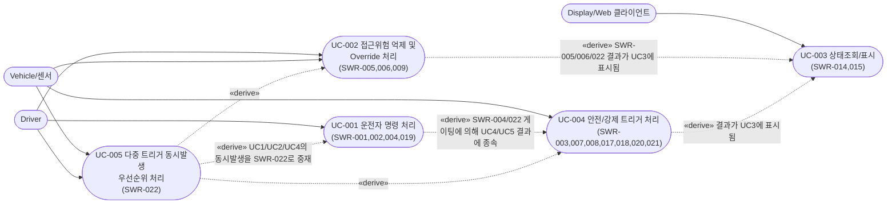
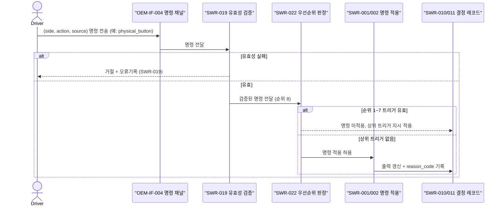
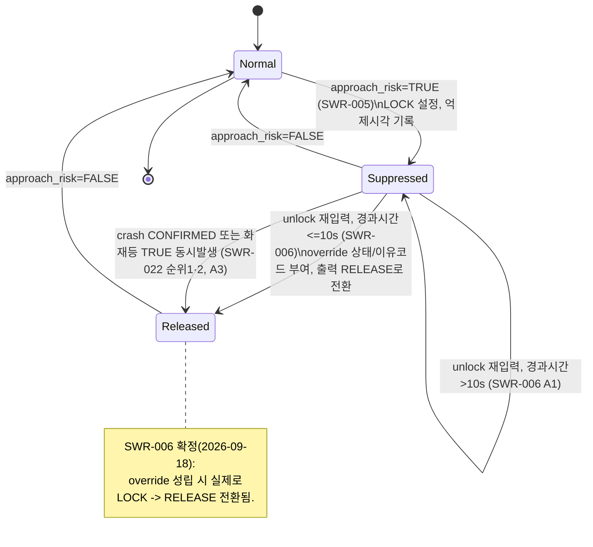
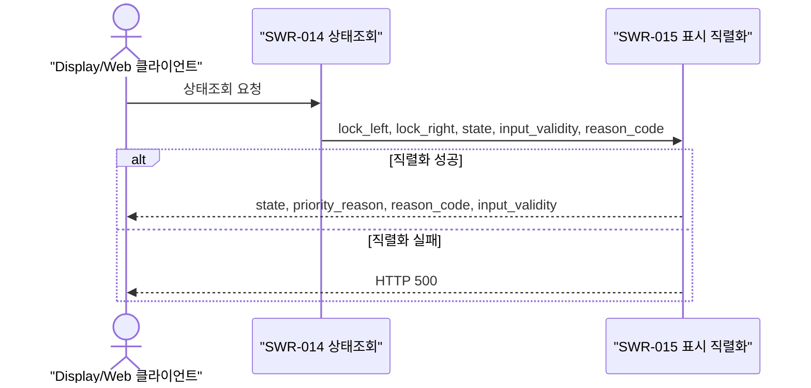

# SWE1-002 Use Case 명세서 — 전자식 차일드락 제어 SW

## 문서 통제

| 항목 | 내용 |
|---|---|
| 문서 ID / 명칭 | SWE1-002 / Use Case 명세서 — 전자식 차일드락 제어 SW |
| 적용 템플릿 | TPL-SWE1-002_Use Case 명세서 템플릿.docx (섹션 1~7 구조를 따름), 다이어그램 표기는 TPL-SWE1-003(drawio) 규칙을 Mermaid로 표현 |
| 버전 / 베이스라인 | Rev 0.2 / BL-OEM-1.0 |
| 작성자 | 요구사항분석 에이전트 |
| 검토 요청 대상 | jay.kim3063@gmail.com |
| 승인자 | 대기 — 가상 OEM-A 역할을 겸임하는 사용자(jay.kim3063@gmail.com) |
| 작성 상태 | 작성 완료(Draft), 검토 대기 |

**교육용 시나리오 고지**: 본 문서는 가상 OEM-A 입력(`OEM-SWR-001`)에 근거한 교육용 산출물이며, 실제 제작사 사양이 아니다. `SWE1-001_SW 요구사항 명세서.md`와 함께 읽어야 하며, 특히 §4.2.5(SWR-022 트리거 우선순위 정책)와 §8.2(해결된 사용자 확인 이력)를 전제로 한다.

## 개정 이력

| Rev | 일자 | 변경 내용 |
|---|---|---|
| 0.1 | 2026-09-18 | 최초 작성. UC-001~004, 미결 우선순위(§0(b)) 반영 |
| 0.2 | 2026-09-18 | 사용자 확정 결정 반영: UC-002 override를 실제 RELEASE 전환으로 갱신, UC-004를 확정된 SWR-022 흐름으로 갱신, 다중 트리거 동시발생 시나리오 UC-005 신규 추가. TPL-SWE1-002(1~7절) 구조로 재정렬 |

---

## 1. 목적 및 적용범위

### 1.1 목적

`SWE1-001`의 복잡한 상호작용을 갖는 SWR(운전자 다중경로 명령, 접근위험 억제/override, 다중 트리거 동시발생 우선순위)을 Use Case와 다이어그램으로 구체화한다.

### 1.2 적용범위

UC-001~UC-005 전체가 SWR-001~022를 포괄한다.

### 1.3 적용 경계

`SWE1-001` §1.3과 동일(PC/SIL/Web 범위, HIL/실차/인증 제외).

---

## 2. 액터와 시스템 경계

| 액터 | 설명 |
|---|---|
| Driver | 물리 버튼 / AVN / 음성 / 모바일 앱 4개 채널 중 하나로 명령을 입력하는 운전자 |
| Vehicle/센서 | vehicle_speed_kph, crash_status, approach_risk, fire/overtemperature/adult_present, isofix, ignition_on, sensor_fault 등을 제공하는 차량측 신호원 |
| Display/Web 클라이언트 | 상태조회/표시를 요청하는 클라이언트 |

시스템 경계: 후석 좌/우 전자식 차일드락 제어 SW(PC/SIL 논리). 도어 래치 HW, 통신 신뢰성 자체는 범위 밖(OEM 원문 1.3절).



---

## 3. Use Case 목록

| ID | 명칭 | 목적 | 주 액터 | 관련 요구사항 | 우선순위(관리용) |
|---|---|---|---|---|---|
| UC-001 | 운전자 다중경로 잠금/해제 명령 처리 | 4개 채널 명령 검증·반영 | Driver | SWR-001, 002, 004, 019 | Medium |
| UC-002 | 후측방 접근위험 억제 및 재입력(Override) 처리 | 접근위험 도어 LOCK/억제, 10초 재입력 시 RELEASE 전환 | Driver, Vehicle | SWR-005, 006, 009 | High |
| UC-003 | 상태조회 및 표시 | 현재 상태/이유코드 조회·표시 | Display/Web 클라이언트 | SWR-014, 015 | Medium |
| UC-004 | 안전/강제 트리거 처리 | 자동/안전 트리거 개별 동작 정의(참고용 통합 시나리오) | Vehicle | SWR-003, 007, 008, 017, 018, 020, 021 | High |
| UC-005 | 다중 트리거 동시발생 우선순위 처리 | 2개 이상 트리거가 동시에 유효할 때 SWR-022 순위에 따라 단일 결과를 결정 | Vehicle, Driver | SWR-022(+003,005,006,007,008,017,018,020,021,001/002/004/019) | High |

---

## 4. Use Case 상세

### 4.1 UC-001 운전자 다중경로 잠금/해제 명령 처리

**4.1.1 기본 정보**
- ID/명칭: UC-001 / 운전자 다중경로 잠금/해제 명령 처리
- 목적: 운전자가 4개 입력 채널 중 하나로 좌/우/전체 도어에 대한 잠금/해제 명령을 내리면 SW가 이를 검증하고, 다른 상위 우선 트리거가 없는 도어에 한해 반영한다.
- 주 액터: Driver
- 이해관계자: 가상 OEM-A(승인자), 탑승자(안전 영향)
- 관련 요구사항(«satisfy»): SWR-001, SWR-002, SWR-004, SWR-019

**4.1.2 사전조건과 트리거**
- 사전조건: SW가 NORMAL 평가 사이클을 수행 중이며, OEM-IF-004 명령 채널이 수신 가능한 상태.
- 트리거: Driver가 4개 채널 중 하나로 (side, action, source) 명령을 전송.

**4.1.3 기본 흐름**
1. Driver가 (side, action, source) 명령을 전송한다.
2. SW는 SWR-019에 따라 필드 유효성(등록된 enum, 완전성, 형식)을 검증한다.
3. 유효하면 SW는 SWR-004/022에 따라 대상 도어(들)에 순위 1~7의 상위 트리거(SWR-003/005/006/007/008/017/018/020/021)가 그 평가주기에 적용 중인지 확인한다.
4. 적용 중인 상위 트리거가 없으면 SWR-001(개별 도어) 또는 SWR-002(전체)에 따라 출력을 갱신한다.
5. SW는 결정 레코드(SWR-010/011)를 갱신하고 reason_code를 부여한다.

**4.1.4 대안 흐름**
- A1 (2번에서 유효성 실패): SWR-019에 따라 명령을 거절하고 오류를 기록한 뒤 종료한다.
- A2 (3번에서 상위 트리거 존재): 명령을 적용하지 않고 SWR-004/022에 정의된 대로 기존 출력을 유지한다.

**4.1.5 예외 흐름**
- 없음(입력 채널 통신 자체의 신뢰성은 본 프로젝트 범위 밖, OEM 원문 1.3절).

**4.1.6 사후조건**
- 대상 도어 출력이 갱신되거나(정상), 거절/유지로 종료된다. 결정 레코드가 남는다.



### 4.2 UC-002 후측방 접근위험 억제 및 재입력(Override) 처리

**4.2.1 기본 정보**
- ID/명칭: UC-002 / 후측방 접근위험 억제 및 재입력(Override) 처리
- 목적: 접근위험이 있는 도어를 잠그고 해제를 억제하되, 운전자가 경고 인지 후 10초 이내 재입력하면 해당 도어를 실제로 RELEASE로 전환한다.
- 주 액터: Vehicle(rear_left/right_approach_risk 센서 신호), Driver(재입력 명령)
- 관련 요구사항(«satisfy»): SWR-005, SWR-006, SWR-009 | «derive» 상위: OEM-SR-002(ASIL B), OEM-FR-003

**4.2.2 사전조건과 트리거**
- 사전조건: rear_left_approach_risk/rear_right_approach_risk가 유효(freshness/형식 정상, SWR-013-A/B).
- 트리거: Vehicle이 특정 side의 approach_risk=TRUE를 보고.

**4.2.3 기본 흐름**
1. Vehicle이 특정 side의 approach_risk=TRUE를 보고한다.
2. SW는 SWR-005에 따라 해당 side 출력을 LOCK으로 설정하고 억제 시작 시각을 기록한다.
3. Driver가 같은 side에 unlock 명령을 재입력한다.
4. SW는 억제 시작 시각으로부터 경과시간을 계산한다.
5. 경과시간 ≤10초이면 SWR-006에 따라 override 조건이 성립한 것으로 판정하고, 해당 도어 출력을 RELEASE로 전환하며 override 상태 및 이유코드를 부여한다.

**4.2.4 대안 흐름**
- A1 (경과시간 >10초): override를 부여하지 않고 SWR-005의 LOCK/억제를 그대로 유지한다.
- A2 (반대 side는 independent, SWR-009): 한쪽 side만 TRUE인 경우 반대 side 출력은 영향받지 않는다.
- A3 (crash_status=CONFIRMED 또는 화재/과열/성인탑승 동시 유효, SWR-022 순위 1·2): 해당 도어는 이미 SWR-007/017에 의해 RELEASE이므로, 이후 override 판정 결과와 무관하게 RELEASE가 유지된다(순위 1·2가 순위 4보다 우선).

**4.2.5 예외 흐름**
- 없음. (이전 개정에서 SWR-017과의 동시발생을 예외 흐름으로 미확정 처리했으나, SWR-022 확정으로 위 A3 대안 흐름으로 명확히 편입되었다.)

**4.2.6 사후조건**
- 접근위험이 유효한 동안 출력은 LOCK으로 유지되거나(기본), override 성립 시 RELEASE로 전환된다. 결정 레코드에 원인이 남는다.



### 4.3 UC-003 상태조회 및 표시

**4.3.1 기본 정보**
- ID/명칭: UC-003 / 상태조회 및 표시
- 목적: 현재 잠금 상태, 시스템 state, 입력 유효성, 최근 결정 이유를 조회/표시한다.
- 주 액터: Display/Web 클라이언트
- 관련 요구사항(«satisfy»): SWR-014, SWR-015 | «derive» 상위: OEM-FR-004

**4.3.2 사전조건과 트리거**
- 사전조건: SW가 최소 1회 평가주기를 수행해 결정 레코드가 존재.
- 트리거: 클라이언트의 상태조회 요청.

**4.3.3 기본 흐름**
1. 클라이언트가 상태조회를 요청한다.
2. SW는 SWR-014에 따라 lock_left, lock_right, state, input_validity, reason_code를 조회한다.
3. SW는 SWR-015에 따라 OEM-IF-006 형식(state, priority_reason, reason_code, input_validity)으로 직렬화하여 응답한다.

**4.3.4 대안 흐름**
- A1 (직렬화 실패): HTTP 500을 반환한다(SWR-015).

**4.3.5 예외 흐름**
- 없음.

**4.3.6 사후조건**
- 클라이언트가 최신 상태를 표시한다.



### 4.4 UC-004 안전/강제 트리거 처리 (참고용 통합 시나리오)

**4.4.1 기본 정보**
- ID/명칭: UC-004 / 안전/강제 트리거 처리
- 목적: 자동/안전 트리거(자동잠금, 충돌, 화재/과열/성인탑승, ISOFIX, ignition-off, 센서고장) 각각의 개별 동작을 하나의 참고용 Use Case로 묶어 제시한다. 트리거 간 동시발생 우선순위는 UC-005를 참조한다.
- 주 액터: Vehicle
- 관련 요구사항(«satisfy»): SWR-003, SWR-007, SWR-008, SWR-017, SWR-018, SWR-020, SWR-021

**4.4.2 사전조건과 트리거**
- 사전조건: 각 트리거에 대응하는 입력(vehicle_speed_kph, crash_status, fire/overtemperature/adult_present, isofix, ignition_on, sensor_fault)이 유효(SWR-013-A/B).
- 트리거: 각 입력이 해당 조건(예: crash_status=CONFIRMED)으로 전이.

**4.4.3 기본 흐름**
1. Vehicle이 트리거 조건에 해당하는 입력값을 보고한다.
2. SW는 SWR-022 순위 판정을 거쳐(다른 상위 트리거가 없는 경우) 해당 트리거의 SWR(SWR-003/007/008/017/018/020/021)에 정의된 출력·state·reason_code를 적용한다.

**4.4.4 대안 흐름**
- A1 (crash_status=PENDING, SWR-008): 강제해제를 발생시키지 않고 다른 트리거를 정상 평가한다.

**4.4.5 예외 흐름**
- 2개 이상 트리거 동시발생 시의 중재는 본 Use Case의 범위가 아니며 UC-005(SWR-022)로 위임한다.

**4.4.6 사후조건**
- 해당 트리거 조건이 유효한 동안 정의된 출력이 유지된다.

**다이어그램**: 개별 트리거 동작은 `SWE1-001_SW 요구사항 명세서.md` §4.2의 각 SWR 레코드를 참조한다(ID 일치, 중복 작성하지 않음). 트리거 간 상호작용 흐름은 UC-005(§4.5)의 Activity 다이어그램을 참조한다.

### 4.5 UC-005 다중 트리거 동시발생 우선순위 처리 (신규)

**4.5.1 기본 정보**
- ID/명칭: UC-005 / 다중 트리거 동시발생 우선순위 처리
- 목적: 2개 이상의 트리거(운전자 명령, 자동잠금, 접근위험/override, ISOFIX, ignition-off, 화재/과열/성인탑승, 충돌, 센서고장)가 동일 평가주기에 동시에 유효할 때, SWR-022의 8단계 순위에 따라 결정론적으로 단일 결과를 산출하는 과정을 명시한다.
- 주 액터: Vehicle, Driver
- 관련 요구사항(«satisfy»): SWR-022 | «derive» 상위: OEM-SR-001, OEM-SR-002(원문에 전체 순서 근거 없음 — 사용자 승인으로 정의, `SWE1-001` §4.2.5/§8.2 참조)

**4.5.2 사전조건과 트리거**
- 사전조건: SW가 매 평가주기마다 8개 트리거 조건 전체를 평가할 수 있는 정규화된 입력을 보유(SWR-013-A/B로 유효성 확인됨).
- 트리거: 동일 평가주기 내에 2개 이상의 트리거 조건이 동시에 TRUE(또는 해당 조건 성립).

**4.5.3 기본 흐름**
1. SW는 평가주기 시작 시 8개 트리거 조건을 순위 1(crash CONFIRMED)부터 순위 8(운전자 명령)까지 순서대로 판정한다.
2. 순위 1(crash_status=CONFIRMED)이 유효하면 좌·우 강제 RELEASE를 적용하고 판정을 종료한다.
3. 순위 1이 무효이면 순위 2(화재/과열/성인탑승)를 판정한다. 유효하면 좌·우 강제 RELEASE를 적용하고 종료한다.
4. 순위 2가 무효이면 순위 3(sensor_fault)을 판정한다. 유효하면 직전 확정 출력을 유지(state=FAULT)하고 종료한다.
5. 순위 3이 무효이면 순위 4(접근위험)를 판정한다. 유효하면 해당 도어 LOCK(단 override 성립 시 RELEASE)을 적용하고, 나머지 도어/순위는 계속 평가한다.
6. 이후 순위 5(ISOFIX) → 6(ignition-off) → 7(자동잠금) → 8(운전자 명령) 순서로, 아직 결정되지 않은 도어에 한해 동일하게 판정한다.

**4.5.4 대안 흐름**
- A1 (crash_status=PENDING, SWR-008): 순위 1은 무효로 판정되고, 순위 2 이하가 정상 평가된다.
- A2 (좌/우 도어에 서로 다른 순위의 트리거가 유효, 예: 좌측 ISOFIX=TRUE·우측 ignition_on=FALSE): 좌측은 순위 5(LOCK), 우측은 순위 6(RELEASE)이 개별 적용되어 좌우 출력이 달라진다.
- A3 (순위 4의 접근위험 도어에서 override 10초 이내 재입력): 순위 4 내부 예외로 해당 도어가 RELEASE로 전환된다(SWR-006).

**4.5.5 예외 흐름**
- 없음. 8단계 판정으로 모든 조합이 결정론적으로 처리되도록 설계되었다(SWR-022 검증기준의 조합시험 대상).

**4.5.6 사후조건**
- 매 평가주기마다 좌·우 각각에 대해 유일한 (출력, state, reason_code)가 결정된다. 동일 입력 조합에 대해 항상 동일한 결과가 산출된다(SWR-016 결정론 요구와도 정합).

```mermaid
flowchart TD
    Start([평가주기 시작]) --> A{crash_status=CONFIRMED? SWR-007}
    A -->|Yes| R1[좌우 RELEASE 강제 — 순위1]
    A -->|No, PENDING/NONE: SWR-008| B{fire_detected/overtemperature_detected/adult_present 중 TRUE? SWR-017}
    B -->|Yes| R2[좌우 RELEASE 강제 — 순위2]
    B -->|No| C{sensor_fault=TRUE? SWR-021}
    C -->|Yes| R3["직전 확정 출력 유지, state=FAULT — 순위3"]
    C -->|No| D{해당 도어 rear_left/right_approach_risk=TRUE? SWR-005}
    D -->|Yes| E{10초 이내 동일 도어 재입력(override)? SWR-006}
    E -->|Yes| R4a[해당 도어 RELEASE로 전환 — 순위4 예외]
    E -->|No| R4b[해당 도어 LOCK 유지 — 순위4]
    D -->|No| F{isofix_left/right=TRUE? SWR-018}
    F -->|Yes| R5[해당 side 강제 LOCK — 순위5]
    F -->|No| G{ignition_on=FALSE? SWR-020}
    G -->|Yes| R6[좌우 RELEASE, state=OFF — 순위6]
    G -->|No| H{vehicle_speed_kph>=3km/h? SWR-003}
    H -->|Yes| R7[좌우 LOCK — 순위7]
    H -->|No| I[운전자 명령 SWR-001/002/004/019 적용 — 순위8]
```

확정된 우선순위(2026-09-18 사용자 승인, `SWE1-001` §8.2 결정 1, §4.2.5 SWR-022): 위 8단계 전체. OEM 원문에는 이 전체 순서의 근거가 없으며, 프로젝트가 사용자 승인을 받아 정의한 정책임을 재확인한다.

---

## 5. 비대상 시나리오

- 도어 래치 HW 구동, 통신 매체(CAN/이더넷 등)의 신뢰성 자체는 다루지 않는다(OEM 원문 1.3절, 범위 밖).
- HIL/실차 환경에서의 액추에이터 물리 반응은 다루지 않는다.
- crash_status의 HARA/ASIL 도출 타당성 재확인은 다루지 않는다(Part 3 범위 밖).

---

## 6. 추적성

| Use Case | «satisfy» SWR | «derive» 상위 OEM 요구 |
|---|---|---|
| UC-001 | SWR-001, SWR-002, SWR-004, SWR-019 | OEM-FR-001, OEM-IF-004 |
| UC-002 | SWR-005, SWR-006, SWR-009 | OEM-SR-002, OEM-FR-003 |
| UC-003 | SWR-014, SWR-015 | OEM-FR-004, OEM-IF-006 |
| UC-004 | SWR-003, SWR-007, SWR-008, SWR-017, SWR-018, SWR-020, SWR-021 | OEM-FR-002, OEM-SR-001, OEM-FR-005, OEM-FR-006, OEM-FR-007, OEM-SR-004 |
| UC-005 | SWR-022 | OEM-SR-001, OEM-SR-002 (원문 근거 없음 — 사용자 승인 정의, `SWE1-001` §4.2.5) |

Downstream(테스트 케이스 등)은 `TRC-001_양방향 요구사항 추적 매트릭스.md`에서 TBD로 관리된다.

---

## 7. 참고자료

- `SWE1-001_SW 요구사항 명세서.md` (본 문서의 모든 SWR 본문 출처)
- `WorkProducts/Engineering/Traceability/TRC-001_양방향 요구사항 추적 매트릭스.md`
- `WorkProducts/Engineering/SoftwareRequirementsAnalysis/glossary.md`
- 적용 템플릿: `.claude/skills/requirements-analysis/references/template.md` (TPL-SWE1-002, TPL-SWE1-003)
